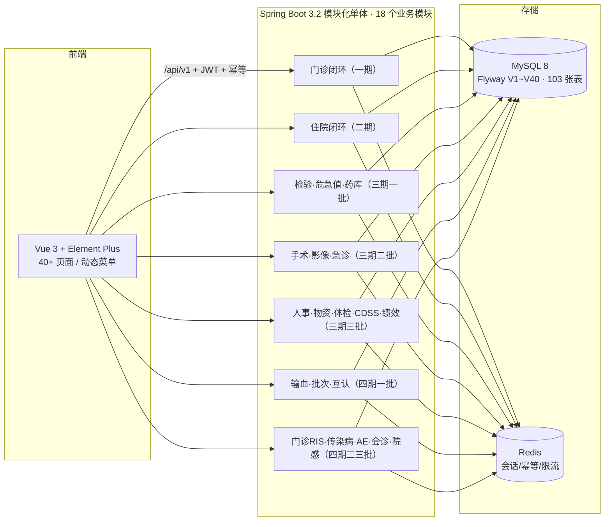

# 医院信息系统（HIS）

依据《医院信息系统技术指导文档》与 `设计文档/`（24 份）实现的医院信息系统，前后端分离的模块化单体。**18 个业务模块**覆盖门诊→住院→检验→危急值→手术→影像→急诊→输血→体检→CDSS→绩效→法定上报全闭环。

## 为什么值得读（工程亮点）

- **质量体系即资产**：九套 API e2e **321 项断言** + 90 项单测 + **57 段数据一致性巡检** + Playwright UI 链路（7 条业务链 25 断言）与 UI 冒烟（全菜单 404 猎手），CI 每次推送全量回归（fail-fast）。
- **资金与库存全服务端硬门禁**：收费/退费行锁与快照、药房 FEFO 拆批扣减、输血三道安全门禁（不相容阻断/签收/双人双签）、物资原子扣减防超卖——前端只是入口。
- **并发正确性有论证**：幂等组件（失败释放锁）、乐观锁断言、条件更新防丢失更新、患者行锁防双登记；66 轮查验沉淀 **20+ 条系统性 bug 模式**（[docs/lessons/bug-patterns.md](his-project/docs/lessons/bug-patterns.md)）。
- **可运维性**：一键部署（含旧前端产物引用闭包回收）、健康检查、异盘备份 + 恢复演练（RTO<60s 含一致性验证）、57 段巡检、慢接口治理有前后数据（床位一览 -83%、病案列表 -78%）、**Redis 停机七探针演练**与发号器降级/恢复补偿。
- **文档即课程**：[运维手册](his-project/docs/lessons/ops-runbook.md)、[演示剧本](his-project/docs/lessons/demo-script.md)、[bug 模式库](his-project/docs/lessons/bug-patterns.md)——每条模式带机理/真实案例/检查方法；[**系统设计白皮书**](his-project/docs/portfolio/系统设计白皮书.md)、[**ADR 13 条**](his-project/docs/portfolio/ADR.md)面向求职作品集；[**16 课时教案 + 实验手册**](his-project/docs/course/README.md)面向教学。


> ⚠️ 定位声明（指导文档 §10）：本系统为产品原型/内部试点/教学演示系统，用于真实医疗业务前须完成合规评估、等保、医保联调与信息科审批。



## 1. 业务域全景

### 一期：门诊闭环
| 模块 | 功能 | 主要角色 |
|---|---|---|
| 权限审计 | JWT+Redis 会话、RBAC 权限码（80+）、操作/登录日志 | 全部 |
| 基础资料 | 机构/科室/医生/药品/收费项目字典 | 管理员 |
| 患者中心 | 建档（身份证 AES-GCM 加密 + EMPI 主索引）、就诊卡 | 收费员 |
| 挂号就诊 | 挂号/退号/号源行锁控制/候诊队列/过号任务 | 收费员 |
| 医生工作站 | 接诊、病历、诊断、医嘱、处方（后端取价重算）、检查申请 | 医生 |
| 收费结算 | 待缴汇总、收费、明细级退费（整方退/已发药先退药）、日结 | 收费员 |
| 药房库存 | 处方审核、发药（FEFO 拆批扣减）、退药、入库、批次/预警/流水 | 药师 |
| 统计报表 | 日挂号量/门诊量/收入/类别分布/明细下钻/库存汇总 + CSV 导出 | 管理员/对账员 |

### 二期：住院闭环
| 模块 | 功能 | 主要角色 |
|---|---|---|
| 平台底座（plt） | 患者主索引 EMPI、集成事件 outbox（闭环事件目录） | 管理员 |
| 住院管理（inp） | 入院登记、床位（条件更新防一床两占）、押金（原子累加）、转科、一日清、出院结算、床位费日结 | 收费员 |
| 医嘱闭环（doc） | 长期/临时医嘱、频次执行计划（每日生成）、药师审核、摆药出库（FEFO）、护士执行即计费、皮试拦截/阳性作废、停嘱恢复 | 医生/药师/护士 |
| 电子病历（emr） | 结构化文书（模板套用）、必填节校验、质控通过/退回闭环 | 医生/管理员 |
| 护理（nur） | 排班、体征录入（范围校验）+ 体温单查询、待执行单、床位一览 | 护士 |
| 病案管理（mrc） | 病案惰性补建、首页编码（ICD-10）/质控、归档双前置、借阅归还 | 病案员 |
| 医保结算（medins） | 申报（Mock 网关防腐层：职工 70/10/20 拆分）、日对账、差异留痕 | 医保专员 |

### 三期一批：LIS + 危急值 + 药库
| 模块 | 功能 | 主要角色 |
|---|---|---|
| 检验（lis） | 申请→标本条码→接收→录入（Mock 仪器通道 + 危急判定）→报告发布 | 检验技师/医生 |
| 危急值（alert） | 自动判定 → 通知登记 → 医生确认（管床校验）→ 处置闭环 | 技师/医生 |
| 药库（whse） | 采购单创建/审批/到货入库（聚合+批次 FEFO）/供应商维护 | 药师/管理员 |

### 三期二批：手术 + 影像 + 急诊
| 模块 | 功能 | 主要角色 |
|---|---|---|
| 手术麻醉（ors） | 申请（跨患者拦截）→审核→排台（全房间搜索）→三方核查（硬门禁）→开始→麻醉→结束→离室→关档记账 | 医生/手术室护士 |
| 影像（ris） | 住院/门诊检查自动生成申请 → 预约 → 执行（Mock 影像）→ 报告双签（不得自审自签）→ 互认标识 | 技师/医生 |
| 急诊五大中心（emc） | 分诊（1~4 级/绿通）→ 中心登记 → 时间节点（达标预警）→ 关档 → 达标率统计 | 急诊护士 |

### 三期三批：人事 + 物资 + 体检 + CDSS + 绩效
| 模块 | 功能 | 主要角色 |
|---|---|---|
| 人事（hr） | 员工档案/职称变更留痕/离职 | 管理员 |
| 物资（mat） | 采购审批→入库（批次效期）→科室领用（FEFO 自动拨批次、原子扣减不超卖） | 药师/管理员 |
| 体检（pe） | 套餐→登记→分项录入→医生总检发布 | 体检人员/医生 |
| CDSS | 规则引擎（配伍/重复/剂量/过敏映射）+ 开单 hook（提示不阻断，异常隔离） | 管理员/医生 |
| 绩效（kpi） | 工作量/效率/安全三类 KPI 聚合 + CSV 导出 | 管理员/对账员 |

### 四期：输血 + 批次 + 互认 + 门诊 RIS + 法定上报
| 模块 | 功能 | 主要角色 |
|---|---|---|
| 输血（bb） | 用血申请→配血（Rh/血型校验，**不相容硬阻断发血**）→发血（签收）→床边双签输注→闭环 | 医生/血库/护士 |
| 物资批次 | 批次效期入库 + FEFO 领用 + 效期 ≤30 天预警 | 药师 |
| 互认 | 检验/影像报告发布勾选"纳入互认"（HR 标识），医生站展示 | 医生 |
| 传染病上报（pub） | 诊断自动匹配字典 → 自动报卡 → 公卫上报 → 疾控回执闭环 | 医生/公卫 |
| 院感监测（pub） | 病例上报 → 感染科确认 → 整改完成 | 医生/公卫 |
| 不良事件（ae） | 任何员工上报 → 质控分派 → 整改 → 闭环确认 | 全部 |
| 会诊（cnt） | 会诊申请（住院/门诊）→ 接受 → 意见完成 | 医生 |

### 内置账号（演示环境，初始密码 `His@2026`）

| 账号 | 角色 | 账号 | 角色 |
|---|---|---|---|
| admin | 管理员（全部） | or.nurse | 手术室护士 |
| dr.wang / dr.li / dr.chen | 医生 | ris.zhang | 影像技师 |
| cashier.li | 收费员 | emc.li | 急诊护士 |
| pharm.zhao | 药师 | lab.chen | 检验技师 |
| nurse.wang / nurse.liu | 护士 | pe.nurse | 体检护士 |
| mrc.zhou | 病案员 | bb.tech | 血库人员 |
| yb.sun | 医保专员 | pub.user | 公卫人员 |

> 演示账号由 `db/demo/` 提供（生产不加载）。密码策略：≥8 位含字母+数字（修改后强制生效）。

## 2. 技术栈

| 层 | 选型 |
|---|---|
| 前端 | Vue 3.4 + TypeScript + Element Plus（按需引入）+ Pinia + Axios + Vite 5 |
| 后端 | Java 17 + Spring Boot 3.2 + Spring Security（JWT）+ MyBatis-Plus 3.5.5（乐观锁/分页） |
| 存储 | MySQL 8.0（Flyway 迁移 V1~V36，104 张表）+ Redis（会话/幂等/限流） |
| 横切 | 统一响应/错误码（A/B/C 三段 80+）、traceId、幂等切面（X-Idempotency-Key）、审计切面（异步落库+脱敏）、定时任务（过号/床位费/长期医嘱计划/批次效期） |

## 3. 工程结构

```
├── his-project/
│   ├── his-backend/       Spring Boot 后端（18 个业务模块，271 个 REST 接口）
│   │   ├── src/main/java/com/his/modules/  # 18 个业务模块 + infrastructure + common
│   │   └── src/main/resources/db/
│   │       ├── migration/  # V1~V36 全环境迁移（104 张表、菜单权限、四期扩展）
│   │       ├── demo/       # V3/V8/V15/V19/V24/V30 演示数据（仅 dev/test 加载）
│   │       └── perf/       # 大数据量灌入脚本（5 万患者）
│   │   └── src/test/       # 48 项单测（7 个测试类）
│   ├── his-web/           # Vue 3 前端（40+ 页面 / 27 个 API 模块）
│   ├── deploy/
│   │   ├── deploy.sh       # 一键部署（停服→备份→替换→启动→健康检查）
│   │   ├── health_check.sh # 健康告警（5 项检查）
│   │   ├── db/             # 一致性巡检 SQL + 恢复演练报告
│   │   └── e2e/            # 八套 e2e 脚本
│   └── docs/              # 用户操作手册、OpenAPI 导出（271 接口）
├── 设计文档/                # 24 份设计文档（含数据字典 103 表 1333 列）
└── README.md
```

## 4. 快速开始（本地开发）

```bash
# 1) 依赖：MySQL 8 + Redis（可用 Docker）
docker run -d -p 3306:3306 -e MYSQL_ROOT_PASSWORD=root123 mysql:8.0.36
docker run -d -p 6379:6379 redis:7.2

# 2) 后端（Flyway 自动建表 + 演示数据；默认连接 localhost:3306, root/root123, 库名 his）
cd his-project/his-backend && mvn spring-boot:run

# 3) 前端（代理已指向 8080）
cd his-project/his-web && npm install && npm run dev
```

打开 http://localhost:5173 ，用 admin / His@2026 登录（首登请改密）。

## 5. 生产部署

见 **`deploy/部署指南.md`**（方案 A Docker Compose / 方案 B Windows 服务化双方案），要点：
- `.env` 必改：`DB_PASSWORD` / `JWT_SECRET` / `AES_KEY`（`openssl rand -base64 32` 生成）；
- 生产 `FLYWAY_LOCATIONS=classpath:db/migration`（不加载演示数据）；
- 仅对外暴露 80/443；
- 部署：`bash deploy/deploy.sh`（一键停服→备份→替换→启动→健康检查）；
- 告警：注册 `deploy/health_check.sh` 为计划任务（每 30 分钟）；
- 备份产物验证：检查 backup 目录出现当日 sql 且含 "Dump completed" 结尾标记。

## 6. 测试与验收

| 脚本 | 覆盖 | 结果 |
|---|---|---|
| `python deploy/e2e/e2e_acceptance.py` | 一期门诊闭环 40 项断言 | 40/40 |
| `python deploy/e2e/e2e_phase2.py` | 二期住院闭环 42 项断言 | 42/42 |
| `python deploy/e2e/e2e_phase3.py` | 三期一批 28 项断言 | 28/28 |
| `python deploy/e2e/e2e_phase3b.py` | 三期二批 57 项断言 | 57/57 |
| `python deploy/e2e/e2e_phase3c.py` | 三期三批 45 项断言 | 45/45 |
| `python deploy/e2e/e2e_phase4.py` | 四期 43 项断言 | 43/43 |
| `python deploy/e2e/fix_regression.py` | 修复回归复验 24 项断言 | 24/24 |
| `python deploy/e2e/concurrency_test.py` | 并发安全 8 项断言 | 8/8 |
| `mvn test` | 核心域单测 48 项（Bb 12 + Ors 5 + Mat 4 + Pub 8 + Ae 6 + Cnt 3 + Mask 5 + Crypto 5） | 48/48 |
| `python deploy/perf/perf_test.py` | 100 并发压测（5 万患者数据量下） | PASS |
| 一致性巡检 | 27 段孤儿引用扫描 + 5 段状态一致性 | 零孤儿 |
| 恢复演练 | RTO=9s / RPO≤24h / 99 表一致 | PASS |
| 渗透自查 | Mass Assignment / SQL 注入 / XSS / PHI 泄露 | 全过 |

质量门禁：GitHub Actions CI 流水线（push 自动触发后端测试 + 前端构建）；提交说明按"变更目标/影响模块/数据库变更/测试结果/已知限制"模板。

## 7. 设计文档索引

| 文档 | 内容 |
|---|---|
| 设计文档/01~06 | 一期：总体架构、数据库、接口、权限安全、流程状态机、实施与验收 |
| 设计文档/07 | HIS 全景规划 V2（全院 7 大类 40+ 系统、闭环横切、二~四期路线） |
| 设计文档/08~11 | 二期：总体设计、数据库、接口与状态机、实施计划 |
| 设计文档/12~14 | 三期一批：总体、数据库与接口、实施计划 |
| 设计文档/15~17 | 三期二批：总体、数据库与接口、实施计划 |
| 设计文档/18~20 | 三期三批：总体、数据库与接口、实施计划 |
| 设计文档/21~23 | 四期：总体、数据库与接口、实施计划 |
| 设计文档/数据字典.md | 103 张表 1333 列全覆盖（按 26 个模块分组） |
| his-project/docs/用户操作手册.md | 多角色操作说明 + 常见问题 |
| his-project/deploy/部署指南.md | 双部署方案 + 安全清单 + 演练记录 |

## 8. 质量保障体系

30 轮系统化查验（安全/并发/状态机/幂等/金额/时间/审计/数据一致性/业界对标/逐行审查），79 个真实缺陷修复。bug 模式清单 17 条沉淀（丢失更新/数据形态覆盖/权限矩阵/设计承诺/实体完整性/Flyway/唯一索引/0 元兜底/驳回留痕/报告重提/乐观锁/事件转义/唯一约束兜底/TimeSQL/DTO 转义/浏览器覆盖/资源递进）。

## 9. 已知限制

- 互联网医院 C 端、AI 辅助（阅片/病历质控）、信创迁移：需外部资源，五期评估
- 输血反应实验室联动、患者血型档案：四期二批评估
- 医保为 Mock 通道（真实 SDK 按当地平台规范联调）
- 门诊欠费挂账/催缴：未实现（住院结算完整）
- 数据保留策略/归档策略：运维阶段制定
