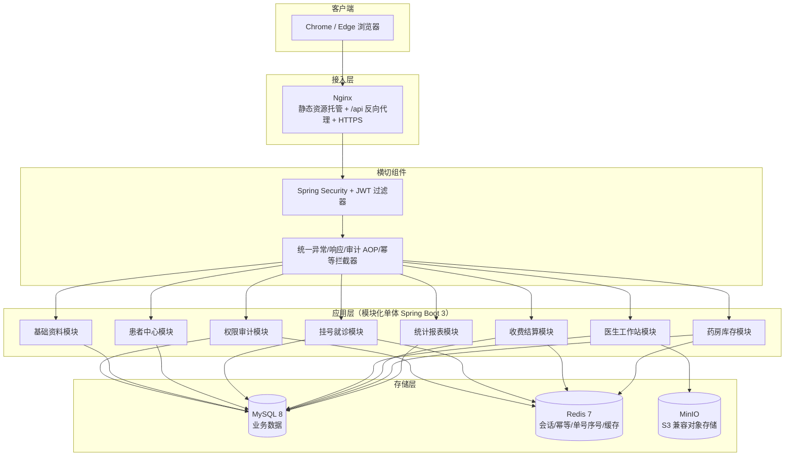
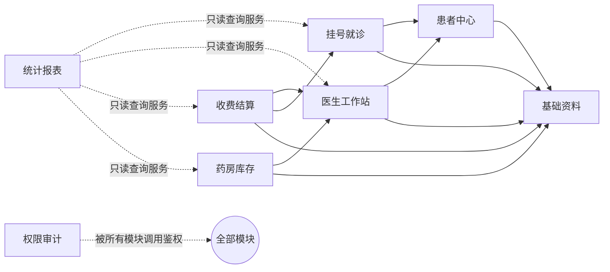

# 01 总体架构设计

版本：V1.0 ｜ 依据：《医院信息系统技术指导文档》§3、§4.1、§4.2、§7

## 1. 设计依据与一期范围

### 1.1 范围内（必须建设）

| 域 | 内容 |
|---|---|
| 基础资料 | 组织、科室、医生、药品、收费项目字典 |
| 患者中心 | 患者档案（身份证/就诊卡、联系方式、过敏史、既往史） |
| 挂号就诊 | 普通号/专家号、退号、候诊队列、就诊状态流转 |
| 医生工作站 | 主诉、现病史、诊断、处方、检查/检验申请、病历提交 |
| 收费结算 | 费用明细汇总、收费、退费、日结 |
| 药房库存 | 处方审核、发药、退药、库存批次、库存预警 |
| 统计报表 | 日挂号量、门诊量、收入、药品库存、操作日志查询 |
| 权限审计 | 五角色 RBAC（管理员/医生/收费员/药师/对账员）、操作留痕 |

### 1.2 范围外（二期，不做）

住院管理、护士站、手术麻醉、血库、体检中心；医保实时结算、电子签名、互联网医院、远程问诊；与检验/影像/医保/支付平台的生产对接；AI 辅助诊断与自动开方；多院区主数据同步。

## 2. 总体架构

前后端分离的模块化单体。前端为纯静态资源由 Nginx 托管，后端单进程承载全部 8 个业务模块，模块间只通过应用服务（Application Service）调用，禁止跨模块直写对方表。



要点：

- **Redis 用途收敛**（§4.1"仅用于会话、短期缓存和幂等控制"）：登录会话/令牌黑名单、幂等键、单号当日序号（INCR）、字典与菜单的短期缓存。**不**用 Redis 保存任何业务单据状态。
- **MinIO** 用于病历附件、检查报告图片等非结构化文件；一期仅医生工作站上传/预览，预签名 URL 下载。
- **统计报表不做独立库**，一期直接走各模块只读查询服务（强制分页 + 索引），二期再考虑读写分离/数仓。

## 3. 技术栈

| 层 | 选型 | 版本 | 说明 |
|---|---|---|---|
| 前端框架 | Vue 3 + TypeScript | Vue ^3.4 | 组合式 API |
| UI 组件 | Element Plus | ^2.7 | 中文错误提示统一封装 |
| 状态管理 | Pinia | ^2.1 | user / menu / dict 三个 store |
| HTTP | Axios | ^1.7 | 请求拦截器注入 token、防重复提交、统一错误提示 |
| 后端框架 | Spring Boot | 3.2.x | Java 17 |
| 安全 | Spring Security + JJWT | 0.12 | JWT 无状态 + Redis 会话双重校验 |
| ORM | MyBatis-Plus | 3.5.x | 内置乐观锁插件、分页插件 |
| 数据库 | MySQL 8.0 | 8.0.36 | InnoDB、utf8mb4 |
| 缓存 | Redis | 7.x | 会话/幂等/序号 |
| 对象存储 | MinIO | 最新 RELEASE | S3 兼容 API |
| 接口文档 | springdoc-openapi | 2.5.x | 运行时生成 OpenAPI 3，Swagger UI |
| 数据库迁移 | Flyway | 9.x | V1 建库、V2 种子数据，禁止手工改库 |
| 构建工具 | Maven 3.9 / pnpm | — | — |
| 部署 | Docker Compose | v2 | nginx + backend + mysql + redis + minio |
| 日志 | SLF4J + Logback | — | JSON 格式，traceId 贯穿，敏感信息脱敏 |

## 4. 模块划分与依赖规则

对应指导文档 §4.2 的 8 个独立业务模块。

| 模块 | 包名 | 职责 | 主要表（详见 02 文档） |
|---|---|---|---|
| 权限审计 | `modules.system` | 用户/角色/菜单/权限码、登录认证、操作日志、登录日志 | sys_user, sys_role, sys_menu, sys_user_role, sys_role_menu, sys_operation_log, sys_login_log |
| 基础资料 | `modules.basedata` | 组织、科室、医生、药品、收费项目字典的维护与查询 | bas_organization, bas_department, bas_doctor, bas_drug, bas_charge_item |
| 患者中心 | `modules.patient` | 患者建档、档案维护、就诊卡管理、敏感数据加解密 | pat_patient, pat_medical_card |
| 挂号就诊 | `modules.registration` | 挂号、退号、过号、候诊队列、挂号费记费来源 | reg_registration |
| 医生工作站 | `modules.clinic` | 就诊记录（接诊/病历/提交）、诊断、医嘱、处方、检查/检验申请 | cli_visit, cli_diagnosis, cli_medical_order, cli_prescription, cli_prescription_item, cli_exam_application |
| 收费结算 | `modules.billing` | 待缴费汇总、收费、支付记录、退费、日结 | bil_charge_bill, bil_charge_detail, bil_payment_record, bil_refund_bill, bil_refund_detail, bil_daily_settlement |
| 药房库存 | `modules.pharmacy` | 处方审核、发药、退药、入库、库存批次/流水、库存预警 | phr_review_record, phr_dispense_order, phr_dispense_detail, phr_return_order, phr_return_detail, inv_inbound_order, inv_inventory_batch, inv_stock_movement |
| 统计报表 | `modules.report` | 日挂号量/门诊量/收入/库存统计、日志查询入口（只读） | 无自有表，只读查询 |

### 4.1 依赖规则（硬约束）



1. 依赖只允许**上层调用下层应用服务**：`收费结算 → {医生工作站, 挂号就诊, 基础资料}`，`药房库存 → {医生工作站, 基础资料}`，`挂号就诊/医生工作站 → {患者中心, 基础资料}`；反向依赖、循环依赖禁止。
   实现补充（阶段二）：`医生工作站 → 挂号就诊`（接诊需联动挂号单状态 10→30，经 `RegistrationAppService.markVisited()`）为唯一允许的同层单向调用，挂号就诊模块不反向依赖医生工作站，不构成循环。
   号源并发控制（《05》R2）：基础资料模块对外提供 `lockDoctor()`（SELECT ... FOR UPDATE），挂号模块在事务内锁定医生行后计数，避免跨模块直写 `bas_doctor`。
2. **禁止跨模块直接读写对方 Mapper/表**。跨模块数据变更必须调用对方模块的 Application Service（例如收费模块把处方标记为"已收费"，必须调用医生工作站模块的 `PrescriptionAppService.markCharged()`）。
3. 统计报表只调用各模块**只读查询服务**，不参与事务。
4. 模块间接口以应用服务接口（Java interface）隔离，为二期拆微服务预留边界。

## 5. 工程结构

### 5.1 仓库布局

```
his-project/
├── his-backend/          # Spring Boot 单体
├── his-web/              # Vue 3 前端
├── deploy/               # docker-compose.yml、nginx.conf、.env.example、备份脚本
├── docs/                 # 本设计文档包、OpenAPI 导出、操作手册
└── README.md
```

### 5.2 后端包结构（按模块分包，模块内 controller/service/mapper/entity 分层）

```
com.his
├── HisApplication.java
├── common/                     # 统一响应 R<T>、错误码 ErrorCode、业务异常 BizException、
│                               # 全局异常处理器、分页对象、审计注解 @AuditLog、幂等注解 @Idempotent
├── infrastructure/
│   ├── config/                 # Spring Security、MyBatis-Plus(乐观锁+分页插件)、Redis、Jackson、CORS
│   ├── security/               # JWT 过滤器、UserDetails 实现、权限注解元数据
│   └── util/                   # IdGenerator(单号)、CryptoUtil(身份证加密)、MaskUtil(脱敏)
└── modules/
    ├── system/      ├── basedata/   ├── patient/
    ├── registration/├── clinic/     ├── billing/
    ├── pharmacy/    └── report/
        # 每模块内: controller/ appservice/ service/ mapper/ entity/ dto/
```

分层约定：`controller` 只做参数绑定与鉴权注解；`appservice` 承载跨模块调用与事务边界（`@Transactional` 只在此层）；`service` 承载本模块领域逻辑；实体不跨模块暴露，跨模块一律传 DTO。

### 5.3 前端结构

```
his-web/src/
├── api/            # 按模块组织的接口封装（system.ts, registration.ts, billing.ts ...）
├── router/         # 静态骨架路由 + 登录后按 /auth/menus 动态挂载业务路由
├── stores/         # user(token/角色/权限码) menu dict
├── utils/request.ts# axios 实例：注入 Bearer token、401 跳登录、错误码→中文提示、
│                   # 提交类请求自动携带 X-Idempotency-Key、防连击
├── views/          # 与 8 个模块一一对应的页面目录
└── components/     # 金额展示(分转元格式化)、状态标签、脱敏字段组件
```

前端铁律（§5.5）：金额、库存、状态、权限一律以后端返回与后端判定为准；前端按钮仅按权限码做显隐，不做授权。

## 6. 横切关注点设计

### 6.1 认证与会话

- 登录：`POST /auth/login`，用户名 + 密码（BCrypt 校验）。成功签发 JWT（HS256，有效期 30 分钟，payload 仅含 userId、username），同时在 Redis 写入会话 `sess:{userId}`（TTL 与令牌一致）。
- 每次请求：JWT 过滤器验签 → 校验 Redis 会话存在 → 加载权限码集合；修改密码/禁用用户时删除会话实现即时失效。
- 登录失败 5 次/分钟触发 IP 级临时锁定（Redis 计数），全部登录行为记 `sys_login_log`。

### 6.2 权限控制

- 菜单/按钮/接口统一用权限码（如 `billing:refund:create`），接口层 `@PreAuthorize("@ss.hasPerm('...')")` 强校验；详见《04 权限与安全设计》。

### 6.3 统一响应、异常与错误码

- 所有接口返回统一信封：`{"code":"OK","message":"成功","data":{},"traceId":"..."}`；错误码分段规范与全量错误码见《03 接口设计》。
- 全局异常处理器兜底：参数校验失败（JSR-303）→ A0001 并返回逐字段中文提示；业务异常 → 对应 B 类错误码；未捕获异常 → C9001，记录 error 日志（含 traceId）但对前端隐藏堆栈。

### 6.4 幂等控制（§5.4 强制）

- 所有"提交类"POST 接口（建档、挂号、开方、收费、退费、审核、发药、退药、入库、日结、病历提交）强制请求头 `X-Idempotency-Key`（前端 UUID）。
- 拦截器执行 `SETNX idem:{userId}:{key}`（TTL 24h）：键不存在则放行并在响应后写入响应快照；键已存在则直接返回首次响应，保证"重复提交返回相同结果"。
- 同键不同请求体 → 返回 A0005 幂等键冲突。
- 数据库层再以业务唯一约束兜底（如发药单 `prescription_id` 唯一索引），Redis 故障时不产生重复数据。

### 6.5 事务与一致性（§7"失败时不得产生半成功状态"）

- 事务边界在应用服务层；收费、退费、发药、退药等资金/库存操作为一个原子事务。
- 扣减库存采用"条件更新"：`UPDATE inv_inventory_batch SET quantity = quantity - #{qty}, version = version + 1 WHERE id = ? AND quantity >= #{qty}`，影响行数为 0 即库存不足，整体回滚并抛 B4004。
- 单据状态变更一律带乐观锁（version 字段，MyBatis-Plus 插件）+ 前置状态校验，防并发双写。

### 6.6 单号生成

规则 `{业务前缀}{yyyyMMdd}{6位当日序号}`，序号取 Redis `INCR seq:{biz}:{yyyyMMdd}`（TTL 7 天）；前缀：患者建档 `P`、挂号 `GH`、就诊 `JZ`、处方 `CF`、检查申请 `SQ`、收费 `SF`、退费 `TF`、发药 `FY`、退药 `TY`、入库 `RK`、日结 `RJ`。Redis 不可用时降级为数据库行锁序号表，保证不重号。

### 6.7 审计日志（§7"关键操作可追溯"）

- 注解 `@AuditLog(module="billing", action="收费", bizType="charge_bill", bizIdExpr="#result.data.billNo")` + AOP 异步落 `sys_operation_log`，记录：traceId、操作人、模块、动作、业务类型/ID、请求参数（身份证/手机号/密码字段脱敏）、结果码、IP、耗时。
- 覆盖操作：患者建档/修改、病历提交、诊断/处方增改、检查申请、收费、退费、处方审核、发药、退药、入库、日结、用户/角色/权限变更。日志表 append-only，不提供删除接口。

### 6.8 敏感数据保护

- 身份证号：AES-256-GCM 加密存储（密钥由环境变量注入），另存 SHA-256 摘要列用于唯一性查询与检索；界面默认脱敏显示（`3401**********1234`）。
- 手机号：原文存储（业务必需），展示层统一脱敏组件；密码 BCrypt(cost≥10)；所有日志输出经 Logback 脱敏转换器。

### 6.9 金额与精度

- 全库金额 `DECIMAL(10,2)`、数量 `DECIMAL(12,2)`；Java 侧一律 `BigDecimal`，禁止 double/float；序列化为字符串传输避免 JS 精度丢失。
- 应收金额由后端按明细逐条重算合计，与前端传值不一致直接拒绝（A0006）。

## 7. 部署架构

```yaml
# deploy/docker-compose.yml 服务拓扑
services:
  nginx:    # 80/443，托管 his-web 构建产物，/api → backend:8080，启用 HTTPS(TLS1.2+)
  backend:  # his-backend jar，JVM 17，环境变量注入 DB/Redis/MinIO/JWT 密钥
  mysql:    # 8.0，数据卷持久化，挂载 Flyway 自动迁移，字符集 utf8mb4
  redis:    # 7.x，appendonly yes
  minio:    # 病历附件桶 his-attachment
```

| 环境 | 用途 | 差异 |
|---|---|---|
| dev | 本地开发 | docker-compose 启全套，`spring.jpa`/Flyway 自动迁移 |
| test | 测试与性能验证（§7 要求 ≥100 并发压测） | 独立数据，种子演示数据集 |
| prod | 试点/演示环境 | 配置仅存 `.env`（不入仓库，仓库只放 `.env.example`），每日 02:00 `mysqldump` + binlog，备份脚本与恢复手册见《06》 |

## 8. 与指导文档条款对照

| 指导文档条款 | 本设计落实位置 |
|---|---|
| §4.1 技术栈 | §3 技术栈表 |
| §4.2 八模块边界 | §4 模块划分与依赖规则 |
| §4.3 核心实体与公共字段 | 《02 数据库设计》全量表 |
| §5.4 权限/参数校验/幂等/错误码 | §6.2、§6.3、§6.4、《03 接口设计》 |
| §7 非功能验收 | §6.5/6.7/6.8、《04 权限与安全设计》、《06 实施计划》性能测试方案 |
| §8 交付物 | 《06 实施计划与验收对照》交付物对照表 |
