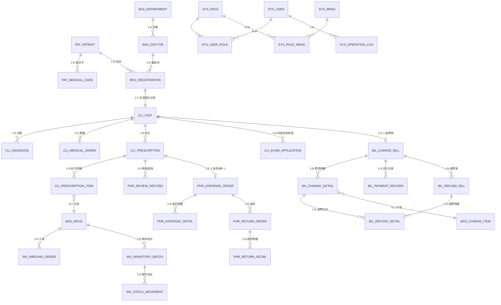

# 02 数据库设计

版本：V1.0 ｜ 数据库：MySQL 8.0 / InnoDB / utf8mb4_general_ci ｜ 依据：《医院信息系统技术指导文档》§4.3

## 1. 设计规范

1. **命名**：表名小写下划线，模块前缀区分归属：`sys_`（权限审计）、`bas_`（基础资料）、`pat_`（患者中心）、`reg_`（挂号就诊）、`cli_`（医生工作站）、`bil_`（收费结算）、`phr_`（药房审核发药退药）、`inv_`（库存）。
2. **公共字段**（指导文档 §4.3 强制）：**所有业务表**统一包含下表字段，后续各表定义不再重复。`sys_operation_log`、`sys_login_log` 为 append-only 审计表，不含 version/status（见 §8）。

| 字段 | 类型 | 约束 | 说明 |
|---|---|---|---|
| id | BIGINT UNSIGNED | PK, AUTO_INCREMENT | 主键 |
| created_by | BIGINT UNSIGNED | NOT NULL | 创建人（sys_user.id），系统动作填 0 |
| created_at | DATETIME | NOT NULL, DEFAULT CURRENT_TIMESTAMP | 创建时间 |
| updated_at | DATETIME | NOT NULL, DEFAULT CURRENT_TIMESTAMP ON UPDATE CURRENT_TIMESTAMP | 更新时间 |
| status | TINYINT | NOT NULL | 业务状态（各表状态字典见 §3） |
| version | INT | NOT NULL, DEFAULT 0 | 乐观锁版本号（MyBatis-Plus @Version） |

3. **类型约定**：金额 `DECIMAL(10,2)`，库存/费用数量 `DECIMAL(12,2)`（默认按整包装，预留拆零）；禁止 FLOAT/DOUBLE；单据号 `VARCHAR(32)`；加密字段 `VARCHAR(256)`；文本 `TEXT`。
4. **字典/快照原则**：处方明细、费用明细对药品名/规格/单价、收费项目名/单价做**快照冗余**，保证历史单据不随字典调价而变。
5. **主数据删除策略**：基础资料（科室/医生/药品/收费项目/用户）不物理删除，`status=0` 停用；被业务引用的记录停用后仅不可新增选用。
6. **外键**：不建物理外键（性能与迁移考虑），引用完整性由应用层校验 + 关键唯一索引保障；ER 关系见 §2。
7. **迁移**：Flyway 脚本 `V1__init_schema.sql`（全部表）、`V2__init_data.sql`（菜单/角色/管理员/演示数据，见 §9），此后任何库变更必须新增版本脚本。

## 2. ER 图（核心业务域）

## 3. 状态字典（全库统一取值）

| 表 | status 取值 |
|---|---|
| bas_* / sys_user / sys_role / sys_menu | 1 启用 ｜ 0 停用 |
| pat_medical_card | 1 正常 ｜ 2 挂失 ｜ 3 注销 |
| reg_registration | 10 已挂号 ｜ 20 已退号 ｜ 30 已就诊 ｜ 40 已过号 |
| cli_visit | 10 候诊 ｜ 20 接诊中 ｜ 30 已完成 ｜ 40 已取消 |
| cli_medical_order | 1 有效 ｜ 0 已停止 |
| cli_prescription | 10 待审核 ｜ 20 审核通过 ｜ 30 已发药 ｜ 40 审核驳回 ｜ 50 已作废 |
| cli_exam_application | 10 已申请 ｜ 20 已收费 ｜ 50 已作废 |
| bil_charge_bill | 10 已支付 ｜ 20 部分退费 ｜ 30 全额退费 |
| bil_refund_bill | 10 已退费 ｜ 20 已驳回（退费即时生效，驳回仅留痕） |
| bil_daily_settlement | 1 已日结 |
| phr_return_order | 10 已退药 ｜ 20 已驳回 |
| inv_inbound_order | 1 已入库 |
| inv_inventory_batch | 1 可用 ｜ 2 已冻结 ｜ 3 已过期 ｜ 4 已用尽 |
| cli_prescription.charge_status / reg_registration.charge_status / cli_exam_application.charge_status | 0 未收费 ｜ 1 已收费 |

## 4. 基础资料模块（bas_）

### 4.1 bas_organization 组织机构

| 字段 | 类型 | 约束 | 说明 |
|---|---|---|---|
| org_code | VARCHAR(32) | NOT NULL, UNIQUE | 机构编码 |
| org_name | VARCHAR(64) | NOT NULL | 机构名称 |
| address | VARCHAR(128) | | 地址 |
| phone | VARCHAR(20) | | 联系电话 |

索引：`uk_org_code(org_code)`

### 4.2 bas_department 科室

| 字段 | 类型 | 约束 | 说明 |
|---|---|---|---|
| org_id | BIGINT UNSIGNED | NOT NULL | 所属机构 |
| dept_code | VARCHAR(32) | NOT NULL, UNIQUE | 科室编码 |
| dept_name | VARCHAR(64) | NOT NULL | 科室名称（如 内科、儿科、药房、收费处） |
| dept_type | TINYINT | NOT NULL | 1 临床科室 ｜ 2 医技科室 ｜ 3 药房 ｜ 4 收费挂号 |
| location | VARCHAR(64) | | 位置（楼层/诊区），挂号小票显示用 |

索引：`uk_dept_code(dept_code)`，`idx_dept_type(dept_type, status)`

### 4.3 bas_doctor 医生

| 字段 | 类型 | 约束 | 说明 |
|---|---|---|---|
| user_id | BIGINT UNSIGNED | NOT NULL, UNIQUE | 关联登录账号（sys_user.id），1:1 |
| dept_id | BIGINT UNSIGNED | NOT NULL | 所属临床科室 |
| doctor_code | VARCHAR(32) | NOT NULL, UNIQUE | 工号 |
| doctor_name | VARCHAR(32) | NOT NULL | 姓名（冗余自 sys_user.real_name） |
| title | VARCHAR(32) | NOT NULL | 职称：主任医师/副主任医师/主治医师/住院医师 |
| is_expert | TINYINT | NOT NULL, DEFAULT 0 | 1 专家号 ｜ 0 普通号 |
| normal_fee | DECIMAL(10,2) | NOT NULL | 普通号挂号费（快照进挂号单） |
| expert_fee | DECIMAL(10,2) | NOT NULL | 专家号挂号费 |
| daily_quota | INT | NOT NULL, DEFAULT 40 | 每日上午/下午各限挂数（号源控制） |

索引：`uk_doctor_code(doctor_code)`，`uk_doctor_user(user_id)`，`idx_doctor_dept(dept_id, status)`

> 号源说明：一期不做排班表，号源 = `daily_quota` 按日期+时段计数控制（见《05》规则 R2）；排班为二期扩展。

### 4.4 bas_drug 药品

| 字段 | 类型 | 约束 | 说明 |
|---|---|---|---|
| drug_code | VARCHAR(32) | NOT NULL, UNIQUE | 药品编码 |
| drug_name | VARCHAR(64) | NOT NULL | 商品名/名称 |
| generic_name | VARCHAR(64) | | 通用名 |
| spec | VARCHAR(64) | NOT NULL | 规格，如 `0.25g×24粒` |
| dosage_form | VARCHAR(32) | | 剂型（胶囊/片剂/颗粒/注射液） |
| category | TINYINT | NOT NULL | 1 西药 ｜ 2 中成药 ｜ 3 中药饮片 |
| manufacturer | VARCHAR(64) | | 生产厂家 |
| unit | VARCHAR(16) | NOT NULL | 最小发药单位（盒/瓶/支） |
| retail_price | DECIMAL(10,2) | NOT NULL | 零售价（开方快照） |
| stock_warning_qty | DECIMAL(12,2) | NOT NULL, DEFAULT 0 | 库存预警下限 |
| is_antibiotic | TINYINT | DEFAULT 0 | 1 抗菌药物（提示用，不做限制） |

索引：`uk_drug_code(drug_code)`，`idx_drug_name(drug_name)`，`idx_drug_category(category, status)`

### 4.5 bas_charge_item 收费项目

| 字段 | 类型 | 约束 | 说明 |
|---|---|---|---|
| item_code | VARCHAR(32) | NOT NULL, UNIQUE | 项目编码 |
| item_name | VARCHAR(64) | NOT NULL | 项目名称（如 普通门诊诊查费、血常规、胸部DR） |
| category | TINYINT | NOT NULL | 1 挂号费 ｜ 2 诊查费 ｜ 3 检查费 ｜ 4 检验费 ｜ 5 治疗费 ｜ 6 材料费 ｜ 7 药品费 |
| price | DECIMAL(10,2) | NOT NULL | 单价（计费快照） |
| unit | VARCHAR(16) | NOT NULL, DEFAULT '次' | 计价单位 |

索引：`uk_item_code(item_code)`，`idx_item_category(category, status)`

## 5. 患者中心模块（pat_）

### 5.1 pat_patient 患者档案

| 字段 | 类型 | 约束 | 说明 |
|---|---|---|---|
| patient_no | VARCHAR(32) | NOT NULL, UNIQUE | 建档号（前缀 P） |
| name | VARCHAR(32) | NOT NULL | 姓名 |
| gender | TINYINT | NOT NULL | 1 男 ｜ 2 女 |
| birth_date | DATE | | 出生日期 |
| id_card_no | VARCHAR(256) | NOT NULL | 身份证号，AES-256-GCM 密文 |
| id_card_hash | CHAR(64) | NOT NULL, UNIQUE | 身份证号 SHA-256 摘要，用于唯一建档校验与检索 |
| phone | VARCHAR(20) | NOT NULL | 联系电话（展示层脱敏） |
| address | VARCHAR(128) | | 联系地址 |
| allergy_history | TEXT | | 过敏史 |
| past_history | TEXT | | 既往史 |

索引：`uk_patient_no(patient_no)`，`uk_id_card_hash(id_card_hash)`，`idx_patient_name(name)`

> 重复建档防护：同身份证（id_card_hash 相同）建档被拒（B1001），返回已有患者信息供确认。

### 5.2 pat_medical_card 就诊卡

| 字段 | 类型 | 约束 | 说明 |
|---|---|---|---|
| patient_id | BIGINT UNSIGNED | NOT NULL | 所属患者 |
| card_no | VARCHAR(32) | NOT NULL, UNIQUE | 卡号 |
| card_type | TINYINT | NOT NULL, DEFAULT 1 | 1 实体卡 ｜ 2 电子卡 |

索引：`uk_card_no(card_no)`，`idx_card_patient(patient_id)`

## 6. 挂号就诊模块（reg_）+ 医生工作站模块（cli_）

### 6.1 reg_registration 挂号单

| 字段 | 类型 | 约束 | 说明 |
|---|---|---|---|
| reg_no | VARCHAR(32) | NOT NULL, UNIQUE | 挂号单号（前缀 GH） |
| patient_id | BIGINT UNSIGNED | NOT NULL | 患者 |
| card_no | VARCHAR(32) | | 就诊卡号（快照显示用） |
| dept_id | BIGINT UNSIGNED | NOT NULL | 科室 |
| doctor_id | BIGINT UNSIGNED | NOT NULL | 医生 |
| reg_date | DATE | NOT NULL | 就诊日期 |
| period | TINYINT | NOT NULL | 1 上午 ｜ 2 下午 |
| reg_type | TINYINT | NOT NULL | 1 普通 ｜ 2 专家 |
| reg_fee | DECIMAL(10,2) | NOT NULL | 挂号费（开单时从医生快照） |
| consultation_fee | DECIMAL(10,2) | NOT NULL | 诊查费（快照自收费项目字典） |
| queue_no | INT | NOT NULL | 当日该医生时段排队号 |
| charge_status | TINYINT | NOT NULL, DEFAULT 0 | 挂号费+诊查费 0 未收费 ｜ 1 已收费（由收费模块联动更新） |

索引：`uk_reg_no(reg_no)`，`idx_reg_patient(patient_id, reg_date)`，`idx_reg_queue(doctor_id, reg_date, period, status, queue_no)`

> 防重复挂号不用数据库唯一索引：退号后患者需可重新挂号，唯一性由应用层"存在有效挂号(状态=10)则拒绝（B1002）"+ 幂等键保障（见《05》规则 R1）。

### 6.2 cli_visit 就诊记录（与挂号单 1:1）

| 字段 | 类型 | 约束 | 说明 |
|---|---|---|---|
| visit_no | VARCHAR(32) | NOT NULL, UNIQUE | 就诊号（前缀 JZ） |
| registration_id | BIGINT UNSIGNED | NOT NULL, UNIQUE | 来源挂号单 |
| patient_id | BIGINT UNSIGNED | NOT NULL | 患者（冗余，病历引用） |
| doctor_id | BIGINT UNSIGNED | NOT NULL | 接诊医生 |
| dept_id | BIGINT UNSIGNED | NOT NULL | 科室（冗余） |
| visit_date | DATE | NOT NULL | 就诊日期 |
| chief_complaint | VARCHAR(512) | | 主诉 |
| present_illness | TEXT | | 现病史 |
| physical_exam | VARCHAR(512) | | 体格检查 |
| advice | VARCHAR(512) | | 处理意见 |
| start_time | DATETIME | | 接诊时间 |
| end_time | DATETIME | | 完成（提交病历）时间 |

索引：`uk_visit_no(visit_no)`，`uk_visit_reg(registration_id)`，`idx_visit_doctor(doctor_id, visit_date, status)`，`idx_visit_patient(patient_id)`

> 病历"未保存"防护：接诊中（20）允许暂存；完成后（30）所有编辑接口拒绝（B2001）。

### 6.3 cli_diagnosis 诊断

| 字段 | 类型 | 约束 | 说明 |
|---|---|---|---|
| visit_id | BIGINT UNSIGNED | NOT NULL | 所属就诊 |
| diagnosis_code | VARCHAR(16) | | ICD-10 编码（一期可空，二期接字典） |
| diagnosis_name | VARCHAR(64) | NOT NULL | 诊断名称 |
| diagnosis_type | TINYINT | NOT NULL, DEFAULT 2 | 1 主诊断 ｜ 2 次诊断 |

索引：`idx_diag_visit(visit_id)`

### 6.4 cli_medical_order 医嘱（文字医嘱）

| 字段 | 类型 | 约束 | 说明 |
|---|---|---|---|
| visit_id | BIGINT UNSIGNED | NOT NULL | 所属就诊 |
| order_type | TINYINT | NOT NULL | 1 用药指导 ｜ 2 治疗 ｜ 3 复诊建议 ｜ 9 其他 |
| content | VARCHAR(512) | NOT NULL | 医嘱内容 |

索引：`idx_order_visit(visit_id)`

### 6.5 cli_prescription 处方（主表）

| 字段 | 类型 | 约束 | 说明 |
|---|---|---|---|
| rx_no | VARCHAR(32) | NOT NULL, UNIQUE | 处方号（前缀 CF） |
| visit_id | BIGINT UNSIGNED | NOT NULL | 所属就诊 |
| patient_id | BIGINT UNSIGNED | NOT NULL | 患者（冗余） |
| doctor_id | BIGINT UNSIGNED | NOT NULL | 开方医生 |
| dept_id | BIGINT UNSIGNED | NOT NULL | 科室（冗余） |
| rx_type | TINYINT | NOT NULL, DEFAULT 1 | 1 普通处方（麻醉/精一处方二期） |
| total_amount | DECIMAL(10,2) | NOT NULL | 处方总金额（后端按明细重算） |
| charge_status | TINYINT | NOT NULL, DEFAULT 0 | 0 未收费 ｜ 1 已收费（收费模块联动） |
| review_by | BIGINT UNSIGNED | | 审核药师 user_id（冗余自审核记录） |
| review_at | DATETIME | | 审核时间 |
| review_comment | VARCHAR(256) | | 审核意见/驳回原因 |
| void_reason | VARCHAR(256) | | 作废原因（退费/退药联动作废时记录） |

索引：`uk_rx_no(rx_no)`，`idx_rx_visit(visit_id)`，`idx_rx_review(status, charge_status)`（药房工作队列），`idx_rx_patient(patient_id)`

### 6.6 cli_prescription_item 处方明细

| 字段 | 类型 | 约束 | 说明 |
|---|---|---|---|
| prescription_id | BIGINT UNSIGNED | NOT NULL | 所属处方 |
| drug_id | BIGINT UNSIGNED | NOT NULL | 药品 |
| drug_name | VARCHAR(64) | NOT NULL | 药品名快照 |
| spec | VARCHAR(64) | NOT NULL | 规格快照 |
| dosage | VARCHAR(32) | NOT NULL | 单次剂量，如 `0.25g` |
| frequency | VARCHAR(16) | NOT NULL | 频次：qd/bid/tid/qid/prn |
| usage_route | VARCHAR(16) | NOT NULL | 用法：口服/静滴/肌注/外用 |
| days | INT | NOT NULL | 用药天数 |
| quantity | DECIMAL(12,2) | NOT NULL | 数量（默认整包装） |
| unit | VARCHAR(16) | NOT NULL | 单位快照 |
| unit_price | DECIMAL(10,2) | NOT NULL | 单价快照 |
| amount | DECIMAL(10,2) | NOT NULL | 金额 = quantity × unit_price（后端计算） |
| usage_note | VARCHAR(128) | | 用药嘱托 |

索引：`idx_rxi_prescription(prescription_id)`，`idx_rxi_drug(drug_id)`

### 6.7 cli_exam_application 检查/检验申请

| 字段 | 类型 | 约束 | 说明 |
|---|---|---|---|
| apply_no | VARCHAR(32) | NOT NULL, UNIQUE | 申请单号（前缀 SQ） |
| visit_id | BIGINT UNSIGNED | NOT NULL | 所属就诊 |
| patient_id | BIGINT UNSIGNED | NOT NULL | 患者（冗余） |
| doctor_id | BIGINT UNSIGNED | NOT NULL | 申请医生 |
| charge_item_id | BIGINT UNSIGNED | NOT NULL | 引用收费项目字典（类别=检查/检验） |
| apply_type | TINYINT | NOT NULL | 1 检查 ｜ 2 检验 |
| requirement | VARCHAR(256) | | 临床要求/备注 |
| price | DECIMAL(10,2) | NOT NULL | 单价快照 |
| charge_status | TINYINT | NOT NULL, DEFAULT 0 | 0 未收费 ｜ 1 已收费（收费模块联动） |

索引：`uk_apply_no(apply_no)`，`idx_apply_visit(visit_id)`

> 一期只到"申请+收费"，检查执行/报告回传为二期（与检验影像对接）。

## 7. 收费结算模块（bil_）

### 7.1 bil_charge_bill 收费单（每就诊一张，收费时生成）

| 字段 | 类型 | 约束 | 说明 |
|---|---|---|---|
| bill_no | VARCHAR(32) | NOT NULL, UNIQUE | 收费单号（前缀 SF） |
| visit_id | BIGINT UNSIGNED | NOT NULL, UNIQUE | 所属就诊 |
| patient_id | BIGINT UNSIGNED | NOT NULL | 患者（冗余） |
| total_amount | DECIMAL(10,2) | NOT NULL | 费用合计 |
| discount_amount | DECIMAL(10,2) | NOT NULL, DEFAULT 0 | 优惠（一期恒 0，字段预留） |
| payable_amount | DECIMAL(10,2) | NOT NULL | 应收 = total - discount |
| paid_amount | DECIMAL(10,2) | NOT NULL, DEFAULT 0 | 已收金额 |
| refund_amount | DECIMAL(10,2) | NOT NULL, DEFAULT 0 | 累计退费 |
| pay_method | TINYINT | NOT NULL | 1 现金 ｜ 2 银行卡 ｜ 3 微信 ｜ 4 支付宝（一期全部模拟支付） |
| pay_time | DATETIME | NOT NULL | 支付完成时间 |
| cashier_id | BIGINT UNSIGNED | NOT NULL | 收费员 user_id |

索引：`uk_bill_no(bill_no)`，`uk_bill_visit(visit_id)`，`idx_bill_patient(patient_id)`，`idx_bill_paytime(pay_time)`（日结/报表）

> 一期一次全额收费（部分支付不做）；退费走退费单，不改支付记录。

### 7.2 bil_charge_detail 费用明细

| 字段 | 类型 | 约束 | 说明 |
|---|---|---|---|
| bill_id | BIGINT UNSIGNED | NOT NULL | 所属收费单 |
| visit_id | BIGINT UNSIGNED | NOT NULL | 就诊（冗余，报表用） |
| patient_id | BIGINT UNSIGNED | NOT NULL | 患者（冗余） |
| fee_type | TINYINT | NOT NULL | 同 bas_charge_item.category：1 挂号费 2 诊查费 3 检查费 4 检验费 5 治疗费 6 材料费 7 药品费 |
| source_type | TINYINT | NOT NULL | 1 挂号单 ｜ 2 处方明细 ｜ 3 检查申请 |
| source_detail_id | BIGINT UNSIGNED | NOT NULL | 来源行 ID（registration_id / prescription_item_id / exam_application.id） |
| item_name | VARCHAR(64) | NOT NULL | 项目名快照 |
| quantity | DECIMAL(12,2) | NOT NULL | 数量 |
| unit_price | DECIMAL(10,2) | NOT NULL | 单价快照 |
| amount | DECIMAL(10,2) | NOT NULL | 金额 |
| refund_status | TINYINT | NOT NULL, DEFAULT 0 | 0 未退 ｜ 1 部分退 ｜ 2 全退 |

索引：`idx_cd_bill(bill_id)`，`idx_cd_source(source_type, source_detail_id)`，`idx_cd_paytime_visit(visit_id, fee_type)`

> 收费明细由后端实时汇总生成：挂号单（未收费）→ 挂号费+诊查费两行；处方明细（未收费）→ 每药品一行；检查申请（未收费）→ 每申请一行。

### 7.3 bil_payment_record 支付记录

| 字段 | 类型 | 约束 | 说明 |
|---|---|---|---|
| bill_id | BIGINT UNSIGNED | NOT NULL | 所属收费单 |
| pay_no | VARCHAR(32) | NOT NULL, UNIQUE | 支付流水号 |
| pay_method | TINYINT | NOT NULL | 同收费单 |
| amount | DECIMAL(10,2) | NOT NULL | 支付金额 |
| transaction_id | VARCHAR(64) | | 第三方流水号（一期模拟生成） |
| pay_status | TINYINT | NOT NULL, DEFAULT 1 | 1 成功 ｜ 2 失败（失败留痕） |
| pay_time | DATETIME | NOT NULL | 支付时间 |
| cashier_id | BIGINT UNSIGNED | NOT NULL | 收费员 |

索引：`uk_pay_no(pay_no)`，`idx_pay_bill(bill_id)`

### 7.4 bil_refund_bill 退费单

| 字段 | 类型 | 约束 | 说明 |
|---|---|---|---|
| refund_no | VARCHAR(32) | NOT NULL, UNIQUE | 退费单号（前缀 TF） |
| bill_id | BIGINT UNSIGNED | NOT NULL | 原收费单 |
| visit_id | BIGINT UNSIGNED | NOT NULL | 就诊（冗余） |
| patient_id | BIGINT UNSIGNED | NOT NULL | 患者（冗余） |
| refund_amount | DECIMAL(10,2) | NOT NULL | 退费金额（≤原单可退） |
| reason | VARCHAR(256) | NOT NULL | 退费原因 |
| refund_method | TINYINT | NOT NULL | 1 现金 ｜ 2 原路退回（一期模拟原路） |
| refund_time | DATETIME | NOT NULL | 退费时间 |
| operator_id | BIGINT UNSIGNED | NOT NULL | 操作收费员 |

索引：`uk_refund_no(refund_no)`，`idx_refund_bill(bill_id)`，`idx_refund_time(refund_time)`

### 7.5 bil_refund_detail 退费明细

| 字段 | 类型 | 约束 | 说明 |
|---|---|---|---|
| refund_bill_id | BIGINT UNSIGNED | NOT NULL | 所属退费单 |
| charge_detail_id | BIGINT UNSIGNED | NOT NULL | 原费用明细 |
| refund_quantity | DECIMAL(12,2) | NOT NULL | 退数量 |
| refund_amount | DECIMAL(10,2) | NOT NULL | 退金额 |

索引：`idx_rd_refund(refund_bill_id)`，`idx_rd_charge_detail(charge_detail_id)`

### 7.6 bil_daily_settlement 日结

| 字段 | 类型 | 约束 | 说明 |
|---|---|---|---|
| settlement_no | VARCHAR(32) | NOT NULL, UNIQUE | 日结单号（前缀 RJ） |
| settle_date | DATE | NOT NULL | 日结日期 |
| cashier_id | BIGINT UNSIGNED | NOT NULL | 收费员（个人日结；全院日结=各人日结汇总查询） |
| bill_count | INT | NOT NULL | 收费单数 |
| refund_count | INT | NOT NULL | 退费单数 |
| total_charge_amount | DECIMAL(12,2) | NOT NULL | 收费合计 |
| total_refund_amount | DECIMAL(12,2) | NOT NULL | 退费合计 |
| net_amount | DECIMAL(12,2) | NOT NULL | 净收入 |

索引：`uk_settle_no(settlement_no)`，`uk_settle_date_cashier(settle_date, cashier_id)`

> 日结金额必须可由明细复核：报表按 `bil_charge_bill.pay_time`/`bil_refund_bill.refund_time` 落在 settle_date 的记录重算比对（《05》规则 R12）。

## 8. 药房库存模块（phr_ / inv_）

### 8.1 phr_review_record 处方审核记录（留痕表，处方主表冗余最新状态）

| 字段 | 类型 | 约束 | 说明 |
|---|---|---|---|
| prescription_id | BIGINT UNSIGNED | NOT NULL | 处方 |
| reviewer_id | BIGINT UNSIGNED | NOT NULL | 审核药师 |
| review_action | TINYINT | NOT NULL | 1 通过 ｜ 2 驳回 |
| comment | VARCHAR(256) | | 审核意见 |

索引：`idx_review_rx(prescription_id)`

### 8.2 phr_dispense_order 发药单（处方 1:0..1，防重复发药核心约束）

| 字段 | 类型 | 约束 | 说明 |
|---|---|---|---|
| dispense_no | VARCHAR(32) | NOT NULL, UNIQUE | 发药单号（前缀 FY） |
| prescription_id | BIGINT UNSIGNED | NOT NULL, **UNIQUE** | 处方（唯一索引 = 一处方只能发一次药） |
| patient_id | BIGINT UNSIGNED | NOT NULL | 患者（冗余） |
| dispenser_id | BIGINT UNSIGNED | NOT NULL | 发药药师 |
| total_quantity | DECIMAL(12,2) | NOT NULL | 发药总数量 |
| dispense_time | DATETIME | NOT NULL | 发药时间 |

索引：`uk_dispense_no(dispense_no)`，`uk_dispense_rx(prescription_id)`，`idx_dispense_time(dispense_time)`

### 8.3 phr_dispense_detail 发药明细（支持拆批发药）

| 字段 | 类型 | 约束 | 说明 |
|---|---|---|---|
| dispense_order_id | BIGINT UNSIGNED | NOT NULL | 所属发药单 |
| prescription_item_id | BIGINT UNSIGNED | NOT NULL | 处方明细行 |
| drug_id | BIGINT UNSIGNED | NOT NULL | 药品 |
| batch_id | BIGINT UNSIGNED | NOT NULL | 发放库存批次（FEFO 选取） |
| quantity | DECIMAL(12,2) | NOT NULL | 本批发放数量 |

索引：`idx_dd_dispense(dispense_order_id)`，`idx_dd_batch(batch_id)`

### 8.4 phr_return_order 退药单（一期整方退药）

| 字段 | 类型 | 约束 | 说明 |
|---|---|---|---|
| return_no | VARCHAR(32) | NOT NULL, UNIQUE | 退药单号（前缀 TY） |
| dispense_order_id | BIGINT UNSIGNED | NOT NULL | 原发药单 |
| prescription_id | BIGINT UNSIGNED | NOT NULL | 处方（冗余） |
| patient_id | BIGINT UNSIGNED | NOT NULL | 患者（冗余） |
| reason | VARCHAR(256) | NOT NULL | 退药原因 |
| return_time | DATETIME | NOT NULL | 退药时间 |
| operator_id | BIGINT UNSIGNED | NOT NULL | 操作药师 |

索引：`uk_return_no(return_no)`，`idx_return_dispense(dispense_order_id)`

### 8.5 phr_return_detail 退药明细

| 字段 | 类型 | 约束 | 说明 |
|---|---|---|---|
| return_order_id | BIGINT UNSIGNED | NOT NULL | 所属退药单 |
| prescription_item_id | BIGINT UNSIGNED | NOT NULL | 原处方明细行 |
| drug_id | BIGINT UNSIGNED | NOT NULL | 药品 |
| batch_id | BIGINT UNSIGNED | NOT NULL | 退回批次 |
| quantity | DECIMAL(12,2) | NOT NULL | 退回数量 |

索引：`idx_rtd_return(return_order_id)`

### 8.6 inv_inbound_order 入库单（一品一行，简化入库）

| 字段 | 类型 | 约束 | 说明 |
|---|---|---|---|
| inbound_no | VARCHAR(32) | NOT NULL, UNIQUE | 入库单号（前缀 RK） |
| drug_id | BIGINT UNSIGNED | NOT NULL | 药品 |
| batch_no | VARCHAR(32) | NOT NULL | 生产批号 |
| expiry_date | DATE | NOT NULL | 失效日期 |
| quantity | DECIMAL(12,2) | NOT NULL | 入库数量（>0） |
| unit_price | DECIMAL(10,2) | | 采购单价（成本参考） |
| supplier | VARCHAR(64) | | 供应商 |
| operator_id | BIGINT UNSIGNED | NOT NULL | 入库操作人 |

索引：`uk_inbound_no(inbound_no)`，`idx_inbound_drug(drug_id)`

### 8.7 inv_inventory_batch 库存批次

| 字段 | 类型 | 约束 | 说明 |
|---|---|---|---|
| drug_id | BIGINT UNSIGNED | NOT NULL | 药品 |
| batch_no | VARCHAR(32) | NOT NULL | 生产批号 |
| expiry_date | DATE | NOT NULL | 失效日期 |
| quantity | DECIMAL(12,2) | NOT NULL | 当前可用数量（≥0 条件更新保障） |
| initial_quantity | DECIMAL(12,2) | NOT NULL | 初始数量（核对用） |

约束：`uk_batch(drug_id, batch_no)`；索引：`idx_batch_pick(drug_id, status, expiry_date)`（FEFO 拣批）

> 入库时同 (drug_id, batch_no) 已存在则累加数量（乐观锁更新）；每晚定时任务将 `expiry_date <= CURDATE()` 的批次置为已过期（3）。

### 8.8 inv_stock_movement 库存流水（append-only 业务流水，含公共字段中的 created_by 作操作人）

| 字段 | 类型 | 约束 | 说明 |
|---|---|---|---|
| drug_id | BIGINT UNSIGNED | NOT NULL | 药品 |
| batch_id | BIGINT UNSIGNED | NOT NULL | 批次 |
| movement_type | TINYINT | NOT NULL | 1 入库 ｜ 2 发药出库 ｜ 3 退药入库 ｜ 4 盘点调整 ｜ 5 过期核销 |
| quantity | DECIMAL(12,2) | NOT NULL | 变动数量（带符号） |
| before_qty | DECIMAL(12,2) | NOT NULL | 变动前 |
| after_qty | DECIMAL(12,2) | NOT NULL | 变动后 |
| ref_type | TINYINT | NOT NULL | 1 入库单 ｜ 2 发药单 ｜ 3 退药单 ｜ 4 盘点单 |
| ref_no | VARCHAR(32) | NOT NULL | 关联单号 |

索引：`idx_mv_drug(drug_id, created_at)`，`idx_mv_ref(ref_type, ref_no)`

## 9. 权限审计模块（sys_）

### 9.1 sys_user 用户

| 字段 | 类型 | 约束 | 说明 |
|---|---|---|---|
| username | VARCHAR(32) | NOT NULL, UNIQUE | 登录名 |
| password_hash | VARCHAR(72) | NOT NULL | BCrypt 散列（禁止明文，§7） |
| real_name | VARCHAR(32) | NOT NULL | 姓名 |
| phone | VARCHAR(20) | | 联系电话 |
| last_login_at | DATETIME | | 最后登录时间 |

索引：`uk_user_username(username)`

### 9.2 sys_role 角色

| 字段 | 类型 | 约束 | 说明 |
|---|---|---|---|
| role_code | VARCHAR(32) | NOT NULL, UNIQUE | 角色编码：ADMIN / DOCTOR / CASHIER / PHARMACIST / AUDITOR |
| role_name | VARCHAR(32) | NOT NULL | 管理员/医生/收费员/药师/对账员 |
| description | VARCHAR(128) | | 说明 |

### 9.3 sys_menu 菜单与权限点

| 字段 | 类型 | 约束 | 说明 |
|---|---|---|---|
| parent_id | BIGINT UNSIGNED | NOT NULL, DEFAULT 0 | 父级 |
| menu_name | VARCHAR(32) | NOT NULL | 名称 |
| menu_type | TINYINT | NOT NULL | 1 目录 ｜ 2 菜单 ｜ 3 按钮/接口权限点 |
| permission_code | VARCHAR(64) | | 权限码，如 `billing:refund:create`（权限点必填，唯一） |
| path | VARCHAR(128) | | 前端路由（菜单类） |
| component | VARCHAR(128) | | 前端组件路径（菜单类） |
| sort_no | INT | NOT NULL, DEFAULT 0 | 排序 |

索引：`uk_perm_code(permission_code)`

### 9.4 sys_user_role / 9.5 sys_role_menu 关联表

`user_id + role_id` 联合唯一；`role_id + menu_id` 联合唯一。无其他字段。

### 9.6 sys_operation_log 操作日志（append-only）

| 字段 | 类型 | 约束 | 说明 |
|---|---|---|---|
| trace_id | VARCHAR(32) | NOT NULL | 链路追踪 ID |
| user_id | BIGINT UNSIGNED | NOT NULL | 操作人 |
| username | VARCHAR(32) | NOT NULL | 登录名（冗余防用户删除后失联） |
| module | VARCHAR(32) | NOT NULL | 模块（如 billing） |
| action | VARCHAR(64) | NOT NULL | 动作（如 收费） |
| biz_type | VARCHAR(32) | | 业务类型（如 charge_bill） |
| biz_id | VARCHAR(32) | | 业务单号 |
| method | VARCHAR(128) | | 请求方法（类#方法 或 HTTP method+path） |
| params_json | TEXT | | 请求参数（身份证/手机号/密码脱敏后） |
| result_code | VARCHAR(16) | NOT NULL | 结果码（OK/A0001/…） |
| ip | VARCHAR(64) | | 客户端 IP |
| user_agent | VARCHAR(256) | | UA |
| cost_ms | INT | | 耗时 |

索引：`idx_oplog_user(user_id, created_at)`，`idx_oplog_biz(biz_type, biz_id)`，`idx_oplog_module(module, created_at)`

### 9.7 sys_login_log 登录日志（append-only）

`username, ip, user_agent, success TINYINT, message VARCHAR(128)`，索引 `(username, created_at)`。

## 10. 种子数据与演示集（V2__init_data.sql）

| 类别 | 内容 |
|---|---|
| 菜单/权限点 | 8 个模块菜单 + 全部权限码（清单见《04 权限与安全设计》§2） |
| 角色 | 5 个内置角色并绑定权限码 |
| 用户 | admin（管理员）、dr.wang（内科主任医师·专家）、dr.li（内科主治）、dr.chen（儿科主治）、cashier.li（收费员）、pharm.zhao（药师）、auditor.sun（对账员）；初始密码统一 `His@2026`，首登强制修改（一期提示） |
| 机构/科室 | 示例医院；内科、外科、儿科、药房、收费处 |
| 收费项目 | 普通门诊诊查费 ¥10.00、专家门诊诊查费 ¥20.00、血常规 ¥25.00、尿常规 ¥15.00、胸部DR ¥120.00 |
| 药品 | 阿莫西林胶囊 0.25g×24粒 ¥15.60、布洛芬缓释胶囊 0.3g×20粒 ¥22.00、感冒灵颗粒 10g×9袋 ¥12.50、奥美拉唑肠溶胶囊 20mg×14粒 ¥28.00、开喉剑喷雾剂 ¥32.00；并为每种药品入库 1 个批次（批号 20260601、效期 2027-06-30、数量 1000），其中"感冒灵颗粒"库存设为 20 以演示库存预警 |
| 演示患者 | 张三（男 1990-01-01）、李四（女 1985-05-20，青霉素过敏史），身份证为测试假号 |

> 演示集仅用于测试/教学环境；生产初始化脚本不含演示患者与演示业务数据（Flyway location 分 `classpath:db/migration` 与 `db/demo` 两个目录，prod 不加载后者）。
