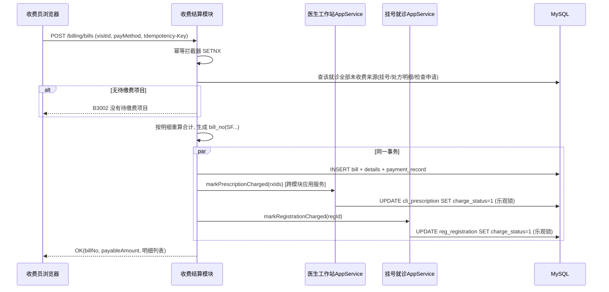
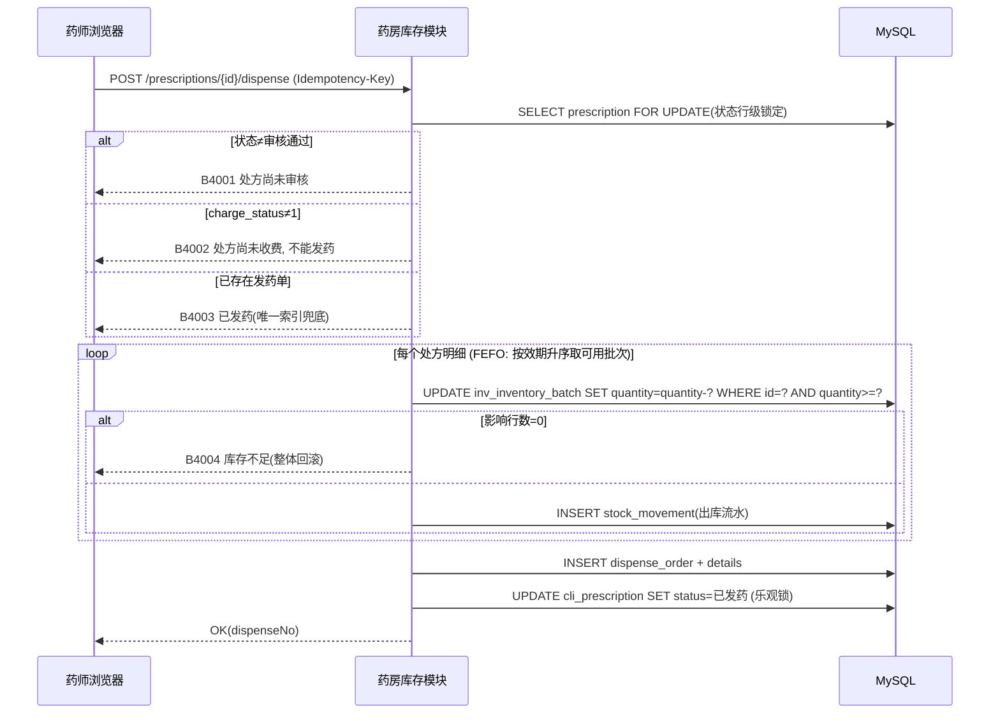
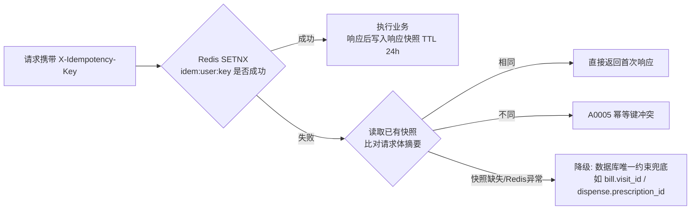

# 03 接口设计

版本：V1.0 ｜ 风格：REST/JSON ｜ 依据：《医院信息系统技术指导文档》§4.1、§5、§7

每个接口编码实现前按本清单核对四要素：**权限码、参数校验、幂等标记、错误码**（指导文档 §5.4）。

## 1. 全局约定

### 1.1 基本约定

| 项 | 约定 |
|---|---|
| Base URL | `/api/v1` |
| 认证 | 除 `/auth/login` 外全部需要请求头 `Authorization: Bearer {jwt}` |
| 幂等头 | 提交类接口（下表"幂等"列 = ✔）必须携带 `X-Idempotency-Key: {UUID}`，缺失返回 A0004 |
| 统一响应 | `{"code":"OK","message":"成功","data":{...},"traceId":"..."}`；`code="OK"` 表示成功，其余见错误码表 |
| HTTP 状态码 | 200 成功；400 参数/业务校验类；401 未登录/会话失效；403 无权限；500 系统异常。业务错误码在响应体 `code` 中细化 |
| 分页请求 | `?pageNum=1&pageSize=20`（pageSize 上限 200，超限按 200） |
| 分页响应 | `data: { "total": 123, "list": [...] }` |
| 时间格式 | `yyyy-MM-dd HH:mm:ss`（ISO 日期 `yyyy-MM-dd`） |
| 金额格式 | JSON 字符串（如 `"15.60"`），避免 JS 浮点精度丢失 |
| 排序 | 列表默认 `id DESC`（队列类除外，见各接口说明） |
| 接口文档 | springdoc-openapi 运行时生成 `/v3/api-docs` + Swagger UI（仅 dev/test 环境开放） |

### 1.2 参数校验

- 服务端使用 JSR-303 注解校验，错误逐字段返回中文提示：`data` 中返回 `[{field, message}]`。
- 通用规则：单据号/编码只允许字母数字；姓名 1~32 字；身份证格式与生日合法性校验；金额/数量 > 0；分页参数 ≥1。

## 2. 错误码总表

分段规则：`A` 通用与安全、`B1xxx` 患者与挂号、`B2xxx` 就诊与处方、`B3xxx` 收费结算、`B4xxx` 药房库存、`B5xxx` 基础资料与权限、`C` 系统异常。

| 错误码 | HTTP | message | 触发场景 |
|---|---|---|---|
| OK | 200 | 成功 | — |
| A0001 | 400 | 参数校验失败：{明细} | JSR-303 校验不通过 |
| A0002 | 401 | 未登录或登录已过期 | 无 token / token 失效 / Redis 会话失效 |
| A0003 | 403 | 无权访问该功能 | 权限码校验不通过 / 数据越权 |
| A0004 | 400 | 缺少幂等标识 | 提交类接口未携带 X-Idempotency-Key |
| A0005 | 400 | 幂等键冲突 | 同一幂等键携带了不同请求体 |
| A0006 | 400 | 金额数据不一致 | 前端传值与后端重算不一致 |
| A0007 | 429 | 操作过于频繁 | 登录限流触发 |
| B1001 | 400 | 该身份证已建档 | id_card_hash 重复 |
| B1002 | 400 | 该患者当前时段已有有效挂号，请勿重复挂号 | 重复挂号（规则 R1） |
| B1003 | 400 | 该医生该时段号源已满 | 超出 daily_quota |
| B1004 | 400 | 该挂号单已退号或已就诊，无法退号 | 非法退号 |
| B1005 | 404 | 挂号单不存在 | — |
| B2001 | 400 | 就诊已完成，病历不可修改 | 已完成就诊再编辑 |
| B2002 | 400 | 请先接诊再填写病历 | 状态=候诊时编辑 |
| B2003 | 400 | 病历不完整（主诉/现病史/诊断必填），无法提交 | 提交病历校验 |
| B2004 | 400 | 就诊仍在候诊中，不能开立处方/申请 | — |
| B2005 | 400 | 处方明细不能为空 | — |
| B2006 | 400 | 处方当前状态不允许作废 | 已发药/已驳回不可作废 |
| B2007 | 404 | 就诊记录不存在 | — |
| B3001 | 400 | 该就诊已收费，请勿重复收费 | 收费单 visit_id 唯一冲突 |
| B3002 | 400 | 没有待缴费项目 | 全部已收费 |
| B3003 | 400 | 退费金额超过可退金额 | 退费校验 |
| B3004 | 400 | 该项目已发药/已执行，请先退药 | 对已发药明细直接退费 |
| B3005 | 400 | 已完成就诊的挂号费/诊查费不可退 | 退费范围校验 |
| B3006 | 400 | 该日期已日结，不能再次日结 | 日结唯一约束 |
| B3007 | 404 | 收费单不存在 | — |
| B4001 | 400 | 处方尚未审核，不能发药 | charge 前置校验 |
| B4002 | 400 | 处方尚未收费，不能发药 | 发药前置校验（规则 R7） |
| B4003 | 400 | 该处方已发药，请勿重复发药 | 发药唯一索引兜底 |
| B4004 | 400 | 库存不足：{药品名}，缺口 {数量} | 条件更新影响行数=0 |
| B4005 | 400 | 药品批次已过期，不能发药 | 效期校验 |
| B4006 | 400 | 退药数量超过发药数量 | 整方退药校验 |
| B4007 | 400 | 该处方未发药，无需退药 | 退药前置校验 |
| B4008 | 400 | 处方已被审核或已作废，不能重复审核 | 审核状态校验 |
| B5001 | 400 | 编码已存在 | 基础资料唯一冲突 |
| B5002 | 400 | 该记录已被业务引用，只能停用不能删除 | 主数据删除拦截 |
| B5003 | 400 | 用户名已存在 | — |
| B5004 | 400 | 医生已绑定登录账号 | doctor.user_id 唯一冲突 |
| C9001 | 500 | 系统繁忙，请稍后重试 | 未捕获异常（详情记日志，不外露） |
| C9002 | 500 | 数据访问异常 | DB 异常 |
| C9003 | 503 | 幂等组件不可用，请稍后重试 | Redis 不可用且未降级成功 |

## 3. 接口清单

权限码命名 `{模块}:{资源}:{动作}`，动作取值 `query / create / update / cancel / do / manage`。角色与权限码的完整映射见《04 权限与安全设计》§3 权限矩阵。

### 3.1 认证（/auth）

| 编号 | 方法 | 路径 | 说明 | 权限码 | 幂等 |
|---|---|---|---|---|---|
| A-01 | POST | /auth/login | 登录，返回 token、用户信息、角色、权限码集合 | 匿名（限流） | — |
| A-02 | POST | /auth/logout | 退出，销毁 Redis 会话 | 登录即可 | — |
| A-03 | GET | /auth/me | 当前用户信息 + 权限码 | 登录即可 | — |
| A-04 | GET | /auth/menus | 当前用户菜单树（前端动态路由数据源） | 登录即可 | — |
| A-05 | PUT | /auth/password | 修改本人密码（旧密码校验） | 登录即可 | — |

### 3.2 权限审计模块（/system、/logs）

| 编号 | 方法 | 路径 | 说明 | 权限码 | 幂等 |
|---|---|---|---|---|---|
| S-01 | GET | /system/users | 用户分页查询（按用户名/姓名/角色过滤） | sys:user:query | — |
| S-02 | POST | /system/users | 创建用户（可同时绑定角色；医生须绑定角色 DOCTOR） | sys:user:create | ✔ |
| S-03 | PUT | /system/users/{id} | 修改用户基本信息与角色 | sys:user:update | ✔ |
| S-04 | PUT | /system/users/{id}/status | 启用/禁用（禁用即时踢下线） | sys:user:update | ✔ |
| S-05 | PUT | /system/users/{id}/password/reset | 管理员重置密码 | sys:user:manage | ✔ |
| S-06 | GET | /system/roles | 角色列表 | sys:role:query | — |
| S-07 | POST | /system/roles | 创建角色（内置五角色不可改） | sys:role:manage | ✔ |
| S-08 | PUT | /system/roles/{id}/menus | 配置角色权限（菜单/权限码集合） | sys:role:manage | ✔ |
| S-09 | GET | /system/menus/tree | 全量菜单权限树（配置用） | sys:role:query | — |
| S-10 | GET | /logs/operations | 操作日志分页查询（按人/模块/时间段/单号） | sys:log:query | — |
| S-11 | GET | /logs/logins | 登录日志分页查询 | sys:log:query | — |

### 3.3 基础资料模块（/basedata）

| 编号 | 方法 | 路径 | 说明 | 权限码 | 幂等 |
|---|---|---|---|---|---|
| D-01 | GET | /basedata/org | 机构信息查询 | basedata:org:query | — |
| D-02 | PUT | /basedata/org | 机构信息维护 | basedata:org:manage | ✔ |
| D-03 | GET | /basedata/departments | 科室列表（按类型/状态过滤；下拉共用） | basedata:dept:query | — |
| D-04 | POST | /basedata/departments | 新增科室 | basedata:dept:manage | ✔ |
| D-05 | PUT | /basedata/departments/{id} | 修改/停用科室 | basedata:dept:manage | ✔ |
| D-06 | GET | /basedata/doctors | 医生列表（按科室/是否专家过滤） | basedata:doctor:query | — |
| D-07 | POST | /basedata/doctors | 新增医生（绑定用户账号） | basedata:doctor:manage | ✔ |
| D-08 | PUT | /basedata/doctors/{id} | 修改医生（职称/号费/限额/停用） | basedata:doctor:manage | ✔ |
| D-09 | GET | /basedata/drugs | 药品分页查询（名称/编码/分类） | basedata:drug:query | — |
| D-10 | POST | /basedata/drugs | 新增药品 | basedata:drug:manage | ✔ |
| D-11 | PUT | /basedata/drugs/{id} | 修改/调价/停用药品 | basedata:drug:manage | ✔ |
| D-12 | GET | /basedata/charge-items | 收费项目列表（按类别过滤） | basedata:item:query | — |
| D-13 | POST | /basedata/charge-items | 新增收费项目 | basedata:item:manage | ✔ |
| D-14 | PUT | /basedata/charge-items/{id} | 修改/调价/停用 | basedata:item:manage | ✔ |

### 3.4 患者中心模块（/patients）

| 编号 | 方法 | 路径 | 说明 | 权限码 | 幂等 |
|---|---|---|---|---|---|
| P-01 | POST | /patients | 患者建档（身份证加密入库；重复建档返回 B1001 并带已有患者号） | patient:archive:create | ✔ |
| P-02 | GET | /patients | 患者分页查询（姓名/身份证摘要/手机号/建档号/卡号） | patient:archive:query | — |
| P-03 | GET | /patients/{id} | 患者详情（含过敏史/既往史，身份证/手机号按权限脱敏） | patient:archive:query | — |
| P-04 | PUT | /patients/{id} | 修改档案（变更前后值记审计日志） | patient:archive:update | ✔ |
| P-05 | POST | /patients/{id}/cards | 补办/换发就诊卡 | patient:archive:update | ✔ |

### 3.5 挂号就诊模块（/registrations）

| 编号 | 方法 | 路径 | 说明 | 权限码 | 幂等 |
|---|---|---|---|---|---|
| R-01 | POST | /registrations | 挂号（参数：patientId、doctorId、regDate、period、regType；服务端校验 R1~R3，生成 queue_no，快照号费） | reg:ticket:create | ✔ |
| R-02 | POST | /registrations/{id}/cancel | 退号（仅状态=已挂号可退；挂号费已收费则联动走退费，见《05》R5） | reg:ticket:cancel | ✔ |
| R-03 | GET | /registrations | 挂号单分页查询（患者/医生/日期/状态） | reg:ticket:query | — |
| R-04 | GET | /registrations/queue | 当日候诊队列（医生+时段维度，queue_no 升序） | reg:ticket:query | — |
| R-05 | GET | /registrations/{id} | 挂号单详情（含就诊记录引用） | reg:ticket:query | — |

### 3.6 医生工作站模块（/clinic）

| 编号 | 方法 | 路径 | 说明 | 权限码 | 幂等 |
|---|---|---|---|---|---|
| C-01 | GET | /clinic/queue | 我的候诊列表（当前登录医生当日，状态=已挂号） | clinic:visit:query | — |
| C-02 | POST | /clinic/visits/{registrationId}/start | 接诊（挂号单→已就诊，就诊记录→接诊中；幂等：重复接诊返回已有 visit） | clinic:visit:do | ✔ |
| C-03 | PUT | /clinic/visits/{id}/record | 暂存病历（主诉/现病史/体格检查/处理意见；状态=接诊中才可） | clinic:record:update | ✔ |
| C-04 | POST | /clinic/visits/{id}/diagnoses | 新增诊断（1..N，首个自动为主诊断） | clinic:diagnosis:create | ✔ |
| C-05 | DELETE | /clinic/diagnoses/{id} | 删除诊断（仅接诊中） | clinic:diagnosis:create | ✔ |
| C-06 | POST | /clinic/visits/{id}/orders | 新增文字医嘱 | clinic:record:update | ✔ |
| C-07 | POST | /clinic/visits/{id}/prescriptions | 开处方（明细 1..N；后端按药品字典取价重算金额；生成 rx_no，状态=待审核） | clinic:prescription:create | ✔ |
| C-08 | POST | /clinic/prescriptions/{id}/void | 作废处方（仅未审核/审核通过未收费未发药可作废） | clinic:prescription:create | ✔ |
| C-09 | POST | /clinic/visits/{id}/exam-applications | 开检查/检验申请（引用收费项目字典） | clinic:exam:create | ✔ |
| C-10 | POST | /clinic/visits/{id}/complete | 提交病历（校验主诉/现病史/诊断齐全 → 就诊=已完成；完成后所有编辑接口拒绝） | clinic:record:submit | ✔ |
| C-11 | GET | /clinic/visits/{id} | 就诊详情聚合（病历+诊断+医嘱+处方+申请+收费状态，医生站主页面数据源） | clinic:visit:query | — |
| C-12 | GET | /clinic/visits | 历史就诊分页查询 | clinic:visit:query | — |

### 3.7 收费结算模块（/billing）

| 编号 | 方法 | 路径 | 说明 | 权限码 | 幂等 |
|---|---|---|---|---|---|
| B-01 | GET | /billing/visits/{id}/payable | 待缴费清单（实时汇总：挂号费/诊查费/处方明细/检查申请中未收费部分；收费窗口开单前预览） | billing:charge:query | — |
| B-02 | POST | /billing/bills | 收费（参数：visitId、payMethod；事务内生成收费单+明细+支付记录，联动标记挂号单/处方/申请 charge_status=1） | billing:charge:create | ✔ |
| B-03 | GET | /billing/bills | 收费单分页（单号/患者/日期/收费员） | billing:charge:query | — |
| B-04 | GET | /billing/bills/{id} | 收费单详情（含明细+支付记录+退费记录） | billing:charge:query | — |
| B-05 | POST | /billing/refunds | 退费（参数：billId、明细退费行、原因；规则 R8~R10） | billing:refund:create | ✔ |
| B-06 | GET | /billing/refunds | 退费单分页查询 | billing:refund:query | — |
| B-07 | POST | /billing/settlements | 日结（参数：settleDate；汇总本人当日收费/退费并锁定） | billing:settle:do | ✔ |
| B-08 | GET | /billing/settlements | 日结查询（按日期/收费员；对账员复核入口） | billing:settle:query | — |

### 3.8 药房库存模块（/pharmacy、/inventory）

| 编号 | 方法 | 路径 | 说明 | 权限码 | 幂等 |
|---|---|---|---|---|---|
| F-01 | GET | /pharmacy/prescriptions | 处方审核队列（状态=待审核；支持处方号/患者过滤） | pharmacy:review:query | — |
| F-02 | POST | /pharmacy/prescriptions/{id}/review | 处方审核（参数：pass、comment；写审核记录并更新处方状态） | pharmacy:review:do | ✔ |
| F-03 | GET | /pharmacy/prescriptions/dispensable | 可发药队列（状态=审核通过 且 charge_status=1） | pharmacy:dispense:query | — |
| F-04 | POST | /pharmacy/prescriptions/{id}/dispense | 发药（事务：R7 前置校验 → FEFO 拆批扣库存 → 写发药单/明细/库存流水 → 处方=已发药） | pharmacy:dispense:do | ✔ |
| F-05 | GET | /pharmacy/dispense-orders | 发药单分页查询 | pharmacy:dispense:query | — |
| F-06 | POST | /pharmacy/returns | 退药（参数：dispenseOrderId、原因；整方退药，回补库存+流水，处方→已作废） | pharmacy:return:do | ✔ |
| F-07 | GET | /pharmacy/returns | 退药单分页查询 | pharmacy:return:query | — |
| F-08 | POST | /inventory/inbound | 入库（药品/批号/效期/数量；同批号累加） | inventory:inbound:create | ✔ |
| F-09 | GET | /inventory/batches | 库存批次查询（药品/批号/效期/状态过滤） | inventory:query | — |
| F-10 | GET | /inventory/warnings | 库存预警列表（可用量 ≤ 预警下限的药品及批次明细） | inventory:query | — |
| F-11 | GET | /inventory/movements | 库存流水查询（按药品/单号） | inventory:query | — |

### 3.9 统计报表模块（/stats，全部只读）

| 编号 | 方法 | 路径 | 说明 | 权限码 | 幂等 |
|---|---|---|---|---|---|
| T-01 | GET | /stats/registrations/daily | 日挂号量（按日期区间，支持科室/医生维度下钻） | report:query | — |
| T-02 | GET | /stats/visits/daily | 日门诊量（按就诊完成时间统计） | report:query | — |
| T-03 | GET | /stats/revenue/daily | 日收入汇总（收费/退费/净额，含按费用类别分布） | report:query | — |
| T-04 | GET | /stats/revenue/detail | 收入明细下钻（与收费明细同源，供交叉核对） | report:query | — |
| T-05 | GET | /stats/drug-inventory | 药品库存汇总（含批次效期分布与预警标记） | report:query | — |

## 4. 关键接口时序

### 4.1 收费（B-02）——金额一致性与联动

### 4.2 发药（F-04）——三重前置校验与失败整体回滚

### 4.3 幂等拦截器处理流程

## 5. OpenAPI 产出与维护

- springdoc-openapi 扫描 controller 注解（`@Operation`、`@Schema`）运行时生成 OpenAPI 3 文档，dev/test 环境提供 Swagger UI 调试。
- CI 流水线导出 `docs/openapi.json` 随版本归档，作为交付物《OpenAPI 接口文档》。
- 本清单与最终代码不一致时，以代码生成文档为准并回写本清单（合并前检查项，见《06》测试策略）。
