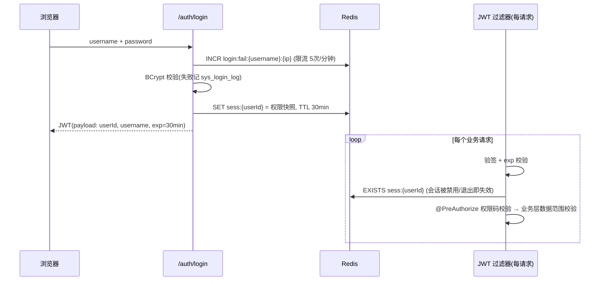

# 04 权限与安全设计

版本：V1.0 ｜ 依据：《医院信息系统技术指导文档》§3.1、§5、§7

## 1. RBAC 模型与角色职责

模型：`用户(sys_user) — N:M — 角色(sys_role) — N:M — 权限点(sys_menu, menu_type=3)`；前端菜单（menu_type=1/2）由权限点集合同源派生，保证"菜单可见性"与"接口可访问性"一致（§7：不同角色只能访问授权菜单、接口和数据范围）。

| 角色编码 | 角色 | 职责定位 |
|---|---|---|
| ADMIN | 管理员 | 系统与基础数据管理：用户/角色/菜单、机构/科室/医生/药品/收费项目、全局日志与全量报表 |
| DOCTOR | 医生 | 门诊接诊：候诊队列、病历、诊断、医嘱、处方、检查/检验申请 |
| CASHIER | 收费员 | 挂号窗口与收费窗口：患者建档、挂号/退号、收费/退费、本人日结 |
| PHARMACIST | 药师 | 药房：处方审核、发药、退药、入库、库存批次与预警 |
| AUDITOR | 对账员 | 财务复核（只读）：收费/退费/日结查询与明细复核、操作日志查询 |

约束：用户至少绑定一个角色；一人可多角色（权限并集，如管理员兼收费）；内置五角色不允许删除，权限集调整仅允许管理员操作并记审计日志。

## 2. 菜单与权限点清单

菜单树（menu_type 1 目录 / 2 页面 / 3 权限点）：

```
his
├── 医生工作站            clinic             → DOCTOR
│   ├── 候诊队列(2)  接诊/病历/提交(clinic:visit:*, clinic:record:*)
│   ├── 诊断/医嘱(clinic:diagnosis:*, clinic:record:update)
│   └── 处方/检查申请(clinic:prescription:create, clinic:exam:create)
├── 挂号收费              reg+billing        → CASHIER
│   ├── 患者建档/查询(patient:archive:*)
│   ├── 挂号/退号(reg:ticket:create/cancel/query)
│   ├── 收费/退费(billing:charge:*, billing:refund:*)
│   └── 我的日结(billing:settle:do/query)
├── 药房工作台            pharmacy           → PHARMACIST
│   ├── 处方审核(pharmacy:review:*)
│   ├── 发药/退药(pharmacy:dispense:*, pharmacy:return:*)
│   └── 库存管理(批次/流水/预警/入库 inventory:*)
├── 统计报表              report             → ADMIN, AUDITOR
│   └── 日挂号量/门诊量/收入/库存(report:query)
├── 对账复核              billing+logs       → AUDITOR(只读)
│   └── 收费/退费/日结查询(billing:*:query) 操作日志(sys:log:query)
└── 系统管理              system+basedata    → ADMIN
    ├── 用户/角色/菜单(sys:user:*, sys:role:*, sys:menu)
    ├── 机构/科室/医生(basedata:org:*, basedata:dept:*, basedata:doctor:*)
    └── 药品/收费项目(basedata:drug:*, basedata:item:*)
```

权限码全集见《03 接口设计》§3 各表"权限码"列（共 45 个权限码），Flyway V2 脚本一次性初始化菜单与权限点。

## 3. 角色权限矩阵

✓ = 授权执行　◯ = 只读授权　✗ = 未授权（菜单不可见、接口 403）

| 功能 | 权限码 | 管理员 | 医生 | 收费员 | 药师 | 对账员 |
|---|---|:---:|:---:|:---:|:---:|:---:|
| 用户/角色/菜单管理 | sys:user:manage, sys:role:manage | ✓ | ✗ | ✗ | ✗ | ✗ |
| 用户/角色查询 | sys:user:query, sys:role:query | ✓ | ✗ | ✗ | ✗ | ✗ |
| 操作/登录日志查询 | sys:log:query | ✓ | ✗ | ✗ | ✗ | ◯ |
| 机构/科室/医生维护 | basedata:org:manage, dept:manage, doctor:manage | ✓ | ✗ | ✗ | ✗ | ✗ |
| 药品/收费项目维护（含调价） | basedata:drug:manage, item:manage | ✓ | ✗ | ✗ | ✗ | ✗ |
| 基础资料查询 | basedata:*:query | ✓ | ✓ | ✓ | ✓ | ✓ |
| 患者建档 | patient:archive:create | ✓ | ✗ | ✓ | ✗ | ✗ |
| 患者档案修改/补卡 | patient:archive:update | ✓ | ✗ | ✓ | ✗ | ✗ |
| 患者档案查询（身份证/手机号脱敏） | patient:archive:query | ✓ | ✓ | ✓ | ✓ | ◯ |
| 挂号/退号 | reg:ticket:create, reg:ticket:cancel | ✓ | ✗ | ✓ | ✗ | ✗ |
| 挂号单查询 | reg:ticket:query | ✓ | ✗ | ✓ | ✗ | ◯ |
| 接诊（开始/完成就诊） | clinic:visit:do | ✓ | ✓ | ✗ | ✗ | ✗ |
| 病历编辑与提交 | clinic:record:update, clinic:record:submit | ✗ | ✓ | ✗ | ✗ | ✗ |
| 诊断/医嘱维护 | clinic:diagnosis:create | ✗ | ✓ | ✗ | ✗ | ✗ |
| 开处方/作废处方 | clinic:prescription:create | ✗ | ✓ | ✗ | ✗ | ✗ |
| 检查/检验申请 | clinic:exam:create | ✗ | ✓ | ✗ | ✗ | ✗ |
| 就诊记录查询 | clinic:visit:query | ✓（全量） | ✓（仅本人接诊） | ✓（本人经办相关） | ✗ | ✗ |
| 收费 | billing:charge:create | ✗ | ✗ | ✓ | ✗ | ✗ |
| 退费 | billing:refund:create | ✗ | ✗ | ✓ | ✗ | ✗ |
| 收费/退费单查询 | billing:charge:query, billing:refund:query | ✓ | ✗ | ✓（本人经办） | ✗ | ◯（全量） |
| 日结执行 | billing:settle:do | ✗ | ✗ | ✓（仅本人） | ✗ | ✗ |
| 日结查询 | billing:settle:query | ✓ | ✗ | ✓（本人） | ✗ | ◯（全量） |
| 处方审核/发药/退药 | pharmacy:review:do, dispense:do, return:do | ✗ | ✗ | ✗ | ✓ | ✗ |
| 药房队列查询 | pharmacy:*:query | ✓ | ✗ | ✗ | ✓ | ✗ |
| 药品入库 | inventory:inbound:create | ✓ | ✗ | ✗ | ✓ | ✗ |
| 库存批次/流水/预警查询 | inventory:query | ✓ | ✗ | ✗ | ✓ | ✗ |
| 统计报表（挂号量/门诊量/收入/库存） | report:query | ✓ | ✗ | ✗ | ✗ | ✓ |

## 4. 数据权限（水平越权防护）

在服务层统一校验（不依赖前端隐藏），规则：

| 角色 | 数据范围 |
|---|---|
| 医生 | 候诊队列、就诊详情、历史就诊仅限 `doctor_id = 当前医生`；越权访问他人就诊返回 A0003 |
| 收费员 | 可收费全部就诊；收费单/日结"本人经办"视图按 `cashier_id` 过滤；退费仅能退本人或本组当日单据，跨日大额退费一期不做拦截（记审计） |
| 药师 | 处方队列全量（药房公共工作池）；发药/退药操作人必须为登录药师本人 |
| 对账员 | 只读全量，任何写接口 403 |
| 管理员 | 全量；管理员执行业务写操作（如代收费）同样记审计日志 |

## 5. 认证与会话安全



- 密码：BCrypt（cost 10）存储；校验失败不区分"用户不存在/密码错误"（防用户枚举）；初始密码首次登录提示修改。
- 退出/禁用/重置密码：立即删除 Redis 会话。
- CORS：仅允许部署域名；生产强制 HTTPS（Nginx TLS1.2+），Cookie 不承载令牌（仅 Header），天然防 CSRF。

## 6. 安全设计清单（对应指导文档 §7"安全"）

| # | 要求 | 设计措施 |
|---|---|---|
| 1 | 密码不可明文存储 | BCrypt 散列（sys_user.password_hash）；代码中禁止出现密码明文日志 |
| 2 | 接口防越权 | 垂直：全部接口 @PreAuthorize 权限码；水平：§4 数据范围校验；对象不存在与无权限统一返回，防资源探测 |
| 3 | 生产配置不提交仓库 | 生产配置仅 `.env`（deploy/.env.example 提供模板）；JWT 密钥、DB 密码、身份证加密密钥、MinIO 密钥全部环境变量注入；.gitignore 排除 .env |
| 4 | 敏感信息日志脱敏 | Logback 脱敏转换器：身份证 `3401**********1234`、手机号 `138****5678`；审计日志 params_json 落库前同样脱敏 |
| 5 | 敏感数据加密存储 | 身份证 AES-256-GCM 密文 + SHA-256 摘要列（可查不可读）；密钥轮换预留 key_version 字段语义（密文前缀标注版本） |
| 6 | SQL 注入 | MyBatis-Plus 全参数化；动态排序白名单；禁用 `${}` 拼接（代码检查项） |
| 7 | XSS | 前端 Vue 默认转义，富文本字段（过敏史/既往史）入库前白名单过滤；Content-Security-Policy 响应头 |
| 8 | 暴力破解 | 登录限流（5 次/分钟/IP+账号），连续失败记 sys_login_log 供管理员审查 |
| 9 | 参数校验 | JSR-303 全接口覆盖 + 服务端金额/状态重算（不信任前端） |
| 10 | 最小权限 | 角色权限矩阵 §3 为唯一授权依据；新增接口必须先补权限码与矩阵，否则 CI 检查失败 |
| 11 | 操作留痕 | §"审计范围"见《01》§6.7；日志查询仅 ADMIN/AUDITOR |
| 12 | 备份恢复 | 每日 02:00 `mysqldump --single-transaction` 全量 + binlog 增量保留 7 天，备份文件异机存放；恢复演练手册与命令清单纳入交付文档（《06》§5） |

## 7. 常见错误提示规范（§7"可用性"）

所有 A/B/C 错误码必须配置中文提示（见《03》§2 message 列），前端 toast 展示 `message`，不展示堆栈与 SQL；表单类错误逐字段内联提示；网络异常统一提示"网络异常，请检查连接后重试"。
