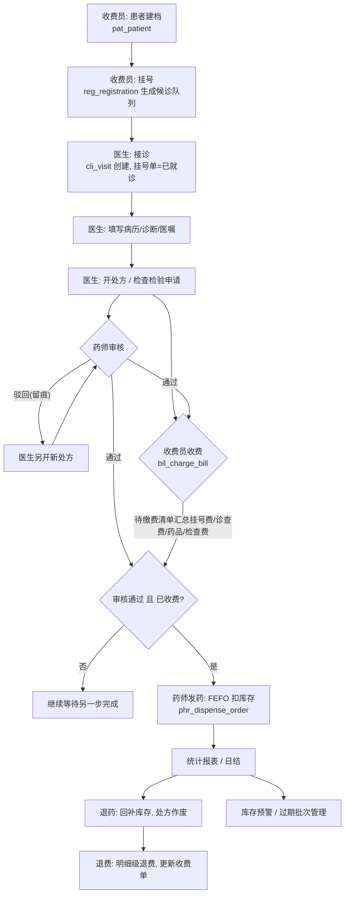
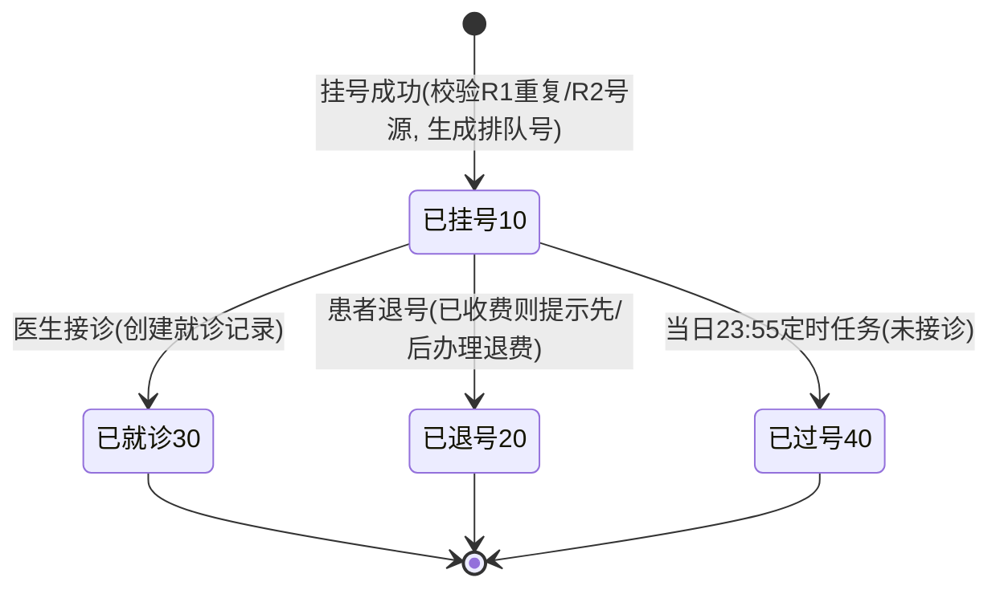
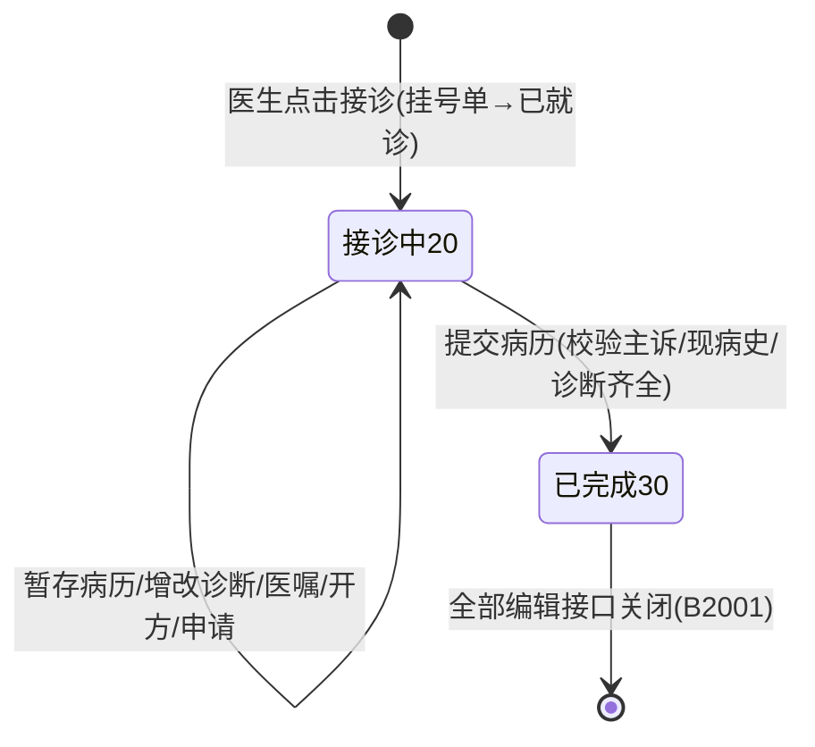
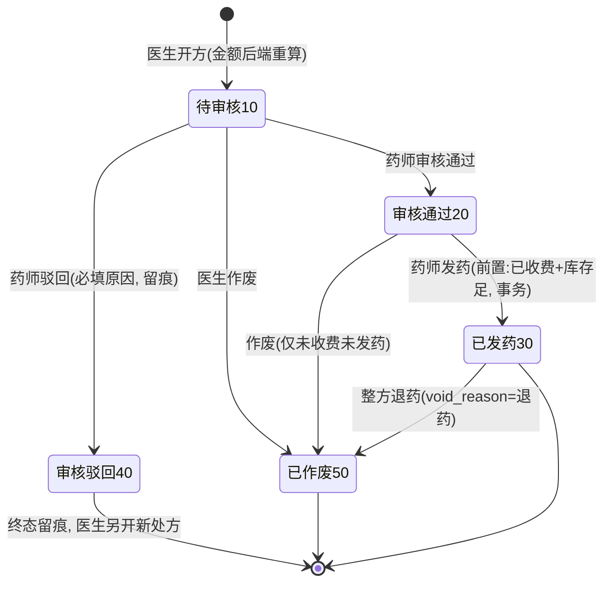
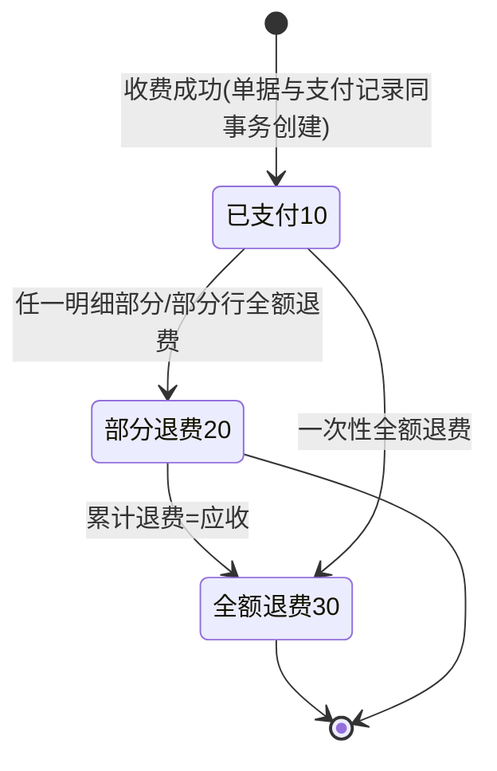
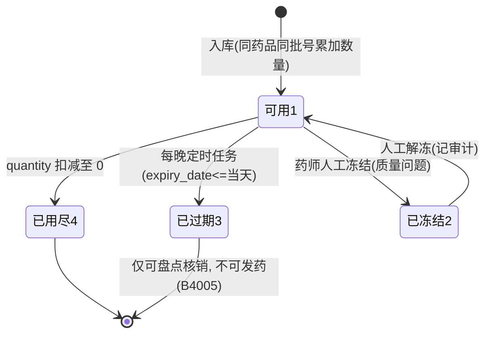
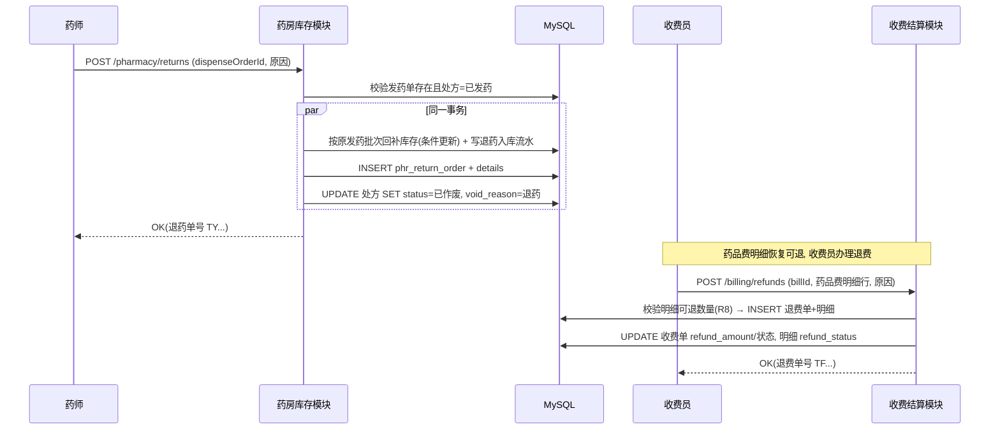

# 05 业务流程与状态机设计

版本：V1.0 ｜ 依据：《医院信息系统技术指导文档》§3.1、§5、§9

按指导文档 §5.2 要求，本文档先行定义状态流转与异常路径，作为页面与接口开发的依据。错误码（B 系列）与《03 接口设计》§2 对应。

## 1. 核心闭环总流程

> 顺序说明：**审核与收费两步可互换顺序、互不阻塞**（对应指导文档 §9 场景"开处方 → 收费 → 药师审核发药"），发药的前置条件是"审核通过 + 已收费"同时满足，由后端事务内复核（《03》§4.2 时序图）。

## 2. 状态机

### 2.1 挂号单（reg_registration.status）

约束：终态（20/30/40）不可再变更；已过号/已退号的患者重新挂号走新挂号单（免重复挂号校验因无有效挂号而自然放行）。

### 2.2 就诊记录（cli_visit.status）

约束：候诊态由挂号单承载（已挂号=候诊）；就诊记录自接诊才存在，因此无"候诊"状态；状态 40（已取消）为一期预留，不产生业务入口。**已完成就诊不可修改任何内容**（§3 规则 R15）。

### 2.3 处方（cli_prescription.status）

约束：`审核通过 + charge_status=1` 是发药的充要前置（B4001/B4002）；发药单 `prescription_id` 唯一索引保证一条处方至多一次发药（B4003）。

### 2.4 收费单（bil_charge_bill.status）

### 2.5 库存批次（inv_inventory_batch.status）

### 2.6 退费单（bil_refund_bill.status）

一期退费即时生效（模拟支付），状态仅 `10 已退费 / 20 已驳回`；驳回用于收费员误发起退费后的留痕，退费金额不超过原单可退余额（B3003）。

## 3. 关键业务规则与异常路径（R1~R16）

| # | 规则 | 异常路径与提示 |
|---|---|---|
| R1 | **防重复挂号**：同患者同医生同日期同时段存在有效挂号（状态=已挂号）则拒绝 | B1002；挂号接口幂等键防连击双击 |
| R2 | **号源控制**：医生 `daily_quota` 按日期+时段计数，事务内锁定医生行后校验 | B1003 号源已满 |
| R3 | **排队号**：当日该医生+时段已分配最大号+1（退号号段不复用），队列按号升序展示 | — |
| R4 | **退号**：仅"已挂号"可退；退号不自动退费 | 已收费时提示"该挂号已收费 X 元，请到退费界面办理"；未收费直接置已退号 |
| R5 | **挂号费退费**：退挂号费/诊查费时，若挂号单仍为"已挂号"则联动作废该挂号（置已退号）；就诊已完成不可退（B3005） | — |
| R6 | **过号**：定时任务将当日未接诊挂号置已过号；不自动退费（可人工退费） | — |
| R7 | **发药三重前置**：审核通过、已收费、未发药；库存按 FEFO（效期早先出）拆批扣减，条件更新防超卖 | B4001 / B4002 / B4003 / B4004 / B4005；任一失败整体回滚 |
| R8 | **退费范围**：明细级可退数量 = 原数量 − 已退数量；药品费在处方已发药时不可直接退费；**药品费必须整方退费**（部分退费会导致处方仍可发药的不一致，实现阶段补充的规则） | B3003 / B3004（提示先退药） |
| R9 | **退费联动**：药品费全额退 → 处方置已作废（void_reason=退费），堵住后续发药；退挂号费 → 联动置挂号单已退号 | — |
| R10 | **金额一致性**：收费/退费金额由后端按明细重算并与请求比对 | A0006 / B3003 |
| R11 | **退药**：仅"已发药"处方可退，一期整方退药；回补原发药批次并写流水；处方置已作废（void_reason=退药），其药品费明细恢复可退 | B4006 / B4007 |
| R12 | **日结**：按收费员+日期汇总（pay_time/refund_time 落当日），重复日结拒绝；日结数与报表明细（T-03/T-04）可交叉核对 | B3006 |
| R13 | **库存预警**：入库/发药/退药后重算药品可用总量，≤ `stock_warning_qty` 进入预警列表（F-10），药房工作台角标提醒 | — |
| R14 | **效期管理**：每晚任务将到期批次置已过期；过期批次不参与 FEFO 拣批与发药 | B4005 |
| R15 | **病历锁定**：就诊完成后病历、诊断、处方、申请全部只读；如需更正，重新挂号就诊（提示明确，不留编辑口子） | B2001 |
| R16 | **驳回重开**：处方驳回为终态（留痕），医生必须另开新处方；原处方不可复活，保证审计链完整 | B2006（非法作废） |

## 4. 退药—退费联动时序（验收场景关键环节）

## 5. 最终验收演示脚本（对应指导文档 §9）

前置：全新部署（docker-compose 起服务 + Flyway V1/V2 迁移，demo 数据集加载）。以下场景需**连续执行 3 次均成功**且金额/库存/日志结果一致。

| 步骤 | 角色 | 操作 | 预期结果 |
|---|---|---|---|
| 1 | 管理员 | 登录，核对科室/医生/药品/收费项目种子数据 | 数据齐全；无权限用户访问系统管理接口返回 A0003 |
| 2 | 收费员 | 患者建档：张三（男，测试身份证号，手机号） | 返回建档号 P...；重复提交同身份证 → B1001；同幂等键重放返回首次结果 |
| 3 | 收费员 | 挂号：张三 → 内科·王医生（专家号，当日上午） | 挂号单 GH...，排队号生成，快照挂号费 20.00 + 诊查费 20.00；同患者同医生同时段再挂 → B1002 |
| 4 | 医生（dr.wang） | 打开候诊队列 → 接诊张三 | 就诊记录 JZ... 创建，挂号单→已就诊，队列中消失 |
| 5 | 医生 | 填写主诉"咳嗽 3 天"、现病史、体格检查；新增主诊断"急性上呼吸道感染（J06.9）"；新增用药医嘱 | 暂存成功；缺诊断直接提交 → B2003 |
| 6 | 医生 | 开处方：阿莫西林胶囊 ×2 盒（¥15.60）、布洛芬缓释胶囊 ×1 盒（¥22.00） | 处方 CF...，总额 53.20（后端重算）；空明细 → B2005 |
| 7 | 医生 | 开检查申请：血常规 ×1（¥25.00）→ 提交病历 | 申请 SQ...；就诊→已完成；此后编辑接口 → B2001 |
| 8 | 收费员 | 查待缴费清单并收费（现金） | 应收 118.20 = 挂号 20.00 + 诊查 20.00 + 药品 53.20 + 血常规 25.00；生成 SF...；挂号/处方/申请 charge_status=1；重复收费 → B3001 |
| 9 | 药师 | 审核处方（通过） | 处方→审核通过；审核记录留痕；重复审核 → B4008 |
| 10 | 药师 | 发药 | 发药单 FY...；阿莫西林批次 20260601 库存 1000→998；处方→已发药；重复发药 → B4003 |
| 11 | 药师 | 查询库存批次与预警列表 | 感冒灵颗粒（库存 20 ≤ 预警下限）出现在预警中 |
| 12 | 对账员 | 查收入报表与日结明细复核 | 当日收费合计 118.20、退费 0、净额 118.20，与明细逐笔一致 |
| 13 | 药师 | 整方退药（原因：患者拒用） | 退药单 TY...；库存 998→1000；处方→已作废(退药) |
| 14 | 收费员 | 退费：药品费 53.20 + 血常规 25.00 | 退费单 TF...；收费单→部分退费；已完成就诊的挂号费/诊查费退费被拒（B3005，设计修正：就诊完成后号费不可退，原脚本"全额退费"口径有误，已按规则修正） |
| 15 | 管理员 | 查询操作日志 | 建档/挂号/接诊/开方/申请/收费/审核/发药/退药/退费各有日志，身份证/手机号脱敏，金额与单号可对应 |
| 16 | — | 三轮一致性核对 | 三次执行的收费、退费、库存、日志结构一致；全程无阻塞缺陷 |

> 演示脚本同时充当**端到端回归用例**（含每步注入的异常分支预期），纳入《06》§4 测试策略。
