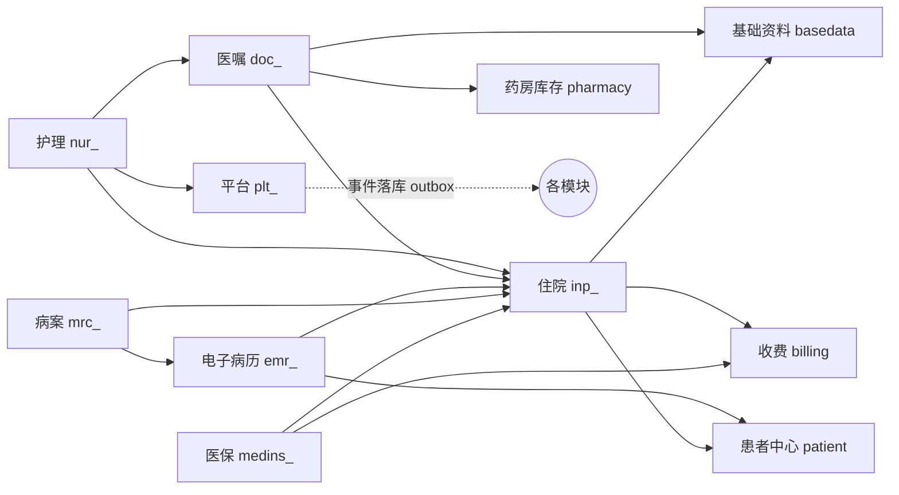

# 08 二期总体设计（住院·EMR·护理·病案·医保·集成平台）

版本：V1.0 ｜ 依据：《07-HIS 全景规划 V2》二期范围 ｜ 上游：《01-总体架构设计》全量沿用

## 1. 范围与目标

| 工作包 | 内容 | 模块前缀 |
|---|---|---|
| WP2.1 集成平台雏形 + EMPI | 患者主索引、患者合并、事件目录与落库（outbox） | `plt_` |
| WP2.2 住院管理 | 入院登记、床位状态机、押金、转科、出院、一日清费用、住院结算 | `inp_` |
| WP2.3 EMR 住院病历 | 大病历结构化书写、模板、质控（缺项/时限）、知情同意 | `emr_` |
| WP2.4 医嘱闭环住院段 | 长期/临时医嘱、成组医嘱、皮试、停嘱、药师审核、摆药出库 | `doc_` |
| WP2.5 护理与移动护理 | 排班、体征采集（体温单）、PDA 执行与扫码 | `nur_` |
| WP2.6 病案管理 | 病案首页质控、ICD-10 编码、归档/借阅 | `mrc_` |
| WP2.7 医保结算接口 | 申报/对账（Mock + 本地 SDK 防腐层双通道） | `medins_` |

**验收主线**（对齐一期 §9 风格）：入院 → 医嘱 → 护士执行 → 费用一日清 → 出院结算 → 病案归档 → 医保对账，连续三次成功。

## 2. 架构增量

沿用一期模块化单体、技术栈、横切机制（统一响应/错误码/幂等/审计/乐观锁）**全部不变**。新增 6 个模块包，模块依赖遵循一期"上层调下层应用服务"规则：

新增依赖规则（硬约束）：

1. `doc_`/`nur_`/`emr_`/`mrc_` 不得直接读写 `inp_` 表，住院主记录变更一律经 `InpAppService`（行锁保护住院状态机）。
2. 医嘱计费、床位计费统一由 `inp_` 模块落 `bil_charge_detail`（经 `BillingAppService` 新增住院计费方法），收费结算复用一期账单模型。
3. 事件落库走 outbox：业务事务内写 `plt_event_log`，发布器异步投递（一期审计异步模式复用）。

## 3. EMPI 与集成事件规范

### 3.1 患者主索引（EMPI）

- 一期 `pat_patient` 为**唯一人口来源**，二期为每名患者生成主索引号 `mpi_no`（前缀 `M`）；
- `plt_master_index(mpi_no, patient_id)` 1:1 映射一期患者；`plt_id_map(mpi_no, source_system, source_id)` 预留多来源（LIS/PACS/互联网医院）接入；
- 患者合并：`merge_flag` + 合并审计（一期暂无重复档，机制先行）；全院各系统就诊记录一律经 EMPI 取患者身份。

### 3.2 集成事件目录（outbox）

事件即《07》§4 闭环清单的节点化。统一载荷：`{eventId, eventType, occurredAt, bizNo, payload}`。

| 事件类型 | 发布模块 | 订阅方（当前=事件表消费查询） |
|---|---|---|
| admission.created / transferred / discharged | inp | 病案、医保 |
| order.created / reviewed / executed / stopped | doc | 护理、计费 |
| fee.daily.recorded / bill.admission.settled | inp/billing | 医保、病案 |
| emr.record.submitted / qc.returned | emr | 病案 |
| mrc.archived | mrc | 医保 |
| medins.settle.applied / reconciled | medins | 财务 |

## 4. 与一期模型的关键衔接点

| 一期模型 | 二期处理 |
|---|---|
| `bil_charge_bill.visit_id`（门诊唯一） | **新增 `admission_id` 列**（各自唯一索引，门诊/住院互不冲突），收费/退费/日结逻辑全量复用 |
| `cli_exam_application.visit_id NOT NULL` | 改为可空 + **新增 `admission_id`**（住院开检查/检验） |
| `phr_*` 处方审核/发药 | 住院药嘱不走门诊处方：`doc_order`（药品类）审核通过 → 摆药出库任务 → 复用 `inv_` 批次扣减 |
| 门诊 `cli_visit` 状态机 | 住院主线独立（`inp_admission` 状态机），门诊不动 |
| `PaymentGateway` 模拟支付防腐层 | 新增同级 `MedInsuranceGateway` 接口 + Mock 实现（本地 SDK 实现位预留） |
| 权限底座（sys_*） | V7 迁移新增 3 角色（护士/病案员/医保专员）+ 约 45 个权限码 |

## 5. 权限与角色增量（概要）

| 新角色 | 核心权限域 |
|---|---|
| NURSE 护士 | 医嘱核对执行、体征采集、执行单查询、排班查询 |
| MRCLERK 病案员 | 首页质控、ICD 编码、归档/借阅 |
| MEDCLERK 医保专员 | 结算申报、对账、差异处理 |
| 既有角色扩展 | 医生 +住院医嘱/EMR 书写；药师 +住院摆药审核；收费员 +押金/出院结算；管理员全量 |

权限矩阵增量全表见《11-二期实施计划》§4。

## 6. 不做的事（二期边界）

互联网医院/在线问诊、手术麻醉（ORIS）、LIS/PACS、PIVAS、HR/绩效、CDSS 智能推荐（仅预留医嘱审查规则位）、真实医保 SDK 联调（二期交付 Mock 通道 + 接口规范）、门诊 EMR 结构化改造（一期门诊病历保持现状）。
