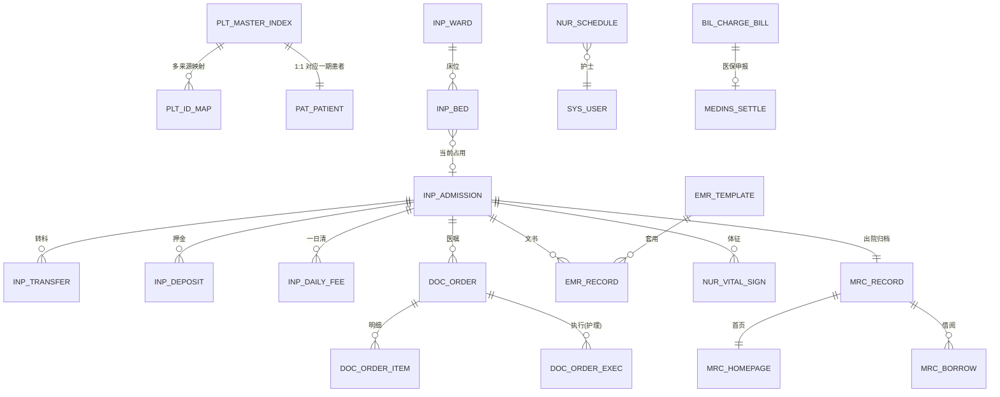

# 09 二期数据库设计（住院·EMR·护理·病案·医保·平台）

版本：V1.0 ｜ 延续《02-数据库设计》全部规范（公共字段/命名/金额 DECIMAL/乐观锁/快照原则），仅列**增量**。

## 1. 迁移脚本规划

| 脚本 | 内容 |
|---|---|
| `V6__phase2_schema.sql` | 本文档全部新表 + 一期表改造 |
| `V7__phase2_menus.sql` | 新菜单/3 个新角色/约 45 个新权限码/绑定（所有环境加载） |
| `V8__phase2_demo.sql`（db/demo） | 演示病区/床位/ICD 字典样例 |

## 2. 一期表改造（V6）

```sql
ALTER TABLE bil_charge_bill
  ADD COLUMN admission_id BIGINT UNSIGNED NULL COMMENT '住院结算来源',
  ADD UNIQUE KEY uk_bill_adm (admission_id);
ALTER TABLE bil_charge_detail
  ADD COLUMN admission_id BIGINT UNSIGNED NULL,
  ADD KEY idx_cd_adm (admission_id, fee_date);
ALTER TABLE cli_exam_application
  MODIFY visit_id BIGINT UNSIGNED NULL COMMENT '门诊来源(住院时为空)',
  ADD COLUMN admission_id BIGINT UNSIGNED NULL,
  ADD KEY idx_apply_adm (admission_id);
```

> 门诊/住院账单各自唯一索引互不冲突（MySQL 唯一索引允许多个 NULL）；检查申请改为"门诊或住院二选一来源"。

## 3. ER 图（二期增量）



## 4. 平台层（plt_）

### 4.1 plt_master_index 患者主索引

| 字段 | 类型 | 约束 | 说明 |
|---|---|---|---|
| mpi_no | VARCHAR(32) | NOT NULL, UNIQUE | 主索引号（前缀 M） |
| patient_id | BIGINT UNSIGNED | NOT NULL, UNIQUE | 一期 pat_patient.id（当前唯一人口来源） |
| merge_flag | TINYINT | NOT NULL, DEFAULT 0 | 1 已被合并（预留） |
| merged_into | BIGINT UNSIGNED | NULL | 合并目标 mpi_id（预留） |

### 4.2 plt_id_map 来源映射（多系统接入预留）

`mpi_id, source_system VARCHAR(32), source_id VARCHAR(64)`，UNIQUE(mpi_id, source_system, source_id)。

### 4.3 plt_event_log 集成事件日志（outbox，append-only）

| 字段 | 类型 | 说明 |
|---|---|---|
| event_no | VARCHAR(32) | 事件号（前缀 EV） |
| event_type | VARCHAR(64) | 见《08》§3.2 事件目录 |
| biz_no | VARCHAR(32) | 业务单号 |
| payload | JSON | 事件载荷 |
| created_at | DATETIME | （append-only，无 status/version） |

索引：`(event_type, created_at)`、`(biz_no)`。

## 5. 住院管理（inp_）

### 5.1 inp_ward 病区

`ward_code UNIQUE, ward_name, dept_id（关联临床科室）, location, status` + 公共字段。

### 5.2 inp_bed 床位

| 字段 | 类型 | 说明 |
|---|---|---|
| ward_id | BIGINT | 病区 |
| bed_no | VARCHAR(16) | 床号 |
| bed_status | TINYINT | 1 空闲 ｜ 2 占用 ｜ 3 预约 ｜ 4 停用 |
| current_admission_id | BIGINT | 当前住院（占用时） |
| charge_item_id | BIGINT | 床位费收费项目 |

约束：`UNIQUE(ward_id, bed_no)`；索引：`(bed_status, ward_id)`。

### 5.3 inp_admission 住院记录（一次住院一条，核心聚合根）

| 字段 | 类型 | 说明 |
|---|---|---|
| admission_no | VARCHAR(32) UNIQUE | 住院号（前缀 ZY） |
| patient_id | BIGINT | 患者（EMPI 延伸） |
| dept_id / ward_id / bed_id | BIGINT | 现科室/病区/床位（转科后更新） |
| doctor_id | BIGINT | 主治医生 |
| admission_type | TINYINT | 1 普通 ｜ 2 急诊 ｜ 3 转院入院 |
| admission_time | DATETIME | 入院时间 |
| planned_diagnosis | VARCHAR(128) | 入院诊断 |
| deposit_total | DECIMAL(12,2) | 押金累计 |
| discharge_way | TINYINT | 1 治愈 2 好转 3 未愈 4 死亡 5 自动离院 6 转院 |
| discharge_diagnosis | VARCHAR(256) | 出院诊断 |
| discharge_time | DATETIME | 出院时间 |
| status | TINYINT | 10 在院 ｜ 20 出院未结 ｜ 30 已结算 ｜ 40 转院 |

索引：`uk_admission_no`、`(patient_id, status)`、`(status, dept_id)`、`(bed_id)`。

### 5.4 inp_transfer 转科记录（append 留痕）

`admission_id, from_dept_id, to_dept_id, transfer_time, reason`；转科事务：改住院记录科室 + 原床位释放 + 新病区分配床位，同事务。

### 5.5 inp_deposit 押金

`admission_id, amount DECIMAL(12,2), pay_method, pay_time, operator_id, status`；押金只增不减，退款走一期退费防腐层。

### 5.6 inp_daily_fee 住院每日费用（一日清，计费落点）

| 字段 | 类型 | 说明 |
|---|---|---|
| admission_id | BIGINT | 住院 |
| fee_date | DATE | 费用日期 |
| fee_type | TINYINT | 同收费项目类别（床位/护理/药品/检查…） |
| source_type | TINYINT | 1 床位日费 ｜ 2 医嘱执行 ｜ 3 摆药出库 ｜ 4 手记 |
| source_detail_id | BIGINT | 来源行（执行记录/摆药单…） |
| item_name / quantity / unit_price / amount | — | 快照同一期规范 |
| charge_status | TINYINT | 0 未结算 ｜ 1 已结算 |

索引：`(admission_id, fee_date)`、`(admission_id, charge_status)`。
生成规则：床位费每日定时任务；医嘱执行/摆药出库时实时记账。**住院费用与门诊明细同落 `bil_charge_detail`（带 admission_id），出院结算生成住院收费单。**

## 6. 医嘱闭环住院段（doc_）

### 6.1 doc_order 医嘱主表

| 字段 | 类型 | 说明 |
|---|---|---|
| order_no | VARCHAR(32) UNIQUE | 医嘱号（前缀 YZ） |
| admission_id / patient_id / doctor_id | BIGINT | 归属 |
| order_class | TINYINT | 1 长期 ｜ 2 临时 |
| category | TINYINT | 1 药品 ｜ 2 检查 ｜ 3 检验 ｜ 4 治疗 ｜ 5 护理 ｜ 6 材料 |
| start_time / stop_time | DATETIME | 起/停时间 |
| frequency | VARCHAR(16) | qd/bid/tid/q8h/prn |
| skin_test_flag | TINYINT | 1 需皮试 |
| total_amount | DECIMAL(10,2) | 药品/计费类合计（后端重算） |
| review_by / review_at / review_comment | — | 药师审核（药品类必审） |
| stop_reason / void_reason | VARCHAR(256) | 停止/作废原因 |
| status | TINYINT | 10 待审核 ｜ 20 审核通过 ｜ 30 执行中 ｜ 40 已执行 ｜ 50 已停止 ｜ 60 已作废 ｜ 70 已驳回 |

索引：`uk_order_no`、`(admission_id, status)`、`(status, category)`（药师工作队列）。

### 6.2 doc_order_item 医嘱明细

`order_id, drug_id(药品类)/charge_item_id(非药品类) 二选一, 名称/规格/单价快照, dosage, frequency, usage_route, days, quantity, amount, status`。

### 6.3 doc_order_exec 医嘱执行记录（护士执行/计费落点）

| 字段 | 类型 | 说明 |
|---|---|---|
| order_id / item_id | BIGINT | 医嘱/明细 |
| exec_date / exec_slot | DATE / VARCHAR(16) | 执行日期/时段（长期医嘱按频次展开） |
| exec_type | TINYINT | 1 核对 ｜ 2 执行 ｜ 3 皮试 |
| nurse_id | BIGINT | 执行护士 |
| bed_no | VARCHAR(16) | 快照 |
| result | VARCHAR(128) | 皮试结果/备注 |
| charge_detail_id | BIGINT | 计费回写（执行即记账） |
| status | TINYINT | 1 待执行 ｜ 2 已执行 ｜ 3 跳过 |

约束：`UNIQUE(item_id, exec_date, exec_slot, exec_type)`（防重复执行）；索引：`(nurse_id, exec_date, status)`（护士工作单）。

## 7. EMR（emr_）

### 7.1 emr_record 病历文书

| 字段 | 类型 | 说明 |
|---|---|---|
| record_no | VARCHAR(32) UNIQUE | 文书号（前缀 BW） |
| admission_id | BIGINT | 住院（门诊文书二期不动） |
| doc_type | TINYINT | 1 入院记录 ｜ 2 病程记录 ｜ 3 出院记录 ｜ 4 知情同意 ｜ 9 其他 |
| title | VARCHAR(64) | 标题 |
| content_json | JSON | 结构化节（主诉/现病史/查体/诊疗计划…），沿用一期病历校验思路扩展 |
| doctor_id / record_time | — | 书写医生/时间 |
| qc_by / qc_time / qc_issues | — | 质控人/时间/问题清单（JSON 数组） |
| status | TINYINT | 10 书写中 ｜ 20 已提交 ｜ 30 质控通过 ｜ 40 质控退回 |

约束：入院记录一患一院一条（`UNIQUE(admission_id, doc_type)` 仅对 doc_type=1 由应用保证）；质控规则：提交时必填节校验 + 入院记录 24h 时限（超时标记，不阻断）。

### 7.2 emr_template 模板

`template_name, doc_type, dept_id(空=全院), content_json, created_by, status`。

## 8. 护理（nur_）

### 8.1 nur_schedule 排班

`nurse_id, ward_id, shift_date, shift_type(1 白 ｜ 2 中 ｜ 3 夜), status`；UNIQUE(nurse_id, shift_date)。

### 8.2 nur_vital_sign 体征（体温单数据源）

`admission_id, patient_id, record_time, temperature DECIMAL(4,1), pulse, respiration, bp_high, bp_low, spo2, pain_score, nurse_id`；索引 `(admission_id, record_time)`；录入校验范围（体温 30~42 等）超限提示。

## 9. 病案（mrc_）

### 9.1 mrc_record 病案

| 字段 | 说明 |
|---|---|
| mrc_no UNIQUE | 病案号（前缀 BA，规则=住院号） |
| admission_id UNIQUE | 出院未结阶段即生成待归档记录 |
| archive_status | 10 待归档 ｜ 20 已归档 ｜ 30 借阅中 ｜ 40 已归还 |
| qc_status / qc_by / qc_time | 首页质控：0 未质控 ｜ 1 通过 ｜ 2 退回 |
| archive_time | 归档时间（首页质控通过为前置） |

### 9.2 mrc_homepage 病案首页

`admission_id UNIQUE, main_diagnosis_code/name, other_diagnoses JSON, operation_code/name, charge_summary JSON（费用分类汇总自 bil_charge_detail）, coder_id, code_time, status`。

### 9.3 mrc_borrow 借阅

`mrc_id, borrower_id, borrow_time, expect_return_time, return_time, status(1 借阅中 2 已归还)`；同一病案同时仅一条借阅中（UNIQUE(mrc_id, status) 由应用保证）。

### 9.4 mrc_icd10 ICD-10 字典

`code UNIQUE, name, category（章节）, status`；V8 种子样例若干条，支持增量导入。

## 10. 医保（medins_）

### 10.1 medins_settle 医保结算

| 字段 | 说明 |
|---|---|
| settle_no UNIQUE | 结算申报号（前缀 YB） |
| bill_id UNIQUE | 一期账单（出院结算单） |
| insurance_type | 1 城镇职工 ｜ 2 城乡居民 |
| total_amount / account_pay / pool_pay / self_pay | 总额/个账/统筹/自费（Mock 通道按比例拆分） |
| status | 10 已申报 ｜ 20 对账通过 ｜ 30 对账差异 |
| reconcile_time / diff_reason | 对账时间/差异原因 |

防腐层：`MedInsuranceGateway` 接口（apply/reconcile），`MockMedInsuranceGateway` 实现；SDK 实现位预留（同一期 PaymentGateway 模式）。

## 11. 单号前缀增量

住院 ZY ｜ 医嘱 YZ ｜ 文书 BW ｜ 病案 BA ｜ 主索引 M ｜ 事件 EV ｜ 医保 YB（延续一期 IdGenerator 机制）。
