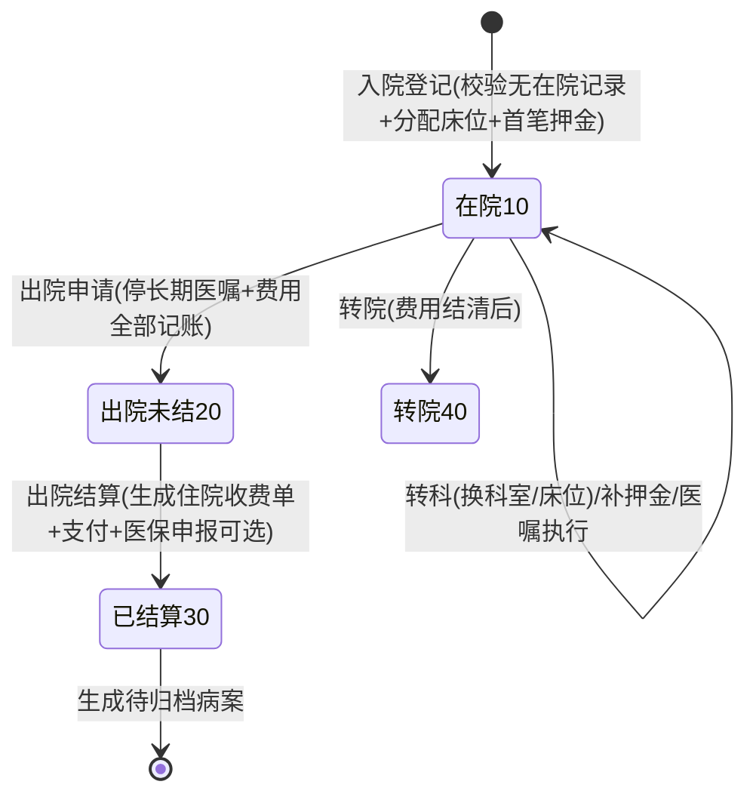
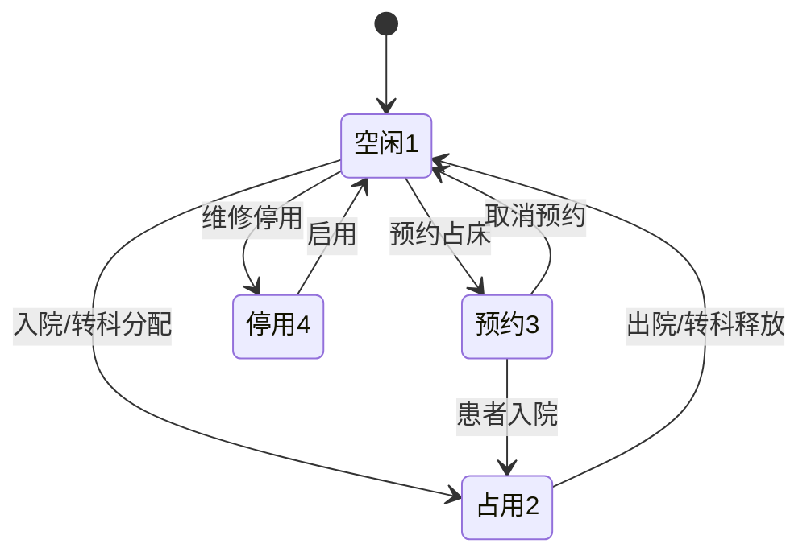
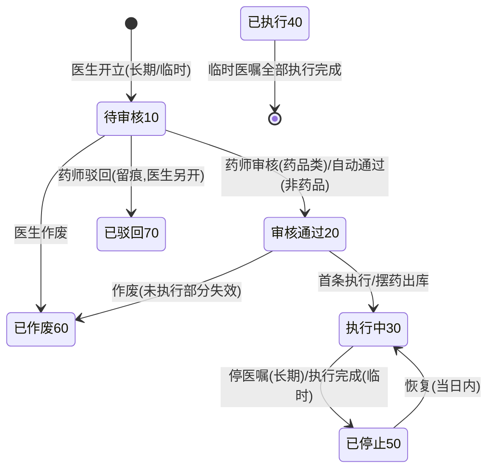
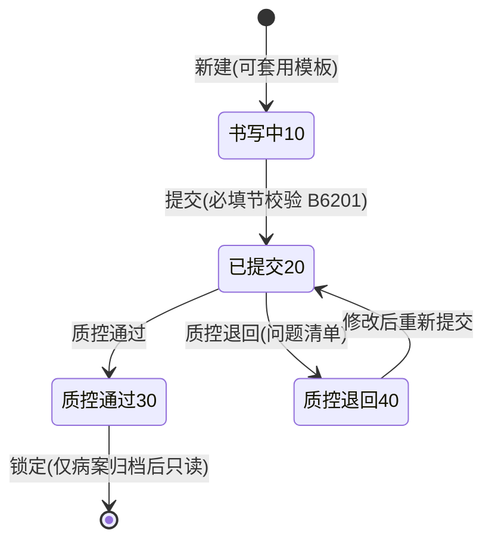
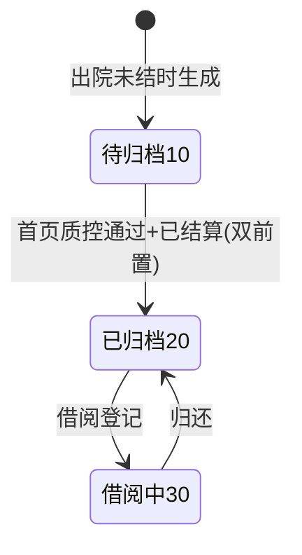
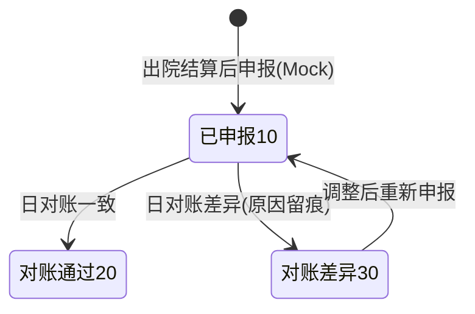

# 10 二期接口与状态机设计

版本：V1.0 ｜ 全局约定（BaseURL / 统一响应 / 幂等头 / 分页 / 金额字符串）**全量沿用《03-接口设计》§1**，仅列增量。

## 1. 错误码增量（延续 B 段）

| 段 | 域 | 关键码示例 |
|---|---|---|
| B60xx | 住院 | B6001 床位不可用 ｜ B6002 该患者已有在院记录 ｜ B6003 非在院状态禁止操作 ｜ B6004 押金不足（提醒不阻断）｜ B6005 转科目标病区无床位 ｜ B6006 出院结算前存在未记账费用（先记账） |
| B61xx | 医嘱 | B6101 医嘱已停止 ｜ B6102 药品医嘱未审核 ｜ B6103 重复执行 ｜ B6104 皮试未通过禁止执行 ｜ B6105 长期医嘱停止后不可再执行 ｜ B6106 医嘱已作废 |
| B62xx | EMR | B6201 必填节缺失（逐字段提示）｜ B6202 已质控文书不可修改 ｜ B6203 入院记录已存在 ｜ B6204 模板已被引用不可删除 |
| B63xx | 病案 | B6301 出院未结算不可归档 ｜ B6302 首页质控未通过不可归档 ｜ B6303 病案已被借阅 ｜ B6304 归档后不可修改 |
| B64xx | 医保 | B6401 重复申报 ｜ B6402 账单未支付不可申报 ｜ B6403 对账差异待处理 ｜ B6404 网关不可用（Mock 异常）|
| A 段沿用 | plt | EMPI 查询/合并复用 A0001/A0003 |

## 2. 状态机

### 2.1 住院记录（inp_admission.status）

约束：`出院未结` 前置校验——长期医嘱全部停止、检查申请无未收费项、费用记账完成（B6006 阻断）；结算复用一期收费/退费/医保申报。

### 2.2 床位（inp_bed.bed_status）

并发保护：分配床位 = 条件更新 `SET bed_status=2, current_admission_id=? WHERE id=? AND bed_status=1`，影响行数 0 即 B6001。

### 2.3 医嘱（doc_order.status）

约束：药品类审核通过 + 摆药出库后才可执行（复用库存条件扣减）；皮试医嘱执行通过前，关联药品医嘱不可执行（B6104）。

### 2.4 病历文书（emr_record.status）

### 2.5 病案（mrc_record.archive_status）与医保（medins_settle.status）

## 3. 接口清单（增量，约 66 个）

权限码延续 `{模块}:{资源}:{动作}`；幂等 ✔ 标记提交类接口；均为 `/api/v1` 前缀。

### 3.1 平台/EMPI（plt，5 个）

| # | 方法 | 路径 | 说明 | 权限码 | 幂等 |
|---|---|---|---|---|---|
| P-01 | GET | /plt/index/search | 主索引查询（姓名/证件/mpi_no/patient_no） | plt:index:query | — |
| P-02 | GET | /plt/index/{mpiNo} | 主索引详情（含全部来源映射） | plt:index:query | — |
| P-03 | POST | /plt/index/merge | 患者合并（预留，双人复核） | plt:index:merge | ✔ |
| P-04 | GET | /plt/events | 事件查询（类型/单号/时段，联调用） | plt:event:query | — |
| P-05 | GET | /plt/events/{bizNo} | 按业务单号取事件链 | plt:event:query | — |

### 3.2 住院（inp，12 个）

| # | 方法 | 路径 | 说明 | 权限码 | 幂等 |
|---|---|---|---|---|---|
| I-01 | GET | /inp/wards / /inp/beds | 病区/床位查询（按状态过滤） | inp:bed:query | — |
| I-02 | POST | /inp/beds | 新增床位 | inp:bed:manage | ✔ |
| I-03 | PUT | /inp/beds/{id}/status | 停用/启用/取消预约 | inp:bed:manage | ✔ |
| I-04 | POST | /inp/admissions | 入院登记（校验无在院记录+分配床位+首笔押金，事务） | inp:admission:create | ✔ |
| I-05 | GET | /inp/admissions | 住院记录分页（在院/出院/结算状态） | inp:admission:query | — |
| I-06 | GET | /inp/admissions/{id} | 住院详情聚合（患者/床位/押金/费用汇总/诊断） | inp:admission:query | — |
| I-07 | POST | /inp/admissions/{id}/transfers | 转科（换病区换床） | inp:transfer:create | ✔ |
| I-08 | POST | /inp/admissions/{id}/deposits | 缴纳押金 | inp:deposit:create | ✔ |
| I-09 | GET | /inp/admissions/{id}/daily-fees | 一日清（按日期分组明细+汇总） | inp:fee:query | — |
| I-10 | POST | /inp/daily-fees/manual | 手工记账（治疗/材料类） | inp:fee:create | ✔ |
| I-11 | POST | /inp/admissions/{id}/discharge | 出院申请（前置校验 B6006，停长期医嘱） | inp:discharge:create | ✔ |
| I-12 | POST | /inp/admissions/{id}/settle | 出院结算（生成住院收费单+支付+押金抵扣，复用一期账单事务） | billing:charge:create | ✔ |

### 3.3 医嘱（doc，12 个）

| # | 方法 | 路径 | 说明 | 权限码 | 幂等 |
|---|---|---|---|---|---|
| O-01 | POST | /doc/orders | 开医嘱（长期/临时，药品/非药品，明细 1..N） | doc:order:create | ✔ |
| O-02 | GET | /doc/orders | 医嘱分页（患者/状态/类别/日期） | doc:order:query | — |
| O-03 | GET | /doc/orders/{id} | 医嘱详情（含执行记录） | doc:order:query | — |
| O-04 | POST | /doc/orders/{id}/review | 药师审核（药品类；非药品自动通过） | pharmacy:review:do | ✔ |
| O-05 | POST | /doc/orders/{id}/stop | 停止长期医嘱 | doc:order:stop | ✔ |
| O-06 | POST | /doc/orders/{id}/resume | 恢复（当日内） | doc:order:stop | ✔ |
| O-07 | POST | /doc/orders/{id}/void | 作废 | doc:order:create | ✔ |
| O-08 | POST | /doc/orders/{id}/dispense | 摆药出库（药房，复用库存扣减） | pharmacy:dispense:do | ✔ |
| O-09 | GET | /doc/orders/review-queue | 药师审核队列 | pharmacy:review:query | — |
| O-10 | GET | /doc/executions/todo | 护士待执行单（我的执行，按床号分组） | nur:exec:do | — |
| O-11 | POST | /doc/executions/{id}/do | 执行（核对→执行；执行即计费 B6006 前置） | nur:exec:do | ✔ |
| O-12 | POST | /doc/skin-tests/{execId} | 皮试结果登记（阴性放行/阳性拦截） | nur:exec:do | ✔ |

### 3.4 EMR（emr，8 个）

| # | 方法 | 路径 | 说明 | 权限码 | 幂等 |
|---|---|---|---|---|---|
| E-01 | POST | /emr/records | 新建文书（可套模板） | emr:record:create | ✔ |
| E-02 | PUT | /emr/records/{id} | 暂存（书写中） | emr:record:update | ✔ |
| E-03 | POST | /emr/records/{id}/submit | 提交（必填节校验） | emr:record:submit | ✔ |
| E-04 | GET | /emr/records | 文书分页（患者/类型/状态） | emr:record:query | — |
| E-05 | GET | /emr/records/{id} | 文书详情 | emr:record:query | — |
| E-06 | POST | /emr/records/{id}/qc | 质控（通过/退回+问题清单） | emr:qc:do | ✔ |
| E-07 | GET/POST/PUT | /emr/templates(+/{id}) | 模板管理 | emr:template:manage | ✔ |
| E-08 | GET | /emr/qc/pending | 待质控队列 | emr:qc:do | — |

### 3.5 护理（nur，6 个）

| # | 方法 | 路径 | 说明 | 权限码 | 幂等 |
|---|---|---|---|---|---|
| N-01 | GET/POST | /nur/schedules | 排班查询/排班（护士长） | nur:schedule:manage | ✔ |
| N-02 | POST | /nur/vital-signs | 体征录入（范围校验） | nur:vital:create | ✔ |
| N-03 | GET | /nur/vital-signs | 体征查询（按住院/时段，体温单数据） | nur:vital:query | — |
| N-04 | GET | /nur/patients | 在院患者列表（本护士病区，PDA 首页） | nur:exec:do | — |
| N-05 | GET | /nur/executions/pending | 待执行/待核对汇总 | nur:exec:do | — |
| N-06 | GET | /nur/wards/beds | 病区床位一览（患者卡） | nur:exec:do | — |

### 3.6 病案（mrc，8 个）

| # | 方法 | 路径 | 说明 | 权限码 | 幂等 |
|---|---|---|---|---|---|
| M-01 | GET | /mrc/records | 病案分页（归档状态/质控状态） | mrc:archive:query | — |
| M-02 | POST | /mrc/records/{id}/archive | 归档（双前置：已结算+质控通过） | mrc:archive:do | ✔ |
| M-03 | POST | /mrc/homepage/{admissionId}/code | 首页编码提交（ICD） | mrc:homepage:code | ✔ |
| M-04 | POST | /mrc/homepage/{admissionId}/qc | 首页质控 | mrc:homepage:qc | ✔ |
| M-05 | GET | /mrc/homepage/{admissionId} | 首页预览（费用分类汇总自动带出） | mrc:archive:query | — |
| M-06 | POST | /mrc/records/{id}/borrow | 借阅登记 | mrc:borrow:create | ✔ |
| M-07 | POST | /mrc/records/{id}/return | 归还 | mrc:borrow:create | ✔ |
| M-08 | GET | /mrc/icd10 | ICD-10 字典查询 | mrc:archive:query | — |

### 3.7 医保（medins，4 个）

| # | 方法 | 路径 | 说明 | 权限码 | 幂等 |
|---|---|---|---|---|---|
| Y-01 | POST | /medins/settles | 结算申报（出院结算后，Mock 网关） | medins:settle:create | ✔ |
| Y-02 | GET | /medins/settles | 申报单分页 | medins:settle:query | — |
| Y-03 | POST | /medins/settles/{id}/reconcile | 日对账（Mock：通过/差异） | medins:settle:reconcile | ✔ |
| Y-04 | GET | /medins/reconcile/daily | 对账单（按日期汇总申报/通过/差异） | medins:settle:query | — |

### 3.8 菜单与角色（V7 迁移，概要）

新菜单目录：住院管理（登记/床位/押金/一日清/出院结算）、医生站-住院（医嘱/EMR）、护理工作台（执行单/体征/排班/床位一览）、病案管理、医保对账、平台（EMPI/事件）。新角色 NURSE / MRCLERK / MEDCLERK；权限码全表随 V7 初始化并同步《11》§4 矩阵。

## 4. 事件与审计

- 事件：所有状态机迁移点按《08》§3.2 目录写 `plt_event_log`（事务内 outbox），查询接口 P-04/P-05 供联调对账。
- 审计：延续 @AuditLog 切面覆盖全部写接口；params_json 脱敏规则不变。
