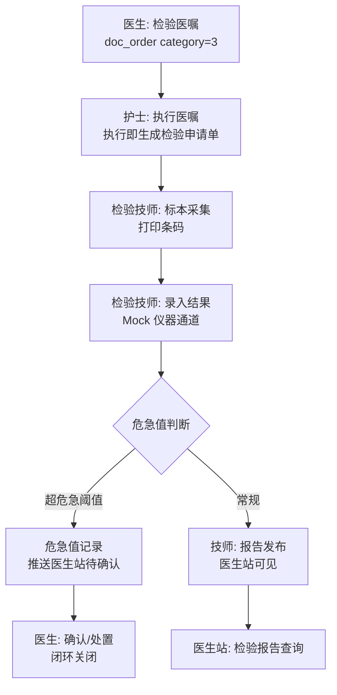

# 12 三期总体设计（第一批：LIS 检验闭环 · 危急值闭环 · 药库管理）

版本：V1.0 ｜ 依据：《07-HIS 全景规划 V2》三期路线 ｜ 上游：《08-二期总体设计》架构全量沿用

## 1. 三期范围裁剪（三批划分）

三期全景（LIS/PACS/ORIS/药库/体检/五大中心/HR/绩效）按价值与依赖分三批落地，**本设计包只覆盖第一批**：

| 批次 | 范围 | 选择理由 |
|---|---|---|
| **第一批（本包）** | LIS 检验闭环、危急值闭环、药库管理增强（采购/盘点/供应商）、检验报告医生站查询 | 与二期住院医嘱闭环**直接衔接**（检验医嘱已开立到"执行"即断链）；危急值是《07》§4 七大闭环中唯一未落地的强制项；药库补齐"采购→入库"上游 |
| 第二批 | 手术麻醉（ORIS）、PACS/RIS、急诊五大中心 | 依赖集成平台事件规范成熟 |
| 第三批 | HR/物资/绩效（国考监测）、体检、CDSS 全面化 | 运营增强类 |

明确不做（第一批边界）：检验仪器真实对接（Mock 通道+防腐层接口）、细菌耐药监测、PIVAS、病理/心电/内镜专项、影像。

## 2. 业务主线



**危急值闭环**（《07》§4 状态机）：结果录入时按危急阈值表自动判定 → 生成危急值记录（待处理）→ 检验技师电话通知后置"已通知"→ 责任医生站确认 → 填写处置意见 → 闭环关闭。全流程留痕（对接《08》§3.2 事件目录新增 4 个事件）。

## 3. 模块与依赖

| 新模块 | 前缀 | 职责 |
|---|---|---|
| 检验（lis） | `lis_` | 检验申请、标本、结果、报告 |
| 危急值（alert） | `alert_` | 危急值记录与闭环（独立模块便于二期 PACS 复用同一危急值通道） |
| 药库（whse） | `whse_` | 供应商、采购订单、盘点 |
| 字典扩展 | `bas_supplier` | 供应商字典挂基础资料 |

依赖规则（延续《08》§2 无环约束）：

```
doc --执行检验医嘱生成申请--> lis（doc → lis 单向）
lis --危急值--> alert（lis → alert 单向）
whse --到货入库--> pharmacy（whse → phr 单向，复用 InventoryService.inbound）
lis/whse --> basedata/patient/inp（读）
```

## 4. 与既有系统的衔接点

| 既有模型 | 三期处理 |
|---|---|
| `doc_order(category=3)` 检验医嘱 + `doc_order_exec` 护士执行 | 护士执行检验医嘱时，doc 模块调用 `LisAppService.createRequest()` 自动生成检验申请单与标本采集任务（免手工录入）；检验医嘱状态随报告发布联动完成 |
| `doc_order_exec` 计费 | 检验费仍按"执行即计费"不变，LIS 不重复计费 |
| `InventoryService.inbound` | 采购订单"到货入库"调用现有入库（FEFO/流水全复用），whse 只管订单与审批 |
| 危急值确认人 | 经 `DoctorDTO`（bas_doctor）解析责任医生，无新增患者模型 |
| 权限底座 | V13 迁移：新角色 LIS_USER（检验技师）+ 约 14 个权限码 |

## 5. Mock 仪器通道

`LabInstrumentGateway` 防腐层接口（对齐 PaymentGateway/MedInsuranceGateway 模式）：
- `fetchResult(specimenNo)`：Mock 按标本号生成确定性伪随机结果（含可配置危急值命中）；
- 真实 LIS 仪器对接（ASTM/HL7）为后续实现位。

## 6. 不做的事（第一批边界）

检验仪器真实通讯、细菌耐药监测、药库三级库存（药库→药房调拨，现维持一级库存）、PIVAS、手术麻醉、影像、危急值短信推送（站内推送+事件留痕）、检验报告 PDF 打印版式。
