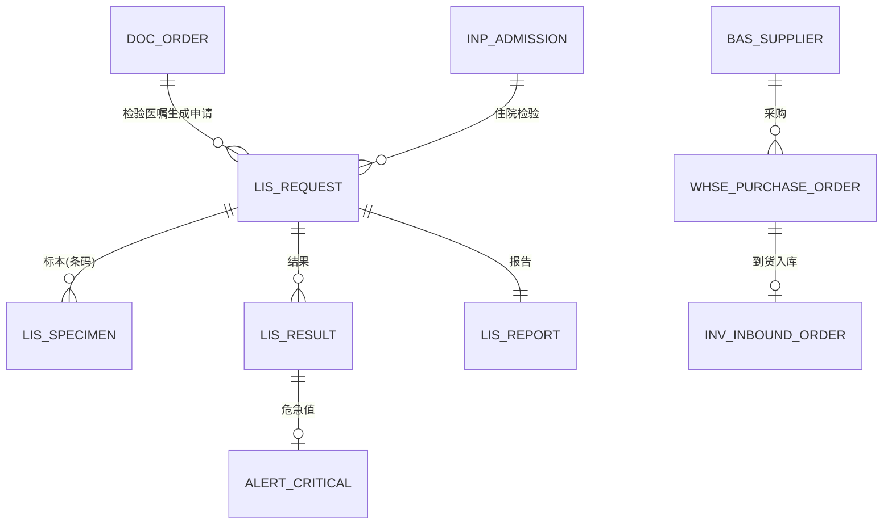
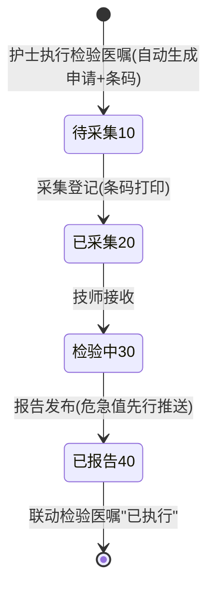
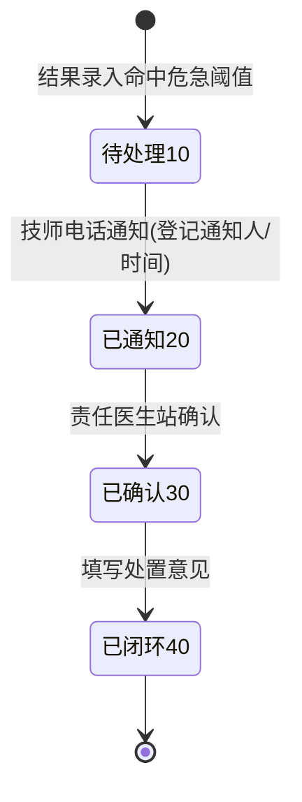
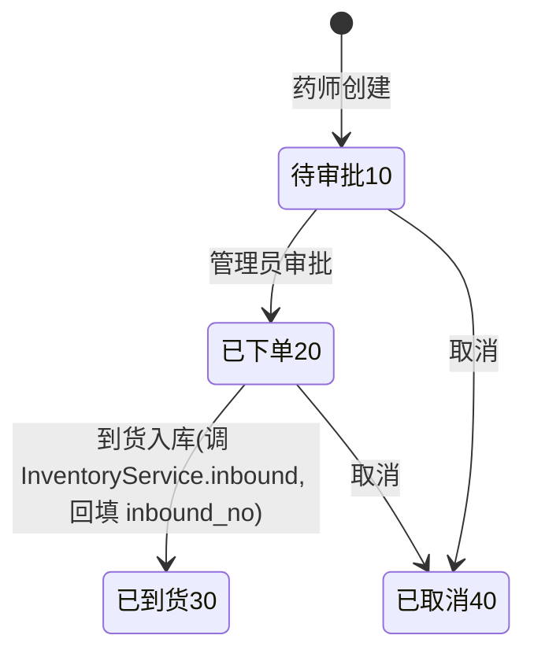
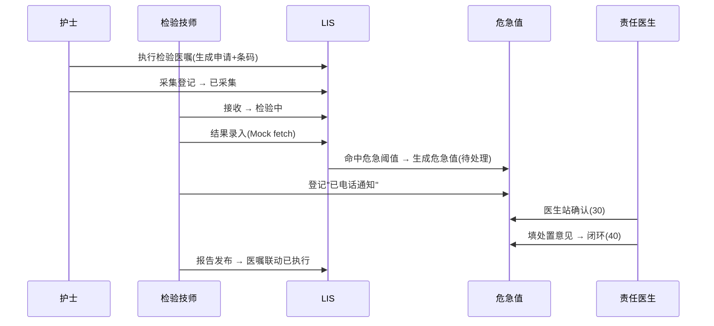

# 13 三期数据库与接口设计（LIS · 危急值 · 药库）

版本：V1.0 ｜ 延续《02/09》全部规范（公共字段/DECIMAL/乐观锁/快照/单号），仅列增量。

## 1. 迁移脚本规划

| 脚本 | 内容 |
|---|---|
| `V13__phase3_schema.sql` | 本文档全部新表 |
| `V14__phase3_menus.sql` | 检验菜单/LIS_USER 角色/权限码/绑定（全环境） |
| `V15__phase3_demo.sql`（db/demo） | 演示技师账号、供应商、危急阈值样例 |

## 2. ER 图（三期增量）

## 3. 数据库（lis_ / alert_ / whse_ / bas_supplier）

### 3.1 lis_request 检验申请单

| 字段 | 类型 | 说明 |
|---|---|---|
| request_no | VARCHAR(32) UNIQUE | 申请单号（前缀 JY） |
| order_id | BIGINT | 来源检验医嘱 |
| admission_id / patient_id / doctor_id | BIGINT | 归属（住院检验；门诊检验二期） |
| specimen_type | VARCHAR(16) | 标本类型（静脉血/末梢血/尿/…，来自医嘱 usage_route 扩展或默认静脉血） |
| status | TINYINT | 10 待采集 ｜ 20 已采集 ｜ 30 检验中 ｜ 40 已报告 ｜ 50 作废 |

索引：`(admission_id, status)`、`(status)`、`(order_id)`。

### 3.2 lis_specimen 标本（条码）

`specimen_no VARCHAR(32) UNIQUE`（条码前缀 BB）、`request_id`、`collected_at`、`collector_id`、`status`（1 已采集 2 已接收 3 作废）。

### 3.3 lis_result 检验结果

| 字段 | 类型 | 说明 |
|---|---|---|
| request_id | BIGINT | 申请单 |
| item_name | VARCHAR(64) | 检验项目名（如 白细胞计数） |
| result_value | VARCHAR(64) | 结果值 |
| unit | VARCHAR(16) | 单位 |
| reference_range | VARCHAR(32) | 参考范围 |
| abnormal_flag | TINYINT | 0 正常 ｜ 1 偏高(H) ｜ 2 偏低(L) |
| critical_flag | TINYINT | 1 危急 |
| instrument | VARCHAR(32) | 仪器（Mock-1000） |
| status | TINYINT | 1 有效 |

索引：`(request_id)`。

### 3.4 lis_report 检验报告

`report_no UNIQUE`（前缀 BG）、`request_id UNIQUE`、`result_summary`（异常项摘要）、`reporter_id`、`report_time`、`audited_by`（双签预留）、`status`（10 编制中 20 已发布）。

### 3.5 alert_critical 危急值（闭环）

| 字段 | 类型 | 说明 |
|---|---|---|
| alert_no | VARCHAR(32) UNIQUE | 危急值号（前缀 WJ） |
| source | TINYINT | 1 LIS（预留 2 PACS） |
| request_id / result_id | BIGINT | 来源 |
| patient_id / admission_id | BIGINT | 患者（住院） |
| item_name / critical_value | VARCHAR | 项目与危急值 |
| notified_nurse | BIGINT | 通知护士 |
| notified_at | DATETIME | 通知时间 |
| confirmed_doctor | BIGINT | 确认医生 |
| confirmed_at | DATETIME | 确认时间 |
| handle_note | VARCHAR(256) | 处置意见 |
| status | TINYINT | 10 待处理 ｜ 20 已通知 ｜ 30 已确认 ｜ 40 已闭环 |

索引：`(status, created_at)`、`(admission_id)`。

### 3.6 whse_purchase_order 采购订单

| 字段 | 说明 |
|---|---|
| po_no UNIQUE | 采购单号（前缀 CG） |
| supplier_id | 供应商 |
| drug_id / quantity / unit_price | 采购内容 |
| expected_date | 预计到货 |
| status | 10 待审批 ｜ 20 已下单 ｜ 30 已到货入库 ｜ 40 已取消 |
| inbound_no | 到货入库单号（调 InventoryService.inbound 后回填） |
| approver_id / approved_at | 审批（管理员） |

### 3.7 bas_supplier 供应商字典

`supplier_code UNIQUE, supplier_name, contact, phone, status` + 公共字段。

### 3.8 危急阈值配置

V15 种子 `lis_critical_threshold` 表（`item_name UNIQUE, low_value DECIMAL(12,2), high_value DECIMAL(12,2)`，样例：白细胞计数 <2 或 >30 等）——结果录入时按项目名匹配判定危急。

## 4. 状态机

### 4.1 检验申请（lis_request.status）

### 4.2 危急值（alert_critical.status）

### 4.3 采购订单（whse_purchase_order.status）

## 5. 接口清单（约 18 个，前缀 /api/v1）

### 5.1 检验（/lis，权限 lab:*）

| # | 方法 | 路径 | 说明 | 权限码 | 幂等 |
|---|---|---|---|---|---|
| L-01 | GET | /lis/requests | 申请单分页（状态/患者/日期） | lab:request:query | — |
| L-02 | GET | /lis/requests/{id} | 详情（含标本/结果/报告） | lab:request:query | — |
| L-03 | POST | /lis/specimens/collect | 采集登记（requestId）→ 打印条码返回 | lab:specimen:collect | ✔ |
| L-04 | POST | /lis/specimens/{id}/receive | 标本接收（检验中） | lab:specimen:collect | ✔ |
| L-05 | POST | /lis/results/entry | 结果录入（requestId + 结果行数组；Mock 仪器通道 `fetch=true` 自动取数） | lab:result:entry | ✔ |
| L-06 | POST | /lis/reports/{requestId}/publish | 报告发布（联动医嘱已执行） | lab:report:publish | ✔ |
| L-07 | GET | /lis/reports | 报告分页 | lab:report:query | — |
| L-08 | GET | /lis/reports/{requestId} | 报告详情（含全部结果） | lab:report:query | — |
| L-09 | GET | /lis/thresholds | 危急阈值查询 | lab:threshold:query | — |
| L-10 | POST/PUT | /lis/thresholds(+/{id}) | 危急阈值维护（管理员） | lab:threshold:manage | ✔ |

### 5.2 危急值（/alerts，权限 alert:*）

| # | 方法 | 路径 | 说明 | 权限码 | 幂等 |
|---|---|---|---|---|---|
| W-01 | GET | /alerts | 危急值列表（状态过滤；医生站"待我确认"） | alert:query | — |
| W-02 | POST | /alerts/{id}/notify | 登记通知（技师） | alert:notify | ✔ |
| W-03 | POST | /alerts/{id}/confirm | 医生确认 | alert:confirm | ✔ |
| W-04 | POST | /alerts/{id}/close | 处置意见闭环 | alert:confirm | ✔ |

### 5.3 药库（/whse，权限 whse:*）

| # | 方法 | 路径 | 说明 | 权限码 | 幂等 |
|---|---|---|---|---|---|
| S-01 | GET/POST | /whse/suppliers(+/{id}) | 供应商字典 | whse:supplier:manage | ✔ |
| S-02 | GET | /whse/purchase-orders | 采购单分页 | whse:po:query | — |
| S-03 | POST | /whse/purchase-orders | 创建采购单（药师） | whse:po:create | ✔ |
| S-04 | POST | /whse/purchase-orders/{id}/approve | 审批（管理员） | whse:po:approve | ✔ |
| S-05 | POST | /whse/purchase-orders/{id}/receive | 到货入库（调 InventoryService.inbound，回填单号） | whse:po:approve | ✔ |
| S-06 | POST | /whse/purchase-orders/{id}/cancel | 取消 | whse:po:create | ✔ |

### 5.4 事件目录新增（《08》§3.2 扩展）

`lis.request.created / specimen.collected / report.published`、`alert.created / confirmed / closed`、`whse.po.approved / received`。

## 6. 关键时序：危急值闭环

