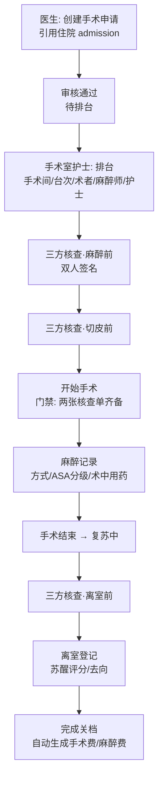
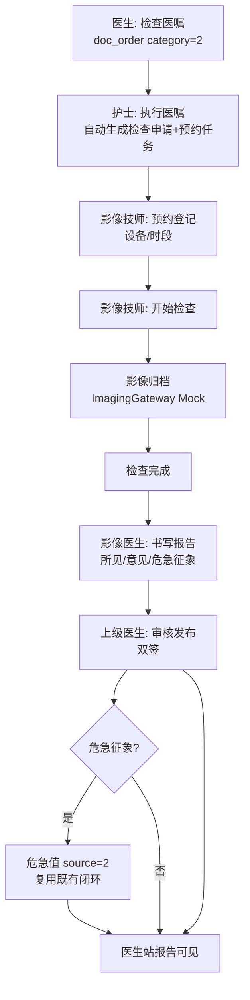
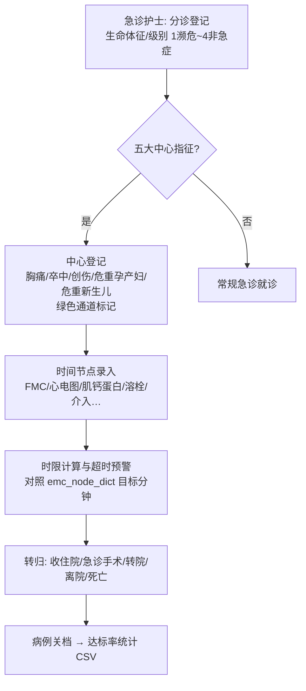

# 15 三期总体设计（第二批：手术麻醉 ORIS · PACS/RIS 影像 · 急诊五大中心）

版本：V1.0 ｜ 依据：《07-HIS 全景规划 V2》三期路线 ｜ 上游：《12-三期总体设计》架构与依赖规则全量沿用

## 1. 三期第二批范围裁剪

三期按价值与依赖分三批落地（《12》§1）。第二批三类系统均强依赖集成平台事件规范（已在一/二期落地）与危急值通道（第一批已落地，`alert_critical.source` 预留 2=PACS），本设计包只覆盖第二批：

| 批次 | 范围 | 选择理由 |
|---|---|---|
| 第一批（已完成） | LIS 检验闭环、危急值闭环、药库管理 | 与二期住院医嘱闭环直接衔接 |
| **第二批（本包）** | 手术麻醉（ORIS 手术申请→排台→三方核查→麻醉记录→复苏关档）、PACS/RIS 住院检查闭环（医嘱→预约→执行→影像 Mock→报告双签→危急值）、急诊五大中心（分诊→登记→时间节点→时限预警→关档统计） | 手术安全核查与输血同为《07》§4 七大闭环中未落地项；危急值通道预留 `source=2` 本批启用；五大中心补齐急诊入口与国考时限指标雏形 |
| 第三批（后续） | HR/物资/绩效（国考监测）、体检、CDSS 全面化 | 运营增强类 |

明确不做（第二批边界）见 §7。

## 2. 业务主线

### 2.1 ORIS 手术麻醉闭环



手术走**申请单制**（独立于 `doc_order` 医嘱状态机，与真实 ORIS 一致）；术前/术后用药医嘱仍走既有 doc 闭环，不重复建模。手术完成后由 ORIS **以系统身份调用住院计费通道 `InpAppService.addExecFee`** 生成手术费（类别 9）与麻醉费（类别 10）费用明细——保持"住院费用必经统一计费通道"口径，退费/日结/医保申报自动兼容。

**手术安全核查**（《07》§4 闭环）：麻醉前/切皮前/离室前三张核查单，双人签名留痕；前两张是"开始手术"的硬门禁，第三张是"离室"的硬门禁——核查不齐推进接口直接拒绝（服务端校验，非前端约束）。

### 2.2 PACS/RIS 住院检查闭环



与 LIS 完全同构：`DocOrderService.execute` 的 category=2 分支调用 `RisService.createRequestFromOrder()`（category=3 分支已有 LIS 同款联动，代码路径 `doc/service/DocOrderService.java:265`），状态机逐态对应，报告发布联动医嘱"已执行"。

**报告双签**：影像医生书写 → 上级审核（reviewer ≠ reporter）→ 审核通过即发布。危急征象命中时走第一批危急值闭环（`source=2`），通知/确认/处置全流程复用，零新增通道。

### 2.3 急诊五大中心



五大中心核心是**时间节点管理**（国考/评审时限指标的数据底座）：每中心一套标准节点字典（V19 种子），节点时间绝对记录，达标率=节点时刻相对登记时刻的分钟差对照目标值；超时在时间轴接口计算返回，前端红色标注。

**绿色通道（先诊疗后收费）**：绿色通道患者的完整费用闭环天然由住院链路成立（住院本就"先诊疗、出院结算"）；分诊挂号走现有 `reg_registration`（急诊科室普通号）。急诊欠费挂账、欠费催缴不做（§7）。

## 3. 模块与依赖

| 新模块 | 前缀 | 职责 |
|---|---|---|
| 手术麻醉（ors） | `or_` | 手术申请、手术间、排台、安全核查、麻醉记录、术后记录 |
| 影像（ris） | `ris_` | 检查申请、预约、影像（Mock）、报告 |
| 急诊五大中心（emc） | `emc_` | 分诊、五大中心登记、时间节点、节点字典 |

依赖规则（延续《08》§2 无环约束，第一批规则不变）：

```
doc --执行检查医嘱(category=2)生成申请--> ris（doc → ris 单向，同 LIS 模式）
ris --危急征象--> alert（ris → alert 单向，source=2）
ors --完成关档记账--> inp（ors → inp 单向，调 InpAppService.addExecFee）
emc --关联就诊/住院--> registration/inp（emc → 读，可后补关联）
emc --危急值同样走 alert（本批仅预留，急诊危急值经 LIS/RIS 通道已覆盖）
ors/ris/emc --> basedata/patient（读）
```

## 4. 与既有系统的衔接点

| 既有模型 | 第二批处理 |
|---|---|
| `doc_order(category=2)` 检查医嘱 + `doc_order_exec` 护士执行 | 执行时 doc 模块调用 `RisService.createRequestFromOrder()` 自动生成检查申请（与 LIS category=3 同款 hook）；检查费仍"执行即计费"不变 |
| `alert_critical.source`（1 LIS，预留 2 PACS） | ris 报告审核发布时命中危急征象 → 写入 `source=2` 危急值，`request_id`=ris_request.id、`result_id`=ris_report.id（16 号 §3.6 注明语义） |
| `InpAppService.addExecFee(admissionId, feeType, itemName, …)` | ORIS 完成关档时以系统身份记账：手术费（类别 9）+ 麻醉费（类别 10）两条明细；退费/一日清/医保申报零改动 |
| `bas_charge_item.category`（V1 枚举 1~7） | V17 扩展枚举：**9 手术费 10 麻醉费**（TINYINT，无表结构变更；V19 种子插入对应收费项目，价目由管理员维护） |
| `reg_registration`（reg_type 1 普通 2 专家） | 急诊挂号复用普通号（急诊科室），绿色通道不改挂号模型 |
| EMPI/建档（patient 模块） | 急诊未建档患者走既有快速建档（身份证可空），患者主索引自动归一 |
| 危急值确认/闭环（第一批 alert 模块） | 完全复用：通知登记→确认→处置闭环，医生站"待我确认"列表自动包含 PACS 来源 |
| 权限底座 | V18 迁移：新角色 OR_NURSE/RIS_USER/EMC_NURSE + 约 30 个权限码；医生/管理员扩展绑定 or/ris/emc 权限码 |

## 5. Mock 与防腐层

`ImagingGateway` 防腐层接口（对齐 `LabInstrumentGateway`/`PaymentGateway` 模式，`ris/gateway/`）：
- `mockStudy(modality, bodyPart)`：按检查大类+部位生成**确定性伪随机**影像元数据（series_count/image_count）与"影像所见"文本（含可配置危急征象命中）；
- 影像本体不存储——`ris_image` 仅存元数据与 Mock 所见文本，前端影像区显示占位图 + 元数据（真实 DICOM 存储/影像浏览器为后续实现位）。

ORIS 无外部仪器依赖，不引入 Gateway。

## 6. 事件目录新增（《08》§3.2 扩展）

`ors.request.created / scheduled / started / completed`、`ris.request.created / report.published`、`emc.visit.registered / closed`。危急值事件复用第一批（`alert.created/confirmed/closed`），来源字段区分 1/2。

## 7. 不做的事（第二批边界）

- 真实 DICOM 存储、影像浏览（Web viewer）、PACS 与设备真实通讯（DICOM/HL7）——仅 Mock 元数据与占位；
- 超声/心电/内镜/病理专项报告模板（ris_request.modality 字典预留，业务闭环只做通用检查）；
- 手术器械/耗材一级库计费、麻醉药品专用台账（麻精处方）、术中用药与药房库存联动（术中用药为记录性文本）；
- ICU 重症管理（or 术后去向 2=ICU 仅登记转归，不做 ICU 系统）；
- 输血闭环（《07》§4 第三批单独设计）；
- 急诊欠费挂账/催缴、五大中心上级质控平台上报 SDK（达标率统计 CSV 为国考雏形）；
- 门诊检查 RIS 闭环（一期 `cli_exam_application` apply_type=1 现无执行环节，本批只做住院段；门诊段衔接登记为第三批评估项）；
- 危重新生儿/危重孕产妇的专科评分表（只用通用节点字典）。
