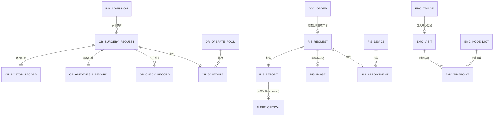
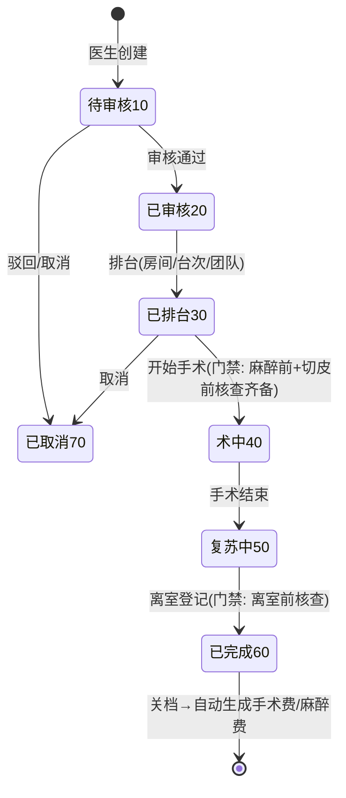
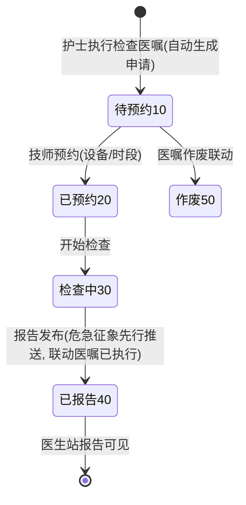
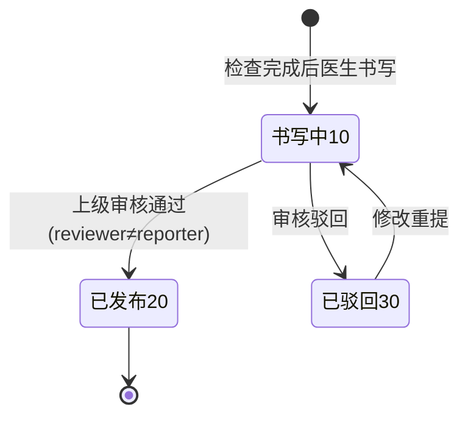
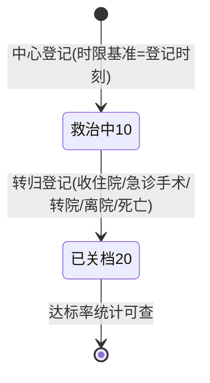
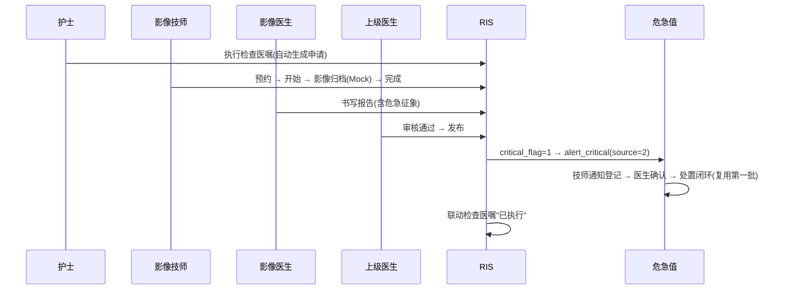
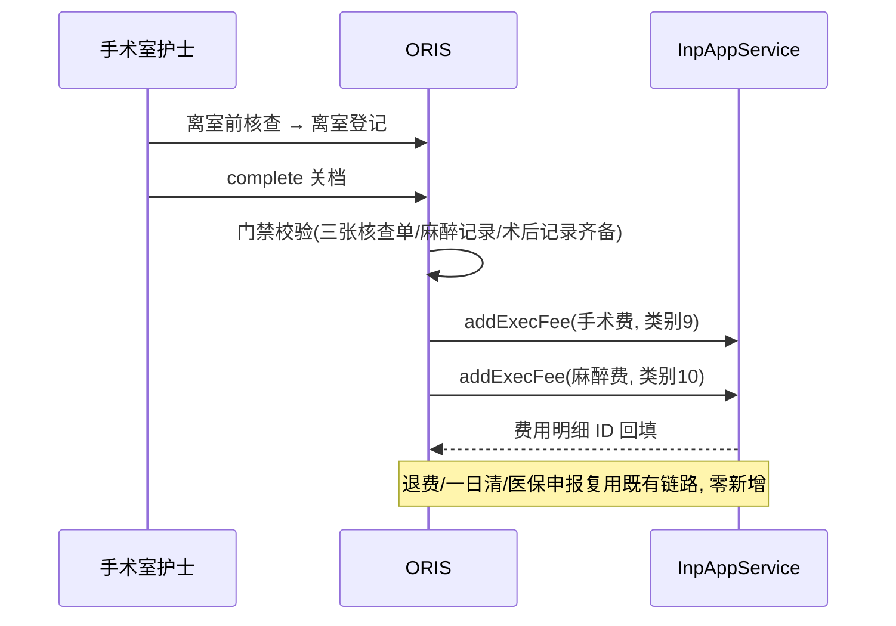

# 16 三期第二批数据库与接口设计（ORIS · PACS/RIS · 急诊五大中心）

版本：V1.0 ｜ 延续《02/09/13》全部规范（公共字段/DECIMAL/乐观锁/快照/单号），仅列增量。

## 1. 迁移脚本规划

| 脚本 | 内容 |
|---|---|
| `V17__phase3b_schema.sql` | 本文档全部新表（or_/ris_/emc_ 共 15 张） |
| `V18__phase3b_menus.sql` | 手术/影像/急诊菜单、OR_NURSE/RIS_USER/EMC_NURSE 角色、权限码与绑定（全环境） |
| `V19__phase3b_demo.sql`（db/demo） | 演示账号（or.nurse/ris.zhang/emc.li）、手术间 3 间、影像设备 3 台、五大中心节点字典与目标时限、手术/麻醉费收费项目样例 |

## 2. ER 图（第二批增量）

## 3. 数据库（or_ / ris_ / emc_）

### 3.1 or_surgery_request 手术申请单

| 字段 | 类型 | 说明 |
|---|---|---|
| request_no | VARCHAR(32) UNIQUE | 手术申请号（前缀 SS） |
| admission_id / patient_id | BIGINT | 住院/患者 |
| applicant_doctor_id | BIGINT | 申请医生 |
| surgery_name | VARCHAR(64) | 手术名称 |
| surgery_code | VARCHAR(32) NULL | 术式编码（ICD-9-CM-3，可空） |
| diagnosis | VARCHAR(256) | 术前诊断快照 |
| planned_date | DATE | 拟手术日期 |
| anesthesia_method | TINYINT | 1 全麻 2 椎管内 3 神经阻滞 4 局麻+镇静 5 基础麻醉 |
| incision_time / end_time | DATETIME NULL | 切皮/结束时间 |
| status | TINYINT | 10 待审核 ｜ 20 已审核(待排台) ｜ 30 已排台 ｜ 40 术中 ｜ 50 复苏中 ｜ 60 已完成 ｜ 70 已取消 |

索引：`(admission_id, status)`、`(status, planned_date)`。

### 3.2 or_operate_room 手术间（字典）

`room_no UNIQUE, room_name, status(1 可用 0 维护)` + 公共字段。V19 种子 3 间。

### 3.3 or_schedule 排台

| 字段 | 说明 |
|---|---|
| schedule_no UNIQUE | 排台单号（前缀 PT） |
| request_id UNIQUE | 手术申请 |
| room_id / surgery_date / seq_no | 手术间/日期/台次 |
| start_time / end_time | 台次时间 |
| surgeon_id / anesthetist_id | 主刀/麻醉医生 |
| circulating_nurse_id / scrub_nurse_id | 巡回/洗手护士（可空，排台后可补） |
| status | 1 已排台 2 已完成 3 已取消 |

约束：同手术间同日期 `seq_no` 唯一（`UNIQUE(room_id, surgery_date, seq_no)`，排台冲突服务端校验+行锁）。

### 3.4 or_check_record 手术安全核查单

| 字段 | 说明 |
|---|---|
| request_id + check_type | UNIQUE(组合)：1 麻醉前 2 切皮前 3 离室前 |
| check_items | JSON 文本：`[{"item":"患者身份核对","result":true},…]`（每张核查单 ≥10 项，V19 种子标准清单） |
| checker1_id / checker2_id | 双人签名（手术医生/麻醉医生/手术室护士三方，第二签名人不同人校验） |
| checked_at | 核查时间 |

### 3.5 or_anesthesia_record 麻醉记录

`record_no UNIQUE`（前缀 MZ）、`request_id UNIQUE`、`anesthesia_method`（可微调）、`asa_grade TINYINT(1~5)`、`anesthetist_id`、`start_time/end_time`、`drug_note VARCHAR(512) 术中用药摘要`、`event_note VARCHAR(512) 术中事件`、`vital_sample VARCHAR(1024) 关键时点生命体征 JSON`、`status(1 有效)`。

### 3.6 or_postop_record 术后记录

`request_id UNIQUE`、`recovery_score TINYINT(0~10 苏醒评分)`、`destination TINYINT 1 回病房 2 转ICU 3 离院`、`followup_note VARCHAR(256) 术后随访`、`visited_at DATETIME 随访时间`、`status(1 有效)`。

### 3.7 ris_request 检查申请单

| 字段 | 类型 | 说明 |
|---|---|---|
| request_no | VARCHAR(32) UNIQUE | 检查申请号（前缀 JC） |
| order_id | BIGINT | 来源检查医嘱 |
| admission_id / patient_id / doctor_id | BIGINT | 归属（住院检查；门诊段不做，见《15》§7） |
| modality | TINYINT | 1 DR 2 CT 3 MR 4 超声 5 心电 |
| body_part | VARCHAR(32) | 检查部位 |
| requirement | VARCHAR(256) | 临床要求 |
| urgency | TINYINT | 1 常规 2 急查 |
| status | TINYINT | 10 待预约 ｜ 20 已预约 ｜ 30 检查中 ｜ 40 已报告 ｜ 50 作废 |

索引：`(admission_id, status)`、`(status)`、`(order_id)`。

### 3.8 ris_device 设备（字典）

`device_no UNIQUE, device_name, modality TINYINT(1DR 2CT 3MR), status` + 公共字段。V19 种子 DR/CT/MR 各 1 台。

### 3.9 ris_appointment 预约

`request_id UNIQUE`、`device_id`、`appt_time DATETIME`、`status(1 已预约 2 已到场 3 已取消)` + 公共字段。

### 3.10 ris_image 影像（Mock）

`study_no UNIQUE`（前缀 IM）、`request_id UNIQUE`、`series_count`、`image_count`、`impression_text VARCHAR(1024) Mock 影像所见`、`status(1 已归档)`。影像本体不存储（《15》§5）。

### 3.11 ris_report 检查报告

| 字段 | 类型 | 说明 |
|---|---|---|
| report_no | VARCHAR(32) UNIQUE | 影像报告号（前缀 XD） |
| request_id UNIQUE | BIGINT | 检查申请 |
| finding | VARCHAR(2048) | 影像所见（书写可改 Mock 文本） |
| conclusion | VARCHAR(1024) | 诊断意见 |
| critical_sign | VARCHAR(128) NULL | 危急征象描述（如 主动脉夹层征象） |
| critical_flag | TINYINT | 1 危急 |
| reporter_id / report_time | | 书写医生/时间 |
| reviewer_id / review_time | NULL | 审核医生/时间（双签，reviewer ≠ reporter 校验） |
| status | TINYINT | 10 书写中 ｜ 20 已发布 ｜ 30 已驳回 |

发布即审核通过（状态 10→20），同时：危急命中写 `alert_critical(source=2, request_id=ris_request.id, result_id=ris_report.id)`；联动医嘱"已执行"（同 LIS 模式）。

### 3.12 emc_triage 急诊分诊

| 字段 | 类型 | 说明 |
|---|---|---|
| triage_no | VARCHAR(32) UNIQUE | 分诊单号（前缀 FZ） |
| patient_id | BIGINT | 患者（未建档走既有快速建档） |
| visit_id | BIGINT NULL | 关联门诊就诊（可后补） |
| chief_complaint | VARCHAR(256) | 主诉 |
| t / p / r / bp / spo2 | VARCHAR/DECIMAL | 生命体征（体温/脉搏/呼吸/血压/血氧） |
| triage_level | TINYINT | 1 濒危 2 危重 3 急症 4 非急症 |
| center_type | TINYINT | 0 无 ｜ 1 胸痛 ｜ 2 卒中 ｜ 3 创伤 ｜ 4 危重孕产妇 ｜ 5 危重新生儿 |
| green_channel | TINYINT | 1 绿色通道 |
| triage_nurse_id / triage_time | | 分诊护士/时间 |
| status | TINYINT | 1 已分诊 2 已关档 |

### 3.13 emc_visit 五大中心登记

`visit_no UNIQUE`（前缀 JZ）、`triage_id`、`center_type(1~5)`、`doctor_id 责任医生`、`admission_id BIGINT NULL（转住院后补关联）`、`start_time（登记时刻，时限基准）`、`outcome TINYINT NULL 1 收住院 2 急诊手术 3 转院 4 离院 5 死亡`、`outcome_time`、`status(10 救治中 20 已关档)`。

### 3.14 emc_timepoint 时间节点

| 字段 | 说明 |
|---|---|
| emc_visit_id + node_code | UNIQUE(组合) |
| node_time | 节点时刻（绝对时间） |
| recorder_id / note | 记录人/备注 |

### 3.15 emc_node_dict 节点字典（V19 种子）

`node_code UNIQUE, node_name, center_type(1~5), seq 序号, target_minutes INT NULL（自登记 start_time 目标分钟，NULL=不限时）`。样例：胸痛——`XT_ECG 首份心电图 ≤10min`、`XT_TPN 肌钙蛋白回报 ≤20min`、`XT_BAL 球囊扩张 ≤90min`；卒中——`ZZ_CT 头颅CT ≤20min`、`ZZ_TPA 静脉溶栓 ≤45min`；创伤——`CC_OR 进抢救室 ≤10min` 等。

### 3.16 alert_critical 复用语义（不新增表）

`source=2`（PACS）时：`request_id` = ris_request.id、`result_id` = ris_report.id、`item_name` = 检查项目名、`critical_value` = critical_sign 文本。通知/确认/闭环字段与流程全复用。

## 4. 状态机

### 4.1 手术申请（or_surgery_request.status）

### 4.2 检查申请（ris_request.status）

### 4.3 检查报告（ris_report.status）

### 4.4 急诊病例（emc_visit.status）

## 5. 接口清单（约 30 个，前缀 /api/v1）

### 5.1 手术麻醉（/ors，权限 or:*）

| # | 方法 | 路径 | 说明 | 权限码 | 幂等 |
|---|---|---|---|---|---|
| OR-01 | POST | /ors/requests | 创建手术申请（医生） | or:request:create | ✔ |
| OR-02 | GET | /ors/requests | 申请分页（状态/日期/患者） | or:request:query | — |
| OR-03 | GET | /ors/requests/{id} | 详情（排台/核查/麻醉/术后聚合） | or:request:query | — |
| OR-04 | POST | /ors/requests/{id}/review | 审核（通过/驳回） | or:request:review | ✔ |
| OR-05 | POST | /ors/requests/{id}/schedule | 排台（房间/台次/团队，冲突校验） | or:schedule:manage | ✔ |
| OR-06 | POST | /ors/requests/{id}/checks | 提交核查单（type+items+双签） | or:check:submit | ✔ |
| OR-07 | POST | /ors/requests/{id}/start | 开始手术（硬门禁校验） | or:stage:operate | ✔ |
| OR-08 | POST | /ors/requests/{id}/anesthesia | 保存麻醉记录（术中可多次覆盖） | or:anesthesia:write | ✔ |
| OR-09 | POST | /ors/requests/{id}/finish | 手术结束→复苏中 | or:stage:operate | ✔ |
| OR-10 | POST | /ors/requests/{id}/leave | 离室登记（门禁：离室前核查+术后记录） | or:stage:operate | ✔ |
| OR-11 | POST | /ors/requests/{id}/complete | 完成关档（自动记账） | or:request:complete | ✔ |
| OR-12 | POST | /ors/requests/{id}/cancel | 取消（待审核/已排台可取消） | or:request:create | ✔ |
| OR-13 | GET | /ors/rooms | 手术间列表 | or:room:query | — |

### 5.2 影像（/ris，权限 ris:*；医嘱执行自动生成申请无独立接口）

| # | 方法 | 路径 | 说明 | 权限码 | 幂等 |
|---|---|---|---|---|---|
| R-01 | GET | /ris/requests | 申请分页（技师工作池，状态/急查） | ris:request:query | — |
| R-02 | GET | /ris/requests/{id} | 详情（预约/影像/报告聚合） | ris:request:query | — |
| R-03 | POST | /ris/requests/{id}/appoint | 预约（设备/时段） | ris:appt:manage | ✔ |
| R-04 | POST | /ris/requests/{id}/start | 开始检查 | ris:exam:execute | ✔ |
| R-05 | POST | /ris/requests/{id}/images | 影像归档（`fetch=true` 走 Mock 通道） | ris:exam:execute | ✔ |
| R-06 | POST | /ris/requests/{id}/finish | 检查完成（待报告） | ris:exam:execute | ✔ |
| R-07 | POST | /ris/reports | 书写报告（所见/意见/危急征象） | ris:report:write | ✔ |
| R-08 | POST | /ris/reports/{id}/review | 审核（通过→发布→危急值+医嘱联动；驳回） | ris:report:review | ✔ |
| R-09 | GET | /ris/reports | 报告分页 | ris:report:query | — |
| R-10 | GET | /ris/devices | 设备列表 | ris:device:query | — |

### 5.3 急诊五大中心（/emc，权限 emc:*）

| # | 方法 | 路径 | 说明 | 权限码 | 幂等 |
|---|---|---|---|---|---|
| E-01 | POST | /emc/triage | 分诊登记（含快速建档参数） | emc:triage:create | ✔ |
| E-02 | GET | /emc/triage | 分诊列表 | emc:triage:query | — |
| E-03 | POST | /emc/visits | 五大中心登记（时限基准） | emc:visit:create | ✔ |
| E-04 | GET | /emc/visits | 病例分页 | emc:visit:query | — |
| E-05 | GET | /emc/visits/{id} | 详情（含时间轴与达标计算） | emc:visit:query | — |
| E-06 | POST | /emc/visits/{id}/timepoints | 节点录入（字典外节点拒绝） | emc:timepoint:record | ✔ |
| E-07 | POST | /emc/visits/{id}/link | 后补关联就诊/住院 | emc:visit:create | ✔ |
| E-08 | POST | /emc/visits/{id}/close | 关档（转归） | emc:visit:close | ✔ |
| E-09 | GET | /emc/stats | 达标率统计（分中心/时段，CSV） | emc:stats:query | — |

### 5.4 事件目录新增（《08》§3.2 扩展）

`ors.request.created / scheduled / started / completed`、`ris.request.created / report.published`、`emc.visit.registered / closed`。

## 6. 关键时序：检查报告双签与危急值（source=2）

## 7. 关键时序：手术完成自动记账

