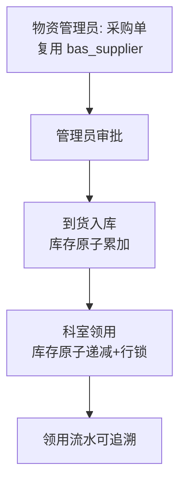
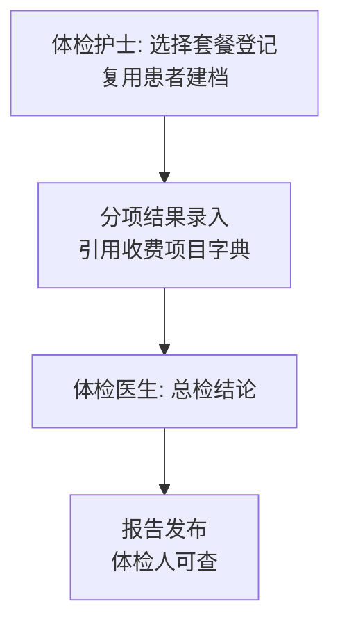
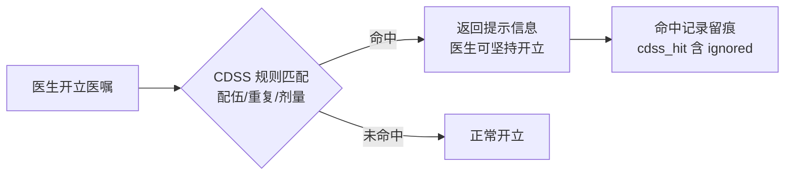

# 18 三期总体设计（第三批：HR 人事 · 物资耗材 · 绩效国考监测 · 体检 · CDSS 全面化）

版本：V1.0 ｜ 依据：《07-HIS 全景规划 V2》三期路线 ｜ 上游：《12/15》架构与依赖规则全量沿用

## 1. 三期第三批范围裁剪

三期收尾批，聚焦运营增强与决策支持（《12》§1 第三批原文：HR/物资/绩效（国考监测）、体检、CDSS 全面化）：

| 工作包域 | 范围 | 选择理由 |
|---|---|---|
| HR 人事 | 员工档案、职称变更记录（关联 sys_user 可空） | 国考人力指标数据底座；现系统人员散落在 sys_user/bas_doctor/bas_nurse，缺档案维度 |
| 物资耗材 | 物资字典、采购（复用 bas_supplier 与 whse 审批模式）、库存、科室领用 | 药品之外的第二条物耗线；与药库同构降低实现风险 |
| 绩效国考监测 | 工作量/效率/安全三类 KPI 聚合接口 + 看板（**0 新表**，纯聚合查询 + CSV） | 《07》§3 BI/国考监测的落地雏形；数据已全部在库（bil_/inp_/alert_/or_） |
| 体检 | 套餐、登记、分项结果、总检报告闭环 | 面向 C 端的健康管理入口，复用患者建档与收费项目字典 |
| CDSS 全面化 | 规则引擎（配伍禁忌/重复检查/剂量上限）+ 医嘱开单命中提示（**提示不阻断**）+ 命中留痕 | 一/二期已有硬校验（频次白名单/皮试/资质），本批补"软提示"层并全程留痕 |

明确不做（第三批边界）：输血闭环（07 §4 登记为四期评估项，涉及血库专线对接）、绩效工资核算（仅做国考监测口径，不做薪酬发放）、体检与 HIS 医保结算联动、CDSS 知识库商业化规则集（仅规则框架+样例规则）、物资批次效期（耗材效期管理四期评估）。

## 2. 业务主线

### 2.1 物资耗材闭环



### 2.2 体检闭环



### 2.3 CDSS 开单提示



### 2.4 国考监测

三类指标（对齐国考病案/运营口径雏形）：**工作量**（门诊/住院人次、手术台次）、**效率**（平均住院日、床位使用率）、**安全**（危急值闭环率、手术三方核查率、CDSS 命中率）。全部聚合自既有业务表，按时段出数 + CSV 导出。

## 3. 模块与依赖

| 新模块 | 前缀 | 职责 |
|---|---|---|
| 人事（hr） | `hr_` | 员工档案、职称变更 |
| 物资（mat） | `mat_` | 物资字典、采购、库存、领用 |
| 体检（pe） | `pe_` | 套餐、登记、结果、报告 |
| 临床决策（cdss） | `cdss_` | 规则、命中记录 |
| 绩效（report 扩展） | 无新表 | KPI 聚合接口 + 看板页 |

依赖规则（延续无环约束）：

```
doc --开单后置校验--> cdss（doc → cdss 单向，命中不阻断）
mat --到货入库--> mat_stock（模块内聚合根，不经药房 InventoryService）
pe --引用--> basedata（收费项目字典）/patient（建档复用）
hr --关联--> system（sys_user 可空引用，弱关联）
report/kpi --> 只读聚合 bil_/inp_/lis_/alert_/ors_（report 已有读权先例）
```

## 4. 与既有系统的衔接点

| 既有模型 | 第三批处理 |
|---|---|
| `sys_user`/`bas_doctor`/`bas_nurse` | hr_staff.user_id 可空弱关联（不强制一人一档，历史人员可后补档） |
| `bas_supplier` | 物资采购直接复用供应商字典 |
| `bas_charge_item` | 体检套餐项引用收费项目（检验/检查类），费用走体检套餐价（不走 bil 实时计费，体检独立收费登记为边界） |
| `doc_order` 开立链路 | DocOrderService.create 落库后**异步**调用 cdssAppService.check（命中不阻断、ignored 留痕）——不改变开单事务边界 |
| `bil_charge_detail`/`inp_daily_fee`/`lis_report`/`alert_critical`/`or_surgery_request` | KPI 只读聚合，不新增写路径 |
| 权限底座 | V23：新角色 PE_USER（体检人员，role 13）；mat 权限码绑管理员+药师；hr/cdss/kpi 权限码绑管理员（kpi 另绑对账员）；sys_role 用到 13、sys_menu 用到 245 左右 |

## 5. 不做的事（第三批边界）

- 输血闭环、耗材批次效期、绩效薪酬核算、体检医保/收费联动；
- CDSS 阻断级规则（全部为提示级，硬阻断仍由一/二期既有校验承担）；
- HR 考勤/薪酬/招聘（仅档案与职称线）；
- 物资一级库/二级库调拨（单级库存）；
- KPI 的国标上报 SDK（院内口径 CSV 为准）。
