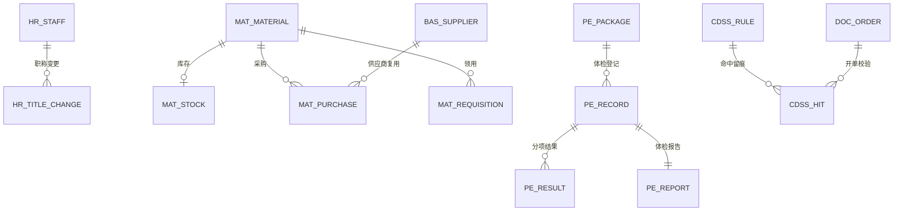
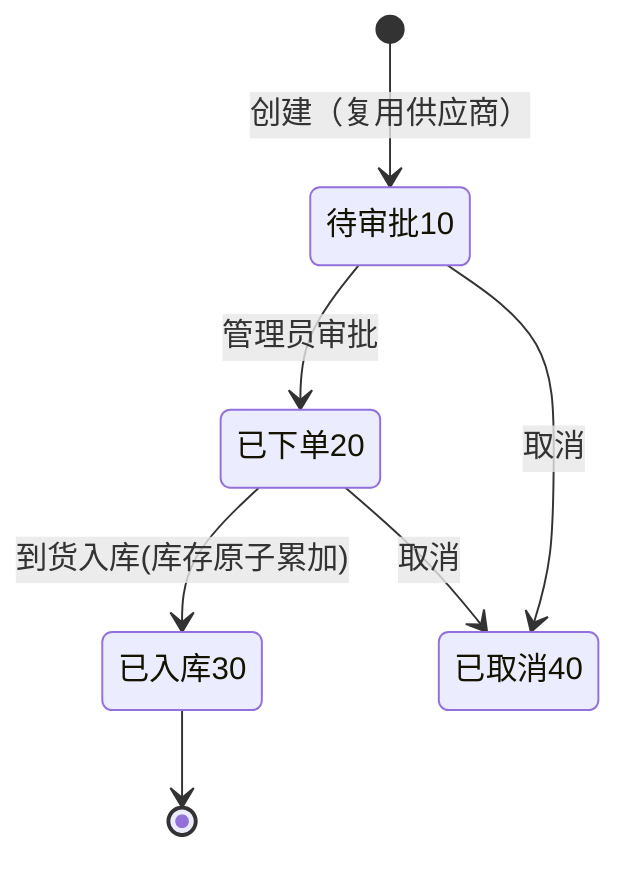
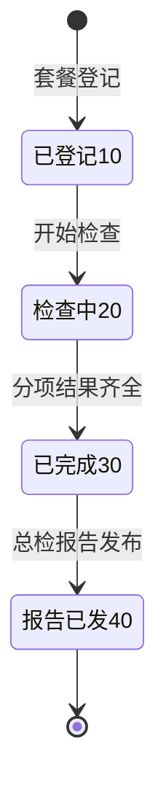
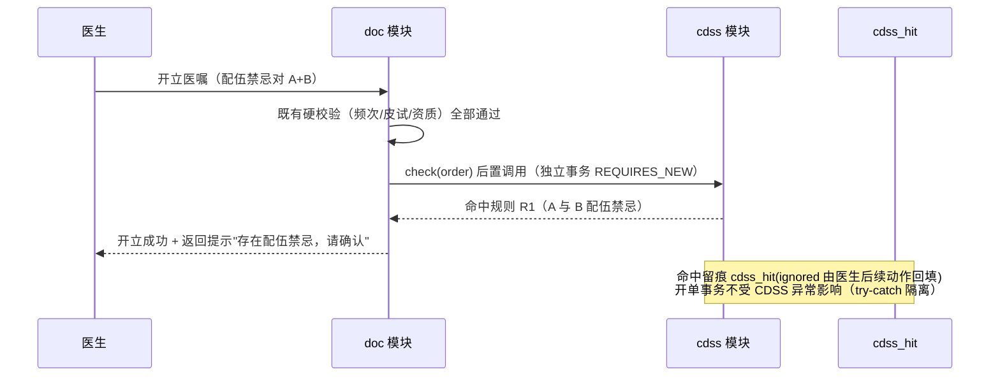

# 19 三期第三批数据库与接口设计（HR · 物资 · 绩效 · 体检 · CDSS）

版本：V1.0 ｜ 延续《02/09/13/16》全部规范（公共字段/DECIMAL/乐观锁/快照/单号），仅列增量。

## 1. 迁移脚本规划

| 脚本 | 内容 |
|---|---|
| `V22__phase3c_schema.sql` | hr_/mat_/pe_/cdss_ 共 12 张新表 |
| `V23__phase3c_menus.sql` | 菜单（230~245）、PE_USER 角色（role 13）、权限码与绑定（全环境） |
| `V24__phase3c_demo.sql`（db/demo） | 演示账号 pe.nurse、物资字典、体检套餐、CDSS 样例规则 |

## 2. ER 图（第三批增量）

## 3. 数据库

### 3.1 hr_staff 员工档案

`staff_no UNIQUE`（前缀 YG）、`user_id NULL`（弱关联 sys_user）、`name`、`dept_id`、`title VARCHAR(32) 职称`、`license_no NULL 执业证号`、`phone`、`entry_date`、`exit_date NULL`、`status(1 在职 0 离职)`。索引 `(dept_id, status)`。

### 3.2 hr_title_change 职称变更

`staff_id + effective_date`、`old_title`、`new_title`、`approver_id`、`note`。索引 `(staff_id)`。

### 3.3 mat_material 物资字典

`material_code UNIQUE`、`name`、`category TINYINT(1 卫生材料 2 低值易耗 3 办公用品 4 试剂)`、`unit`、`price DECIMAL(10,2)`、`safe_stock INT 安全库存`、`status(1 启用)`。

### 3.4 mat_stock 物资库存

`material_id UNIQUE`、`quantity INT`、`version`（**原子累加/递减 + 行锁**，对齐药库资金级安全）。

### 3.5 mat_purchase 物资采购单

`po_no UNIQUE`（前缀 MC）、`supplier_id`（复用 bas_supplier）、`material_id`、`quantity INT`、`unit_price DECIMAL(10,2)`、`expected_date`、`status(10 待审批 20 已下单 30 已入库 40 已取消)`、`approver_id/approved_at`。状态机与 whse_purchase_order 同构。

### 3.6 mat_requisition 科室领用

`req_no UNIQUE`（前缀 LY）、`material_id`、`dept_id`、`quantity INT`、`applicant_id`、`purpose VARCHAR(128)`、`status(1 已领用)`。**领用时库存原子递减，不足拒绝**。

### 3.7 pe_package 体检套餐

`package_no UNIQUE`（前缀 TC）、`name`、`price DECIMAL(10,2)`、`items JSON`（收费项目 id 数组，快照名称与价格）、`status(1 启用)`。

### 3.8 pe_record 体检登记

`record_no UNIQUE`（前缀 TJ）、`patient_id`、`package_id`、`exam_date`、`status(10 已登记 20 检查中 30 已完成 40 报告已发)`。索引 `(status, exam_date)`。

### 3.9 pe_result 体检分项结果

`record_id + charge_item_id UNIQUE(组合)`、`result_value VARCHAR(128)`、`abnormal_flag TINYINT(0 正常 1 异常)`、`examiner_id`、`note`。

### 3.10 pe_report 体检报告

`report_no UNIQUE`（前缀 TJB）、`record_id UNIQUE`、`summary VARCHAR(1024) 总检结论`、`doctor_id`、`report_time`、`status(20 已发布)`。发布联动 pe_record.status=40。

### 3.11 cdss_rule 规则

| 字段 | 说明 |
|---|---|
| rule_code UNIQUE | 规则编码 |
| rule_type TINYINT | 1 配伍禁忌 2 重复检查 3 剂量上限 |
| ref_a_id / ref_b_id | BIGINT（按类型指向药品 id 或收费项目 id；type=3 时 b 为上限值 DECIMAL） |
| level TINYINT | 1 提示（本批全部为提示级） |
| message VARCHAR(256) | 提示文案 |
| status | 1 启用 0 停用 |

### 3.12 cdss_hit 命中记录

`order_id`、`rule_id`、`message 快照`、`ignored TINYINT(0 提示后放弃开立 1 医生坚持开立)`、`hit_time`。索引 `(order_id)`。

## 4. 状态机

### 4.1 物资采购（mat_purchase.status）

### 4.2 体检（pe_record.status）

## 5. 接口清单（约 34 个，前缀 /api/v1）

### 5.1 人事（/hr，权限 hr:*）

| # | 方法 | 路径 | 说明 | 权限码 | 幂等 |
|---|---|---|---|---|---|
| H-01 | GET | /hr/staff | 员工分页（科室/状态/姓名） | hr:staff:query | — |
| H-02 | GET | /hr/staff/{id} | 详情（含职称变更史） | hr:staff:query | — |
| H-03 | POST | /hr/staff | 建档 | hr:staff:manage | ✔ |
| H-04 | PUT | /hr/staff/{id} | 更新 | hr:staff:manage | ✔ |
| H-05 | POST | /hr/staff/{id}/exit | 离职登记 | hr:staff:manage | ✔ |
| H-06 | POST | /hr/staff/{id}/title-change | 职称变更 | hr:staff:manage | ✔ |

### 5.2 物资（/mat，权限 mat:*）

| # | 方法 | 路径 | 说明 | 权限码 | 幂等 |
|---|---|---|---|---|---|
| M-01 | GET/POST/PUT | /mat/materials(+/{id}) | 物资字典 | mat:material:manage | ✔ |
| M-02 | GET | /mat/stocks | 库存查询（含安全库存预警标记） | mat:stock:query | — |
| M-03 | GET | /mat/purchases | 采购单分页 | mat:purchase:query | — |
| M-04 | POST | /mat/purchases | 创建采购单 | mat:purchase:create | ✔ |
| M-05 | POST | /mat/purchases/{id}/approve | 审批 | mat:purchase:approve | ✔ |
| M-06 | POST | /mat/purchases/{id}/receive | 到货入库（原子累加） | mat:purchase:approve | ✔ |
| M-07 | POST | /mat/purchases/{id}/cancel | 取消 | mat:purchase:create | ✔ |
| M-08 | GET | /mat/requisitions | 领用流水 | mat:requisition:query | — |
| M-09 | POST | /mat/requisitions | 科室领用（原子递减，不足拒绝） | mat:requisition:create | ✔ |

### 5.3 体检（/pe，权限 pe:*）

| # | 方法 | 路径 | 说明 | 权限码 | 幂等 |
|---|---|---|---|---|---|
| P-01 | GET/POST/PUT | /pe/packages(+/{id}) | 套餐维护 | pe:package:manage | ✔ |
| P-02 | GET | /pe/records | 登记分页 | pe:record:query | — |
| P-03 | GET | /pe/records/{id} | 详情（含分项/报告聚合） | pe:record:query | — |
| P-04 | POST | /pe/records | 套餐登记 | pe:record:create | ✔ |
| P-05 | POST | /pe/records/{id}/start | 开始检查 | pe:record:manage | ✔ |
| P-06 | POST | /pe/records/{id}/results | 分项结果录入（覆盖式） | pe:result:entry | ✔ |
| P-07 | POST | /pe/records/{id}/finish | 完成检查（分项齐全校验） | pe:record:manage | ✔ |
| P-08 | POST | /pe/records/{id}/report | 总检报告发布 | pe:report:publish | ✔ |

### 5.4 CDSS（/cdss，权限 cdss:*）

| # | 方法 | 路径 | 说明 | 权限码 | 幂等 |
|---|---|---|---|---|---|
| C-01 | GET/POST/PUT | /cdss/rules(+/{id}) | 规则维护（管理员） | cdss:rule:manage | ✔ |
| C-02 | GET | /cdss/hits | 命中记录分页 | cdss:hit:query | — |
| C-03 | POST | /cdss/check | 开单校验（doc 后置调用；返回命中列表，不阻断） | 内部（doc 模块调用） | — |

### 5.5 绩效 KPI（/report/kpi，权限 kpi:*；0 新表）

| # | 方法 | 路径 | 说明 | 权限码 |
|---|---|---|---|---|
| K-01 | GET | /report/kpi/workload | 工作量（门诊/住院人次、手术台次、检验/检查量） | kpi:view |
| K-02 | GET | /report/kpi/efficiency | 效率（平均住院日、床位使用率、次均费用） | kpi:view |
| K-03 | GET | /report/kpi/safety | 安全（危急值闭环率、手术核查率、CDSS 命中/坚持率） | kpi:view |
| K-04 | GET | /report/kpi/export | CSV 导出（csvCell 防注入） | kpi:view |

### 5.6 事件目录新增（《08》§3.2 扩展）

`mat.purchase.approved / received`、`mat.stock.requisitioned`、`pe.record.registered / report.published`、`cdss.hit`、`hr.staff.titleChanged`。

## 6. 关键时序：CDSS 开单提示（提示不阻断）

