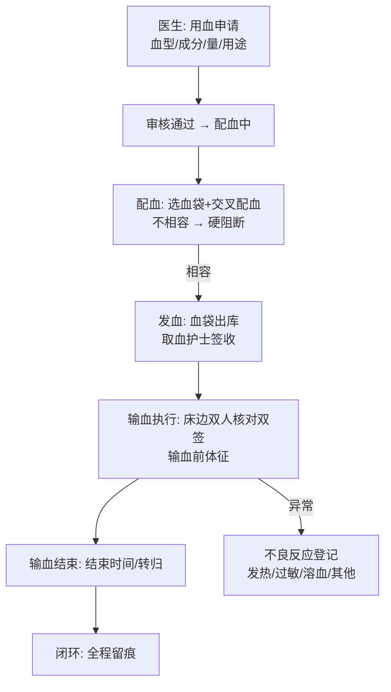

# 21 四期总体设计（第一批：输血闭环 · 耗材批次效期 · CDSS 全面化 · 结果互认标识）

版本：V1.0 ｜ 依据：《07-HIS 全景规划 V2》四期路线 ｜ 上游：《12/15/18》架构与依赖规则全量沿用

## 1. 四期范围裁剪（本批覆盖）

《07》§5 四期原文：互联网医院、CDSS 全面化、AI 应用、区域互认深化、信创迁移；叠加三期登记的四期评估项。按"患者安全优先、单体可自研、外部依赖后置"裁剪：

| 工作包域 | 范围 | 选择理由 |
|---|---|---|
| **输血闭环** | 用血申请 → 配血（不相容硬阻断）→ 发血（双核对）→ 输血执行（床边双签）→ 不良反应登记 | 《07》§4 七大闭环最后一个未落地项，患者安全级；三期已登记四期评估 |
| **耗材批次效期** | mat 库存批次化（批次/效期/FEFO 拨发），领用跨批次拆分留痕 | 三期已登记四期评估；与药房 InventoryService FEFO 同构 |
| **CDSS 全面化** | 过敏原-药品映射规则化（type=4，患者过敏史关键字匹配）+ 剂量规则加年龄维度（儿科框架） | 二十二轮登记的四期项；《07》四期原文"CDSS 全面化" |
| **结果互认标识** | 检验/检查报告发布时可标记"纳入互认"（HR 标识），医生站报告页展示 | 《07》四期"区域互认深化"的院内最小实现（互认项目标识与展示） |

明确不做（四期第一批边界）：互联网医院 C 端（需互联网接入/第三方支付/电子处方流转平台）、AI 辅助阅片/病历质控 AI（需算力与数据治理，五期评估）、信创迁移（基础设施专项）、区域检验结果互认平台上报 SDK（需省级平台联调，本批仅院内标识）、血站专线对接（血液库存为院内登记口径，血站调拨接口预留）。

## 2. 业务主线

### 2.1 输血闭环（患者安全闭环，硬门禁设计）



**三道安全门禁**（服务端硬校验，对齐手术核查设计）：
1. 交叉配血**不相容 → 禁止发血**（患者安全硬阻断，本系统首个阻断级 CDSS 之外的硬安全拦截）；
2. 发血须**取血护士签收**（血袋出库交接留痕）；
3. 输血执行须**床边双人双签**（checker1/checker2 不同人）+ 输血前体征记录，缺任一不可开始输注。

### 2.2 耗材批次效期（FEFO）

入库按批次登记（批次号/效期/数量）；科室领用按**效期近先出**（FEFO）自动拨批次，跨批次拆分记录 breakdown JSON 留痕；`mat_stock.quantity` 保留为聚合视图（对账用），批次明细为拨发依据。效期临近（≤30 天）库存预警。

### 2.3 CDSS 全面化

- **type=4 过敏原映射规则**（规则化，补二十二轮患者级守门之上的精确层）：规则配置过敏原关键字（如"青霉素"）+ 目标药品 ref_a；患者过敏史**包含关键字**且医嘱含该药品 → 精确命中"患者对青霉素过敏，医嘱含 xx"。患者级守门（rule_id=0）保留，双层提示。
- **type=3 剂量规则加年龄维度**：规则增加 age_min/age_max（儿科框架：可限定规则仅对某年龄段生效）；患者年龄由出生日期现算。

### 2.4 结果互认标识

检验/检查报告发布时可勾选"纳入互认"（mutual_flag=1），医生站报告查询页显示 HR 互认标签；互认项目清单管理（简化：报告级标记，不做项目级字典，登记边界）。

## 3. 模块与依赖

| 新模块/扩展 | 前缀 | 职责 |
|---|---|---|
| 输血（bb） | `bb_` | 血袋库存、用血申请、配血、发血、输血执行、不良反应 |
| 物资扩展（mat） | `mat_batch` | 批次明细、FEFO 拨发 |
| CDSS 扩展（cdss） | cdss_rule 加列 | type=4 过敏映射、type=3 年龄维度 |
| 报告扩展（lis/ris） | 加列 | 互认标识 |

依赖规则（延续无环）：

```
doc/inp --用血申请引用--> bb（bb → inp 读在院状态；申请由医生站入口调 bb 服务）
mat --批次拨发--> mat 模块内（领用逻辑升级，接口契约不变）
cdss --扩展--> cdss（check 内部增强，无新跨模块依赖）
lis/ris --加列--> 各自模块内
```

## 4. 与既有系统的衔接点

| 既有模型 | 四期处理 |
|---|---|
| `inp_admission`（在院校验） | 用血申请/输血执行校验在院（requireInHospital，同手术申请模式） |
| `bas_charge_item` | 血费/配血费收费项目（类别 5 治疗费或新增 11 血费——**用 11 血费**，V28 扩枚举注释） |
| `mat_stock`/领用 | 批次化改造：入库按批次登记、领用 FEFO 拨发，`mat_stock` 保留聚合 |
| `cdss_rule`（type 1~3） | V28 加列 allergy_keyword/age_min/age_max；check 扩展 type=4 与年龄维度 |
| `lis_report`/`ris_report` | V28 加列 mutual_flag/mutual_note；前端报告页展示 HR 标签 |
| 权限底座 | V29：新角色 BB_USER（血库人员，role 14）+ bb:* 权限码；菜单 260~272 |

## 5. 不做的事（四期第一批边界）

- 互联网医院 C 端、AI 应用、信创迁移、区域平台上报 SDK（外部依赖，五期/专项）；
- 血站专线对接与血液调拨（院内登记口径）；
- 输血科血型库建档（血型为申请/血袋属性，不做患者血型档案管理，四期第二批评估）；
- 项目级互认字典（仅报告级标记）；
- 耗材效期自动报废任务（效期预警展示，报废手工登记）。
