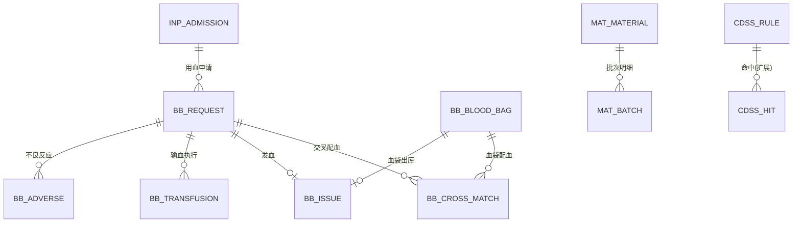
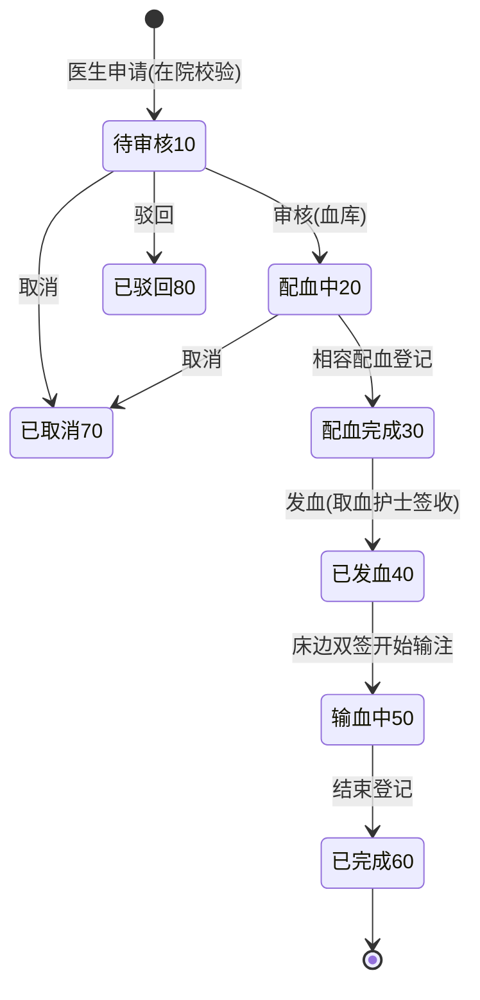
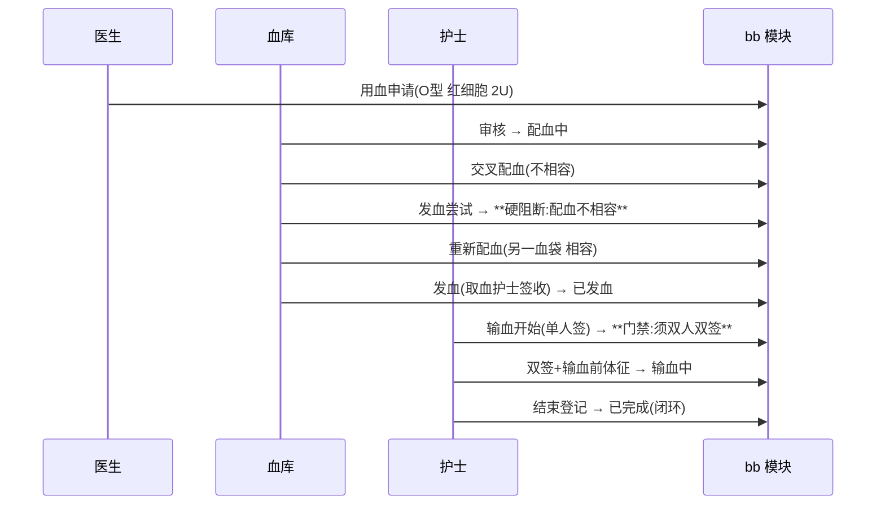
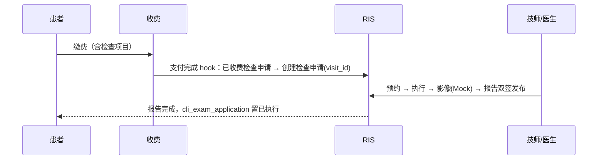

# 22 四期数据库与接口设计（输血闭环 · 耗材批次 · CDSS 增强 · 互认标识）

版本：V1.0 ｜ 延续《02/09/13/16/19》全部规范，仅列增量。

## 1. 迁移脚本规划

| 脚本 | 内容 |
|---|---|
| `V28__phase4_schema.sql` | bb_ 6 张新表 + mat_batch + cdss_rule 加列 + lis/ris_report 互认加列 + 收费类别注释扩展（11 血费） |
| `V29__phase4_menus.sql` | 血库菜单（260~272）、BB_USER 角色（role 14）、bb:/互认权限码绑定 |
| `V30__phase4_demo.sql`（db/demo） | 演示账号 bb.tech、血袋库存、互认样例 |

## 2. ER 图（四期增量）

## 3. 数据库（bb_ / mat_batch / 加列）

### 3.1 bb_blood_bag 血袋（血库库存）

`bag_no UNIQUE`（前缀 XDJ）、`blood_type TINYINT(1 A 2 B 3 AB 4 O)`、`rh TINYINT(1 阳性 2 阴性)`、`component TINYINT(1 红细胞 2 血浆 3 血小板 4 冷沉淀)`、`volume_ml INT`、`blood_station VARCHAR(64) 血站来源`、`collect_date`、`expire_date`、`status(1 在库 2 已发用 3 过期报废 4 退回)`。索引 `(blood_type, component, status)`。

### 3.2 bb_request 用血申请

`req_no UNIQUE`（前缀 XY）、`admission_id/patient_id/doctor_id`、`blood_type/rh/component`、`volume_ml INT`、`use_purpose VARCHAR(256)`、`status(10 待审核 20 配血中 30 配血完成 40 已发血 50 输血中 60 已完成 70 已取消 80 已驳回)`、`reviewer_id/review_note`。索引 `(admission_id, status)`。

### 3.3 bb_cross_match 交叉配血

`request_id`、`bag_id`、`cross_method VARCHAR(32)（盐水介质/抗人球等）`、`cross_result TINYINT(1 相容 2 不相容)`、`matcher_id`、`match_time`、`note`。**不相容 → bb_request 状态不可推进至发血（服务端硬阻断）**。

### 3.4 bb_issue 发血

`request_id + bag_id UNIQUE(组合)`、`issuer_id（发血者）`、`receiver_id（取血护士）`、`issue_time`。发血后血袋 status=2；bb_request 40。

### 3.5 bb_transfusion 输血执行

`request_id`、`bag_id`、`executor_id（执行护士）`、`checker1_id/checker2_id（床边双人双签，须不同人）`、`vital_before VARCHAR(512) 输血前体征 JSON`、`start_time/end_time`、`outcome TINYINT(1 正常 2 有反应(关联不良反应))`、`note`。

### 3.6 bb_adverse 不良反应

`request_id`、`type TINYINT(1 发热 2 过敏 3 溶血 4 其他)`、`severity TINYINT(1 轻 2 中 3 重)`、`handle_note VARCHAR(512)`、`reporter_id`、`report_time`。

### 3.7 mat_batch 批次明细

`material_id`、`batch_no VARCHAR(32)`、`expire_date`、`quantity INT`、`status(1 在库 0 拨尽)`。UNIQUE(material_id, batch_no)。入库按批次登记；领用 FEFO（expire_date 升序）拨发、跨批次 breakdown 留痕（mat_requisition 加列 breakdown JSON NULL）。

### 3.8 加列

| 表 | 列 | 说明 |
|---|---|---|
| cdss_rule | allergy_keyword VARCHAR(64) NULL | type=4 过敏原关键字（患者过敏史包含即匹配） |
| cdss_rule | age_min INT NULL / age_max INT NULL | type=3 生效年龄段（儿科框架） |
| lis_report / ris_report | mutual_flag TINYINT DEFAULT 0 / mutual_note VARCHAR(128) NULL | 互认标识（发布时可勾选） |
| mat_requisition | breakdown JSON NULL | FEFO 拨发拆分留痕 |
| bas_charge_item | 类别注释扩展 | 11 血费 |

## 4. 状态机

### 4.1 用血申请（bb_request.status）

## 5. 接口清单（约 26 个，前缀 /api/v1）

### 5.1 输血（/bb，权限 bb:*）

| # | 方法 | 路径 | 说明 | 权限码 | 幂等 |
|---|---|---|---|---|---|
| B-01 | GET/POST | /bb/bags(+/{id}/scraps) | 血袋库存/入库/报废 | bb:bags:manage | ✔ |
| B-02 | GET | /bb/bags/available | 可用血袋查询（血型/成分过滤，效期升序） | bb:bags:manage | — |
| B-03 | POST | /bb/requests | 用血申请（医生，在院校验） | bb:request:create | ✔ |
| B-04 | GET | /bb/requests | 申请分页 | bb:request:query | — |
| B-05 | GET | /bb/requests/{id} | 详情（配血/发血/执行聚合） | bb:request:query | — |
| B-06 | POST | /bb/requests/{id}/review | 审核/驳回（血库） | bb:request:review | ✔ |
| B-07 | POST | /bb/requests/{id}/cancel | 取消（医生） | bb:request:create | ✔ |
| B-08 | POST | /bb/requests/{id}/cross-match | 交叉配血登记（相容/不相容） | bb:cross:match | ✔ |
| B-09 | POST | /bb/requests/{id}/issue | 发血（不相容硬阻断+取血人签收） | bb:issue:manage | ✔ |
| B-10 | POST | /bb/requests/{id}/transfusion | 输血开始（双人双签门禁） | bb:transfusion:execute | ✔ |
| B-11 | POST | /bb/requests/{id}/finish | 输血结束 | bb:transfusion:execute | ✔ |
| B-12 | POST | /bb/requests/{id}/adverse | 不良反应登记 | bb:adverse:report | ✔ |

### 5.2 物资批次（/mat 扩展）

| # | 方法 | 路径 | 说明 | 权限码 |
|---|---|---|---|---|
| M-10 | GET | /mat/batches | 批次明细（含效期预警 ≤30 天标记） | mat:stock:query |
| M-11 | POST | /mat/purchases/{id}/receive | 入库升级：按批次登记（批次号/效期入参） | mat:purchase:approve |
| （领用 M-09 契约不变） | | | 内部 FEFO 拨发，响应含 breakdown | |

### 5.3 CDSS 规则扩展（C-01 契约扩展）

type=4 规则创建（allergy_keyword+ref_a）；type=3 可带 age_min/age_max；命中消息含匹配依据。

### 5.4 互认（报告发布契约扩展）

lis L-06 发布入参加 mutualFlag/mutualNote；ris R-07 书写同；报告查询响应含互认字段（医生站展示 HR 标签）。权限沿用各报告发布权限码。

### 5.5 事件目录新增

`bb.request.created / reviewed / matched / issued / transfused / completed / adverse`、`mat.batch.received`。

## 6. 关键时序：输血闭环三道门禁

## 7. 四期第二批增补：门诊检查 RIS 闭环

一期门诊检查申请（cli_exam_application，apply_type=1）止步于收费（status=20），无执行与报告环节——门诊检查是最后一段未闭环路径。

### 7.1 设计要点

| 决策 | 内容 |
|---|---|
| 触发点 | **收费成功**（BillingService 支付完成事务内）扫描该就诊的已收费检查申请 → 联动创建 ris_request（billing → ris 单向服务调用，ris 不依赖 billing，无环） |
| 门诊段适配 | ris_request 加 visit_id 列、admission_id 改可空（门诊无住院）；患者必填 |
| 状态联动 | 报告发布时回写 cli_exam_application.status=30（新增"已执行"枚举，ALTER 注释） |
| 血袋/住院无关 | 门诊检查不走押金/一日清 |
| 幂等 | 一条检查申请仅生成一条 ris_request（UNIQUE 不加，靠状态判定：status=20 已收费且未生成过 → 生成后置"配血中"式中间态？——简化：cli_exam_application 加 ris_request_id 列回填，回填即幂等标记） |

### 7.2 迁移 V32

| 变更 | 说明 |
|---|---|
| ris_request ADD COLUMN visit_id BIGINT NULL | 门诊就诊引用 |
| ris_request MODIFY admission_id NULL | 门诊段可空 |
| cli_exam_application ADD COLUMN ris_request_id BIGINT NULL | 回填幂等标记 |
| cli_exam_application MODIFY status 注释 | 10已申请 20已收费 30已执行 50已作废 |

### 7.3 接口与流程

无新增 REST 接口（复用 R-01~R-10）；新增内部方法 RisService.createOutpatientRequest(visitId, examApplication)。门诊患者报告发布后医生站经 visit_id 可查。

